# RAG 系统设计方案

> **当前阶段：P0（基础流程）** — 单文件极简实现，跑通索引→检索→生成全流程
> 完整模块化设计见文末「后续规划」章节，P1/P2 阶段逐步落地

---

## 当前目录结构

```
rag/
├── __init__.py                  # 导出 BasicRAG
├── basic_rag.py                 # 极简 RAG 单文件实现（~180行）
└── index_data.pkl               # 索引持久化文件（运行时自动生成）
```

## 当前实现架构

```
用户查询 → API Embedding → 余弦相似度检索 → 上下文组装 → LLM 生成 → 带引用回答
                ↑                              ↑
            API 向量化                      LLM 调用
        (text-embedding-ada-002)         (复用 Agent 的 LLM 配置)

文档索引：
.txt/.md 文件 → 递归分块 → API 向量化 → 内存存储 → pickle 持久化
```

## 三阶段路线图

| 阶段 | 目标 | 内容 |
|------|------|------|
| **P0（当前）** | 跑通基础流程 | 单文件 BasicRAG，.txt/.md，API Embedding，内存存储，LLM 生成 |
| P1 | 效果优化 | 本地嵌入模型、BM25+稠密混合检索、重排序、PDF/DOCX/HTML 加载 |
| P2 | 生产化 | Milvus/Chroma 持久化、全链路日志、数据飞轮、配置中心、视频加载 |

---

## 使用示例

### 1. 配置环境变量

在项目根目录创建 `.env` 文件：

```env
OPENAI_API_KEY=sk-xxx
OPENAI_BASE_URL=https://api.openai.com/v1/chat/completions
EMBED_BASE_URL=https://api.openai.com/v1/embeddings
EMBED_MODEL=text-embedding-ada-002
LLM_MODEL=gpt-4o-mini
```

### 2. 运行示例脚本

```bash
# 基础索引与检索（从项目根目录运行）
python rag/examples/01_basic_rag.py

# 批量索引目录 + 交互查询
python rag/examples/02_batch_index.py 20260606/
```

### 3. Python API 快速开始

```python
from rag import BasicRAG

rag = BasicRAG(
    api_key="sk-xxx",
    base_url="https://api.openai.com/v1/chat/completions",
)

# 索引
rag.index_text("RAG 是检索增强生成技术。")
rag.index_file("文档.md")

# 检索（仅检索，不生成）
results = rag.search("什么是 RAG？", top_k=3)

# 检索 + 生成
result = rag.query("什么是 RAG？")
print(result["answer"])
```

### 4. 输出示例

```
输入: 什么是 RAG？

输出:
回答: RAG（Retrieval-Augmented Generation）是一种检索增强生成技术。
它通过先检索知识库中的相关文档，再将检索结果作为上下文提供给
大语言模型，从而生成更准确、更有依据的回答。

置信度: 0.92
来源: ['测试文档.md']
```

---

> 以下为 P1/P2 完整设计方案，供后续迭代参考。

---

---

## 附：完整设计方案（P1/P2 参考）

> 以下为 P1/P2 阶段完整模块化设计方案，当前 P0 阶段尚未实现。

### 一、统一数据类型 (types.py)

所有模块共享的数据结构，定义在 `rag/types.py`：

```python
@dataclass
class RawDocument:
    """加载器输出：原始文档"""
    content: str                 # 提取的文本内容
    source: str                  # 源文件路径
    metadata: dict               # 扩展元数据
    # file_name: str            # 文件名
    # file_type: str            # pdf/docx/txt/html/video
    # page_num: int             # 页码
    # modality: str             # text/table/image_ocr/video_ocr/video_audio
    # timestamp: str            # 视频时间戳
    # bbox: dict                # PDF 位置 {x0,y0,x1,y1}
    # created_at: str           # 创建时间


@dataclass
class Chunk:
    """分块器输出：文本块"""
    chunk_id: str                # 唯一 ID (uuid)
    text: str                    # 分块后的文本
    metadata: dict               # 继承自 RawDocument 的元数据
    embeddings: dict             # {embedder_name: vector}
    parent_id: str | None = None # 父 Chunk ID（父子分块时使用）


@dataclass
class SearchResult:
    """检索器输出：带分数的检索结果"""
    chunk: Chunk
    score: float                 # 相似度分数
    rank: int                    # 排序位置


@dataclass
class RAGResult:
    """生成器输出：最终 RAG 结果"""
    answer: str                  # 带引用的答案文本
    sources: list[dict]          # [{"id":1, "source":"file.pdf", "page":5, "text":"..."}]
    confidence: float            # 置信度 0-1
    request_id: str              # 请求追踪 ID
    latency_ms: float            # 总耗时


@dataclass  
class LogEntry:
    """全链路日志条目"""
    request_id: str
    timestamp: str
    user_query: str
    pipeline: dict               # 各阶段耗时和结果
    retrieved_chunks: list[dict]
    generation: dict
    confidence: float
    latency_ms: float
    user_feedback: str | None = None
```

---

## 二、配置加载 (config.py)

```python
class ConfigLoader:
    """加载 rag/config/rag.yaml，提供类型安全的配置访问"""

    def __init__(self, path: str = "rag/config/rag.yaml"):
        self.path = path
        self.data: dict = {}

    def load(self) -> dict:
        """加载并校验 YAML 配置"""
        ...

    def get(self, *keys: str, default=None):
        """链式安全取值: config.get('retrieval', 'hybrid', 'dense_top_k')"""
        ...
```

---

## 三、架构总览

### 1.1 RAG 三阶段

```
┌──────────────────────────────────────────────────────────────┐
│                        索引 (Indexing)                        │
│                                                              │
│  原始文档 → 加载器 → 分块器 → 嵌入器 → 向量存储              │
│  (.html/.vue/    │        │        │         │              │
│   .txt/.docx/    │        │        │         │              │
│   .pdf/视频)     │        │        │         │              │
│                  │        │        │         │              │
└──────────────────┼────────┼────────┼─────────┼──────────────┘
                   │        │        │         │
                   ▼        ▼        ▼         ▼
┌──────────────────────────────────────────────────────────────┐
│                        检索 (Retrieval)                       │
│                                                              │
│  用户查询 → 查询增强 → 混合检索 → 重排序 → Top-K 结果       │
│            (Rewrite/   (稠密+     (Cross-                    │
│             Multi-     BM25+     encoder)                   │
│             Query/     RRF)                                 │
│             HyDE)                                           │
│              │                                              │
│              ├─ Self-RAG: 判断是否需要检索                   │
│              ├─ CRAG: 质量不足时外部补充                     │
│              └─ Multi-round: 多轮迭代检索                   │
└──────────────────────────┬───────────────────────────────────┘
                           │
                           ▼
┌──────────────────────────────────────────────────────────────┐
│                        生成 (Generation)                      │
│                                                              │
│  Top-K 结果 + 用户查询 → 上下文组装 → LLM 生成 → 带引用答案  │
│                          (Token预算+      (复用             │
│                           引用标记)       agent/llm)        │
└──────────────────────────────────────────────────────────────┘
```

### 1.2 与 Agent 的关系

RAG 作为 Agent 的一个内置模块，通过工具接口暴露给 Agent：

```python
# RAG 作为 Agent 工具注册
agent.register_tool(
    name="rag_query",
    func=rag.query,
    description="基于本地知识库进行检索增强生成",
    args_desc='{"query": "问题", "top_k": 5}'
)
```

Agent 在 Thought→Action 循环中，当需要知识库查询时自动调用 `rag_query`，RAG 返回带引用的答案，Agent 将其整合到最终回复中。RAG 的检索结果也作为长期记忆的一部分，供记忆模块检索复用。

---

## 四、索引管线 (Indexing)

### 4.1 文档加载器

#### 4.1.1 抽象基类 (loader/base.py)

```python
class BaseLoader(ABC):
    """所有加载器的统一接口"""

    @abstractmethod
    def load(self, file_path: str) -> list[RawDocument]:
        """加载文件并返回 RawDocument 列表"""
        ...
```

#### 4.1.2 文本加载器 (loader/text_loader.py)

支持格式：`.html` `.vue` `.txt` `.md` `.json` `.yaml` `.css` `.js` `.ts` 等纯文本/代码类文件。

```python
class TextLoader(BaseLoader):
    def load(self, file_path: str) -> list[RawDocument]:
        """
        根据扩展名分发:
          .html  → html.parser 去标签
          .vue   → 提取 template/script 文本
          其他    → UTF-8 直接读取
        """
```

- `.html`：使用 `html.parser` 提取纯文本，去除 script/style 标签
- `.vue`：提取 template/script 部分，保留有意义文本
- 其余文本文件：直接 UTF-8 读取

#### 4.1.3 DOCX 加载器 (loader/docx_loader.py)

```python
class DocxLoader(BaseLoader):
    def load(self, file_path: str) -> list[RawDocument]:
        """
        使用 python-docx 提取:
          - 段落文本
          - 表格文本（按行转 Markdown 格式）
          - 页眉/页脚（可选过滤）
        """
```

- 表格按行转 `| col1 | col2 |` Markdown 格式，保留结构
- 段落保留原始顺序

#### 4.1.4 PDF 加载器 (loader/pdf_loader.py)

PDF 是最复杂的文档类型，采用三层提取策略：

```python
class PdfLoader(BaseLoader):
    def load(self, file_path: str) -> list[RawDocument]:
        """
        三层提取后合并输出:
          - 文字层: RawDocument(modality="text")
              使用 PyMuPDF (fitz) 提取文本块+坐标
          - 表格层: RawDocument(modality="table")
              使用 pdfplumber 提取表格→Markdown
          - OCR层:  RawDocument(modality="image_ocr")
              使用 PaddleOCR 识别图片文字
        每层均携带 page_num, bbox 等位置元数据
        按页面+阅读顺序合并为一个有序文档流
        """
```

```
文字层: PyMuPDF 提取文本块及坐标 → 保留阅读顺序 → 过滤页眉/页脚/页码
表格层: pdfplumber 识别表格区域 → 转 Markdown → 标记页码
OCR层:  PaddleOCR 识别图片区域 → OCR 文字+位置 → 图片上下文描述
```

#### 4.1.5 视频加载器 (loader/video_loader.py)

视频处理拆分为两条独立管线：

```python
class VideoLoader(BaseLoader):
    def load(self, file_path: str) -> list[RawDocument]:
        """
        返回两条管线的 RawDocument 列表:
          画面帧管线:
            - ffmpeg 抽帧（可配置: 1帧/秒）
            - PaddleOCR 提取画面文字
            - RawDocument(modality="video_ocr", timestamp=mm:ss)
          音频管线:
            - ffmpeg 提取音频流 → 16kHz WAV
            - Whisper 转录
            - RawDocument(modality="video_audio", timestamp=mm:ss)
        """
```

两条管线独立分块、独立嵌入，统一存入向量库。查询时分别召回，合并排序。

#### 4.1.6 加载器工厂 (loader/factory.py)

```python
class LoaderFactory:
    """按文件扩展名自动选择加载器"""

    _registry: dict[str, type[BaseLoader]] = {
        ".html": TextLoader,
        ".vue":  TextLoader,
        ".txt":  TextLoader,
        ".md":   TextLoader,
        ".json": TextLoader,
        ".yaml": TextLoader,
        ".docx": DocxLoader,
        ".pdf":  PdfLoader,
        ".mp4":  VideoLoader,
        ".avi":  VideoLoader,
        ".mov":  VideoLoader,
        ".mkv":  VideoLoader,
    }

    def get_loader(self, file_path: str) -> BaseLoader:
        ext = Path(file_path).suffix.lower()
        if ext not in self._registry:
            raise UnsupportedFormatError(f"不支持的文件格式: {ext}")
        return self._registry[ext]()
```

### 4.2 分块策略 (Chunker)

#### 4.2.1 抽象基类 (chunker/base.py)

```python
class BaseChunker(ABC):
    """所有分块器的统一接口"""

    @abstractmethod
    def chunk(self, doc: RawDocument) -> list[Chunk]:
        """将 RawDocument 切分为 Chunk 列表"""
        ...
```

#### 4.2.2 递归分块 (chunker/recursive.py)

```python
class RecursiveChunker(BaseChunker):
    """按分隔符层级递归切分，中英文混合感知"""

    def __init__(self, chunk_size: int = 512, chunk_overlap: int = 64):
        self.chunk_size = chunk_size
        self.chunk_overlap = chunk_overlap

    def chunk(self, doc: RawDocument) -> list[Chunk]:
        """
        分隔符优先级:
          ["\n\n\n", "\n\n", "\n", "。", "。 ", ". ", "；", "； ", "，", ",", ""]
        中英文分隔符交替，保证中英文文档均能正确切分
        """
```

#### 4.2.3 语义分块 (chunker/semantic.py)

```python
class SemanticChunker(BaseChunker):
    """基于句子嵌入相似度，在语义断点处切分"""

    def __init__(self, threshold: float = 0.7, min_chunk_size: int = 100):
        self.threshold = threshold
        self.min_chunk_size = min_chunk_size

    def chunk(self, doc: RawDocument) -> list[Chunk]:
        """
        1. 将文档按句子切分
        2. 计算相邻句子间的 embedding 余弦相似度
        3. 在相似度突降的位置（< threshold）切分
        4. 合并过小的相邻块
        """
```

#### 4.2.4 父子 Chunk (chunker/parent_child.py)

```python
class ParentChildChunker(BaseChunker):
    """两级粒度，兼顾检索精度和上下文完整性"""

    def __init__(self, child_size: int = 128, parent_size: int = 768, overlap: int = 32):
        self.child_size = child_size
        self.parent_size = parent_size
        self.overlap = overlap

    def chunk(self, doc: RawDocument) -> list[Chunk]:
        """
        子 Chunk (child_size): 用于精确检索
        父 Chunk (parent_size): 包含子 Chunk，用于 LLM 上下文
        检索流程: 子 Chunk 定位 → 映射到父 Chunk → 返回父 Chunk
        """
```

#### 4.2.5 分块器工厂 (chunker/factory.py)

```python
class ChunkerFactory:
    """按配置选择分块策略"""

    def get_chunker(self, strategy: str, config: dict) -> BaseChunker:
        if strategy == "recursive":
            return RecursiveChunker(**config.get("recursive", {}))
        elif strategy == "semantic":
            return SemanticChunker(**config.get("semantic", {}))
        elif strategy == "parent_child":
            return ParentChildChunker(**config.get("parent_child", {}))
        else:
            raise ValueError(f"未知分块策略: {strategy}")
```

### 4.3 元数据提取 (metadata.py)

```python
class MetadataExtractor:
    """从 RawDocument 中提取/补充元数据"""

    def extract(self, doc: RawDocument) -> dict:
        """
        提取:
          - 文件大小、修改时间
          - 文件类型
          - 语言检测
          - 关键词提取
        """
```

### 4.4 嵌入层 (Embed)

#### 4.4.1 抽象基类 (embed/base.py)

```python
class BaseEmbedder(ABC):
    @abstractmethod
    def embed(self, texts: list[str]) -> list[list[float]]: ...
    @property
    @abstractmethod
    def dim(self) -> int: ...
    @property
    @abstractmethod
    def name(self) -> str: ...
```

#### 4.4.2 本地嵌入 (embed/local.py)

```python
class LocalEmbedder(BaseEmbedder):
    """BGE-M3 本地嵌入，支持中英双语、稠密+稀疏向量"""
    model: str = "BAAI/bge-m3"
    dim: int = 1024
    device: str = "cpu"       # cpu | cuda
    quantize: bool = True     # ONNX 量化优化
```

#### 4.4.3 API 嵌入 (embed/api.py)

```python
class ApiEmbedder(BaseEmbedder):
    """云端 API 嵌入"""
    provider: str = "openai"
    model: str = "text-embedding-3-small"
    dim: int = 1536
```

#### 4.4.4 混合路由 (embed/router.py)

```python
class EmbedRouter(BaseEmbedder):
    """本地/API 混合路由 + 自动 fallback"""

    def __init__(self, local: LocalEmbedder, api: ApiEmbedder, config: dict):
        self.local = local
        self.api = api
        self.routing = config   # {indexing: local, query_fast: local, query_deep: api}

    def embed(self, texts: list[str], mode: str = "auto") -> list[list[float]]:
        """
        路由策略:
          索引阶段 → 本地（大批量，成本控制）
          短查询   → 本地（低延迟）
          长查询   → API（高质量）
          API 失败 → fallback 到本地
        """
```

### 4.5 向量存储 (Store)

#### 4.5.1 抽象接口 (store/base.py)

```python
class BaseVectorStore(ABC):
    @abstractmethod
    def create_collection(self, name: str, dim: int) -> None: ...
    @abstractmethod
    def insert(self, collection: str, chunks: list[Chunk]) -> None: ...
    @abstractmethod
    def search(self, collection: str, query_vector: list[float], top_k: int) -> list[SearchResult]: ...
    @abstractmethod
    def delete(self, collection: str, chunk_ids: list[str]) -> None: ...
    @abstractmethod
    def delete_collection(self, name: str) -> None: ...
```

#### 4.5.2 Milvus 实现 (store/milvus.py)

```python
class MilvusStore(BaseVectorStore):
    """Docker 部署或 Milvus Lite，索引类型: HNSW"""
```

#### 4.5.3 Chroma 实现 (store/chroma.py)

```python
class ChromaStore(BaseVectorStore):
    """嵌入式零依赖，原型开发/小规模数据"""
```

#### 4.5.4 BM25 关键词检索 (store/bm25.py)

```python
class BM25Index:
    """
    纯 Python 实现（rank_bm25），作为混合检索的关键词路。
    场景: 精确词匹配（人名、型号、代号），弥补向量检索的不足。
    """

    def __init__(self):
        self.indexes: dict[str, BM25Okapi] = {}   # collection → index
        self.chunk_map: dict[str, list[Chunk]] = {}  # collection → chunks

    def add_documents(self, collection: str, chunks: list[Chunk]) -> None:
        """增量添加文档，重建 BM25 索引"""
        tokenized = [self._tokenize(c.text) for c in chunks]
        if collection in self.indexes:
            self.chunk_map[collection].extend(chunks)
        else:
            self.chunk_map[collection] = chunks
        self.indexes[collection] = BM25Okapi(
            [self._tokenize(c.text) for c in self.chunk_map[collection]]
        )

    def search(self, collection: str, query: str, top_k: int) -> list[SearchResult]:
        """BM25 检索，返回带分数的 SearchResult 列表"""
        tokenized_query = self._tokenize(query)
        if collection not in self.indexes:
            return []
        scores = self.indexes[collection].get_scores(tokenized_query)
        top_indices = sorted(
            range(len(scores)), key=lambda i: scores[i], reverse=True
        )[:top_k]
        return [
            SearchResult(chunk=self.chunk_map[collection][i], score=scores[i], rank=rank)
            for rank, i in enumerate(top_indices)
        ]

    def _tokenize(self, text: str) -> list[str]:
        """jieba 中文分词"""
        return jieba.lcut(text)
```

### 4.6 索引编排器 (ingest/indexer.py)

```python
class DocumentIndexer:
    """编排 加载→分块→嵌入→存储 的完整流程"""

    def __init__(self, loader_factory: LoaderFactory, chunker_factory: ChunkerFactory,
                 embed_router: EmbedRouter, vector_store: BaseVectorStore,
                 bm25_index: BM25Index, config: dict):
        self.loader_factory = loader_factory
        self.chunker_factory = chunker_factory
        self.embed_router = embed_router
        self.vector_store = vector_store
        self.bm25_index = bm25_index
        self.chunk_strategy = config.get("chunk", "default_strategy")

    def index_document(self, file_path: str, collection: str) -> int:
        """
        索引单个文档，返回 Chunk 数量

        流程:
          1. loader_factory → 获取对应加载器
          2. loader.load(file_path) → list[RawDocument]
          3. chunker_factory → 获取分块器
          4. chunker.chunk(doc) → list[Chunk]
          5. embed_router.embed(texts) → 批量向量化
          6. vector_store.insert(collection, chunks)
          7. bm25_index.add_documents(collection, chunks)
          8. 返回 chunks 总数
        """
        loader = self.loader_factory.get_loader(file_path)
        raw_docs = loader.load(file_path)
        chunker = self.chunker_factory.get_chunker(self.chunk_strategy, config)

        all_chunks = []
        for doc in raw_docs:
            chunks = chunker.chunk(doc)
            all_chunks.extend(chunks)

        texts = [c.text for c in all_chunks]
        embeddings = self.embed_router.embed(texts, mode="indexing")
        for chunk, emb in zip(all_chunks, embeddings):
            chunk.embeddings[self.embed_router.name] = emb

        self.vector_store.insert(collection, all_chunks)
        self.bm25_index.add_documents(collection, all_chunks)

        return len(all_chunks)
```

---

## 五、检索管线 (Retrieval)

### 5.1 查询增强 (retrieve/rewriter.py)

```python
class QueryRewriter:
    """查询增强：改写、扩展、HyDE"""

    def __init__(self, llm_client, config: dict):
        self.llm = llm_client
        self.config = config

    def rewrite(self, query: str) -> str:
        """
        查询改写：去除口语化、补全指代

        LLM Prompt:
          你是一个查询优化专家。请将用户问题改写为适合文档检索的形式。
          要求：
          - 去除口语化表达
          - 补全指代不明（"那个"、"上次"等）
          - 保留核心意图
        """

    def expand_query(self, query: str) -> list[str]:
        """
        多查询扩展：1 个问题 → 3-5 个角度子查询
        分别检索后合并去重，提升召回率
        """

    def hyde(self, query: str) -> str:
        """
        假设文档嵌入：先生成假设答案，用答案检索
        原理：答案的语义空间比问题更接近文档
        """
```

### 5.2 混合检索 (retrieve/hybrid.py)

```python
class HybridRetriever:
    """稠密 + BM25 混合检索，RRF 融合"""

    def __init__(self, embed_router: EmbedRouter, vector_store: BaseVectorStore,
                 bm25_index: BM25Index, config: dict):
        self.embed_router = embed_router
        self.vector_store = vector_store
        self.bm25_index = bm25_index
        self.dense_weight = config.get("dense_weight", 0.7)
        self.bm25_weight = config.get("bm25_weight", 0.3)
        self.dense_top_k = config.get("dense_top_k", 20)
        self.bm25_top_k = config.get("bm25_top_k", 20)
        self.final_top_k = config.get("final_top_k", 10)
        self.rrf_k = config.get("rrf_k", 60)

    def retrieve(self, query: str, collection: str) -> list[SearchResult]:
        """
        混合检索完整流程:
          1. 稠密检索 Top-20
          2. BM25 检索 Top-20
          3. RRF 融合
          4. 返回 Top-10
        """
        dense_results = self._dense_search(query, collection)
        bm25_results = self._bm25_search(query, collection)
        return self._rrf_fusion([dense_results, bm25_results], self.final_top_k)

    def _dense_search(self, query: str, collection: str) -> list[SearchResult]:
        query_vec = self.embed_router.embed([query], mode="query")[0]
        return self.vector_store.search(collection, query_vec, self.dense_top_k)

    def _bm25_search(self, query: str, collection: str) -> list[SearchResult]:
        return self.bm25_index.search(collection, query, self.bm25_top_k)

    def _rrf_fusion(self, results_list: list[list[SearchResult]], top_k: int) -> list[SearchResult]:
        """
        RRF 融合算法:
          score(doc) = Σ weight_i / (k + rank(doc, result_list_i))
        """
        score_map: dict[str, float] = {}
        chunk_map: dict[str, SearchResult] = {}
        weights = [self.dense_weight, self.bm25_weight]

        for weight, results in zip(weights, results_list):
            for rank, sr in enumerate(results):
                doc_id = sr.chunk.chunk_id
                score_map[doc_id] = score_map.get(doc_id, 0) + weight / (self.rrf_k + rank + 1)
                if doc_id not in chunk_map:
                    chunk_map[doc_id] = sr

        sorted_ids = sorted(score_map, key=lambda x: score_map[x], reverse=True)
        return [
            SearchResult(
                chunk=chunk_map[did].chunk,
                score=score_map[did],
                rank=rank
            )
            for rank, did in enumerate(sorted_ids[:top_k])
        ]
```

### 5.3 重排序 (retrieve/reranker.py)

```python
class Reranker:
    """Cross-encoder 重排序"""

    def __init__(self, model_name: str = "BAAI/bge-reranker-v2-m3", top_k: int = 5):
        self.model_name = model_name
        self.top_k = top_k

    def rerank(self, query: str, results: list[SearchResult], top_k: int = None) -> list[SearchResult]:
        """
        Cross-encoder 逐对打分，精度高但速度慢
        输入: Hybrid Search 召回 Top-20
        输出: 重排后 Top-5（含 relevance_score）
        """
        k = top_k or self.top_k
        pairs = [(query, r.chunk.text) for r in results]
        scores = self._compute_scores(pairs)          # 模型推断
        for sr, score in zip(results, scores):
            sr.score = score
        results.sort(key=lambda x: x.score, reverse=True)
        return results[:k]

    def _compute_scores(self, pairs: list[tuple[str, str]]) -> list[float]:
        """实际调用 Cross-encoder 模型"""
        ...
```

### 5.4 Self-RAG (retrieve/self_rag.py)

```python
class SelfRAG:
    """
    三个判断节点，让 LLM 做自我评判:

    1. need_retrieve(query) → bool
       判断是否需要检索（知识库范围？模型自身知道？）

    2. filter_relevant(query, chunks) → list[SearchResult]
       过滤掉与问题不相关的 Chunk（relevant / irrelevant）

    3. judge_support(query, answer, chunks) → str
       判断答案是否有依据（fully / partially / no support）
       partially 或 no support → 触发重检索
    """

    def __init__(self, llm_client, config: dict):
        self.llm = llm_client
        self.config = config

    def need_retrieve(self, query: str) -> bool: ...
    def filter_relevant(self, query: str, results: list[SearchResult]) -> list[SearchResult]: ...
    def judge_support(self, query: str, answer: str, chunks: list[Chunk]) -> str: ...
```

### 5.5 修正性检索 CRAG (retrieve/corrective_rag.py)

```python
class CorrectiveRAG:
    """检索质量不足时自动外部补充"""

    def __init__(self, config: dict, web_search_fn=None):
        self.min_score = config.get("min_score", 0.3)
        self.web_search = web_search_fn

    def supplement_if_needed(self, query: str, results: list[SearchResult]) -> list[SearchResult]:
        """
        触发条件:
          - 最高分 < 阈值
          - Self-RAG 判定全部不相关
          - 结果数量 < min_chunks
        补充策略:
          - Web Search（调用 Agent 的 web_search 工具）
          - 扩大检索范围
        去噪: 对补充结果做相关性过滤
        """
```

### 5.6 多轮检索 (retrieve/multi_round.py)

```python
class MultiRoundRetriever:
    """多轮迭代检索"""

    def __init__(self, llm_client, config: dict):
        self.llm = llm_client
        self.max_rounds = config.get("max_rounds", 3)

    def iterate(self, query: str, results: list[SearchResult], retrieve_fn) -> list[SearchResult]:
        """
        Round 1: 初始检索 → 生成部分答案
        Round 2: 根据已生成内容构造新查询 → 补充检索
        Round 3: ...
        终止: fully support / max_rounds / 无新信息
        """
```

### 5.7 检索编排器 (retrieve/pipeline.py)

```python
class RetrievalPipeline:
    """编排检索完整流程"""

    def __init__(self, rewriter: QueryRewriter, hybrid: HybridRetriever,
                 reranker: Reranker, self_rag: SelfRAG,
                 corrective: CorrectiveRAG, multi_round: MultiRoundRetriever,
                 config: dict, logger: "PipelineLogger"):
        self.rewriter = rewriter
        self.hybrid = hybrid
        self.reranker = reranker
        self.self_rag = self_rag
        self.corrective = corrective
        self.multi_round = multi_round
        self.config = config
        self.logger = logger

    def retrieve(self, query: str, collection: str) -> list[SearchResult]:
        """完整检索流程，每步记录日志"""

        # Step 0: Self-RAG 判断是否需要检索
        if self.config.get("self_rag", {}).get("retrieve_judge"):
            if not self.self_rag.need_retrieve(query):
                self.logger.log_skip(query, "跳过检索")
                return []

        # Step 1: 查询增强
        queries = [query]
        if self.config.get("rewrite", {}).get("enabled"):
            rewritten = self.rewriter.rewrite(query)
            queries[0] = rewritten
            self.logger.log_rewrite(query, rewritten)

        if self.config.get("multi_query", {}).get("enabled"):
            queries.extend(self.rewriter.expand_query(query))

        # Step 2: 混合检索
        all_results = []
        for q in set(queries):
            results = self.hybrid.retrieve(q, collection)
            all_results.extend(results)

        # Step 3: Self-RAG 相关性过滤
        if self.config.get("self_rag", {}).get("relevance_judge"):
            all_results = self.self_rag.filter_relevant(query, all_results)

        # Step 4: 重排序
        reranked = self.reranker.rerank(query, all_results)

        # Step 5: CRAG 质量补充
        if self.config.get("corrective_rag", {}).get("enabled"):
            reranked = self.corrective.supplement_if_needed(query, reranked)

        # Step 6: 多轮检索
        if self.config.get("multi_round", {}).get("enabled"):
            reranked = self.multi_round.iterate(query, reranked, self.hybrid.retrieve)

        final = reranked[:self.hybrid.final_top_k]
        self.logger.log_retrieval(query, final)
        return final
```

---

## 六、生成管线 (Generation)

### 6.1 上下文组装 (generate/context.py)

```python
class ContextBuilder:
    """将检索结果组装为 LLM 可用的上下文"""

    def __init__(self, token_budget_ratio: float = 0.5):
        self.token_budget_ratio = token_budget_ratio

    def build(self, query: str, results: list[SearchResult], llm_max_tokens: int) -> str:
        """
        1. 计算可用 Token 预算 = llm_max_tokens * token_budget_ratio
        2. 按相关性从高到低依次填入 Chunk
        3. 超限时裁剪低分 Chunk
        4. 每个 Chunk 附带引用编号 [1][2]... 和来源信息

        组装格式:
          [参考文档 1]（来源：文件名.pdf 第15页）
          {chunk_text}

          [参考文档 2]（来源：文件名.docx 第3页）
          {chunk_text}
        """
```

### 6.2 LLM 生成 (generate/generator.py)

```python
class RAGGenerator:
    """复用 ai_agent/llm/client.py 进行 RAG 生成"""

    def __init__(self, llm_client, config: dict):
        self.llm = llm_client
        self.model = config.get("model", "gpt-4o-mini")
        self.temperature = config.get("temperature", 0.3)
        self.max_tokens = config.get("max_tokens", 2048)

    def generate(self, query: str, context: str) -> str:
        """
        System Prompt:
          你是智能知识助手。请基于以下参考文档回答问题。
          要求：
          1. 答案必须基于提供的参考文档
          2. 引用文档时标注来源编号 [1][2]
          3. 如果参考文档中不包含相关信息，明确说明"未找到相关信息"
          4. 不要编造不存在的信息

        Prompt 结构:
          [System Role]
          你是智能知识助手...

          [参考文档]
          [1]（来源：xxx.pdf 第15页）
          {chunk1_text}

          [用户问题]
          {query}
        """
    def evaluate_confidence(self, results: list[SearchResult], answer: str) -> float:
        """
        综合置信度评估:
          - 检索置信度: 最高分 * 0.4 + 平均分 * 0.3
          - 答案长度覆盖: min(len(answer) / expected_len, 1.0) * 0.3
        """
        if not results:
            return 0.0
        top_score = max(r.score for r in results)
        avg_score = sum(r.score for r in results) / len(results)
        retrieval_conf = top_score * 0.4 + avg_score * 0.3
        coverage = min(len(answer) / 100, 1.0) * 0.3 if answer else 0
        return round(retrieval_conf + coverage, 2)
```

### 6.3 引用溯源 (generate/citation.py)

```python
class CitationTracker:
    """从 LLM 输出中解析引用标记，提供溯源信息"""

    def parse(self, answer: str, results: list[SearchResult]) -> tuple[str, list[dict]]:
        """
        输入: "根据文档，明天小雨18℃[1]。已设置提醒[2]。"
        输出:
          answer: 同上（不变）
          sources: [
            {"id": 1, "source": "天气文档.pdf", "page": 5, "text": "片段"},
            {"id": 2, "source": "提醒说明.docx", "page": 2, "text": "片段"}
          ]
        实现: 正则 [N] → 映射 SearchResult 元数据
        """
        sources = []
        for match in re.finditer(r'\[(\d+)\]', answer):
            idx = int(match.group(1)) - 1
            if idx < len(results):
                chunk = results[idx].chunk
                sources.append({
                    "id": idx + 1,
                    "source": chunk.metadata.get("file_name", "未知"),
                    "page": chunk.metadata.get("page_num"),
                    "text": chunk.text[:100]
                })
        # 去重保持顺序
        seen = set()
        unique_sources = []
        for s in sources:
            key = (s["source"], s["page"])
            if key not in seen:
                seen.add(key)
                unique_sources.append(s)
        return answer, unique_sources
```

### 6.4 生成编排器 (generate/pipeline.py)

```python
class GenerationPipeline:
    """编排生成完整流程"""

    def __init__(self, context_builder: ContextBuilder, generator: RAGGenerator,
                 citation_tracker: CitationTracker, self_rag: SelfRAG,
                 config: dict, logger: "PipelineLogger"):
        self.context_builder = context_builder
        self.generator = generator
        self.citation_tracker = citation_tracker
        self.self_rag = self_rag
        self.config = config
        self.logger = logger

    def generate(self, query: str, results: list[SearchResult], request_id: str) -> RAGResult:
        """完整生成流程"""
        import time
        start = time.time()

        # 1. 上下文组装
        context = self.context_builder.build(query, results, self.generator.max_tokens)

        # 2. LLM 生成
        raw_answer = self.generator.generate(query, context)

        # 3. 引用解析
        answer, sources = self.citation_tracker.parse(raw_answer, results)

        # 4. Self-RAG 有依据判断
        need_reretrieve = False
        if self.config.get("self_rag", {}).get("support_judge"):
            support = self.self_rag.judge_support(query, answer, [r.chunk for r in results])
            if support == "no support":
                need_reretrieve = True

        # 5. 置信度评估
        confidence = self.generator.evaluate_confidence(results, answer)

        latency = (time.time() - start) * 1000
        rag_result = RAGResult(
            answer=answer, sources=sources, confidence=confidence,
            request_id=request_id, latency_ms=latency
        )
        self.logger.log_generation(query, rag_result)
        return rag_result, need_reretrieve
```

---

## 七、全链路日志 (logger.py)

```python
class PipelineLogger:
    """记录每次 RAG 查询的完整 Trace"""

    def __init__(self, log_dir: str = "./logs/rag"):
        self.log_dir = Path(log_dir)
        self.log_dir.mkdir(parents=True, exist_ok=True)

    def new_request(self, query: str) -> str:
        """生成 request_id 并初始化日志条目"""
        request_id = f"rag_{uuid4().hex[:12]}"
        self._entries[request_id] = LogEntry(
            request_id=request_id,
            timestamp=datetime.now().isoformat(),
            user_query=query,
            pipeline={},
            retrieved_chunks=[],
            generation={},
            confidence=0.0,
            latency_ms=0.0,
        )
        return request_id

    def log_rewrite(self, original: str, rewritten: str) -> None: ...
    def log_retrieval(self, query: str, results: list[SearchResult]) -> None: ...
    def log_generation(self, query: str, result: RAGResult) -> None: ...
    def log_skip(self, query: str, reason: str) -> None: ...

    def save(self, request_id: str) -> None:
        """将日志条目写入 JSON 文件"""
        entry = self._entries[request_id]
        file_path = self.log_dir / f"{request_id}.json"
        with open(file_path, "w", encoding="utf-8") as f:
            json.dump(asdict(entry), f, ensure_ascii=False, indent=2)
```

## 八、RAG 系统总入口 (rag_system.py)

```python
class RAGSystem:
    """RAG 系统总入口，整合索引、检索、生成三管线"""

    def __init__(self, config_path: str = "rag/config/rag.yaml"):
        # 1. 加载配置
        self.config = ConfigLoader(config_path).load()

        # 2. 初始化嵌入层
        local_embedder = LocalEmbedder(**self.config.get("embedding", {}).get("local", {}))
        api_embedder = ApiEmbedder(**self.config.get("embedding", {}).get("api", {}))
        self.embed_router = EmbedRouter(local_embedder, api_embedder,
                                        self.config.get("embedding", {}).get("routing", {}))

        # 3. 初始化向量存储
        store_cfg = self.config.get("store", {})
        if store_cfg.get("primary") == "milvus":
            self.vector_store = MilvusStore(**store_cfg.get("milvus", {}))
        else:
            self.vector_store = ChromaStore(**store_cfg.get("chroma", {}))

        # 4. 初始化 BM25
        self.bm25_index = BM25Index()

        # 5. 初始化索引管线
        self.indexer = DocumentIndexer(
            loader_factory=LoaderFactory(),
            chunker_factory=ChunkerFactory(),
            embed_router=self.embed_router,
            vector_store=self.vector_store,
            bm25_index=self.bm25_index,
            config=self.config.get("ingestion", {}),
        )

        # 6. 初始化 LLM 客户端（复用 ai_agent/llm/client.py）
        self.llm = self._init_llm_client()

        # 7. 初始化检索管线
        retrieval_cfg = self.config.get("retrieval", {})
        self.retrieval_pipeline = RetrievalPipeline(
            rewriter=QueryRewriter(self.llm, retrieval_cfg),
            hybrid=HybridRetriever(self.embed_router, self.vector_store,
                                   self.bm25_index, retrieval_cfg.get("hybrid", {})),
            reranker=Reranker(**retrieval_cfg.get("reranker", {})),
            self_rag=SelfRAG(self.llm, retrieval_cfg.get("self_rag", {})),
            corrective=CorrectiveRAG(retrieval_cfg.get("corrective_rag", {}),
                                     web_search_fn=self._web_search),
            multi_round=MultiRoundRetriever(self.llm, retrieval_cfg.get("multi_round", {})),
            config=retrieval_cfg,
            logger=self.logger,
        )

        # 8. 初始化生成管线
        gen_cfg = self.config.get("generation", {})
        self.generation_pipeline = GenerationPipeline(
            context_builder=ContextBuilder(token_budget_ratio=gen_cfg.get("token_budget_ratio", 0.5)),
            generator=RAGGenerator(self.llm, gen_cfg),
            citation_tracker=CitationTracker(),
            self_rag=self.retrieval_pipeline.self_rag,
            config=gen_cfg,
            logger=self.logger,
        )

        # 9. 日志
        self.logger = PipelineLogger()

    def query(self, query_text: str, top_k: int = 5) -> dict:
        """
        RAG 查询主入口（作为 Agent 工具暴露）

        返回:
          {
            "answer": "带引用的答案",
            "sources": [...],
            "confidence": 0.85,
            "request_id": "rag_abc123",
            "latency_ms": 1450
          }
        """
        request_id = self.logger.new_request(query_text)
        collection = self.config.get("store", {}).get("milvus", {}).get("collection", "default")

        # 检索
        results = self.retrieval_pipeline.retrieve(query_text, collection)
        if not results:
            self.logger.save(request_id)
            return {"answer": "知识库中未找到相关信息。", "sources": [],
                    "confidence": 0.0, "request_id": request_id, "latency_ms": 0}

        # 生成（支持多轮）
        max_rounds = self.config.get("retrieval", {}).get("multi_round", {}).get("max_rounds", 1)
        for _ in range(max_rounds):
            result, need_reretrieve = self.generation_pipeline.generate(
                query_text, results, request_id
            )
            if not need_reretrieve:
                break
            results = self.retrieval_pipeline.retrieve(query_text, collection)

        self.logger.save(request_id)
        return asdict(result)

    def index_document(self, file_path: str) -> int:
        """索引单个文档"""
        collection = self.config.get("store", {}).get("milvus", {}).get("collection", "default")
        return self.indexer.index_document(file_path, collection)

    def batch_index(self, directory: str) -> dict[str, int]:
        """批量索引目录下所有支持的文件"""
        results = {}
        for file_path in Path(directory).rglob("*"):
            if file_path.suffix.lower() in LoaderFactory._registry:
                try:
                    count = self.index_document(str(file_path))
                    results[str(file_path)] = count
                except Exception as e:
                    results[str(file_path)] = 0  # 记录失败
        return results

    def _init_llm_client(self):
        """初始化 LLM 客户端（对接 ai_agent/llm/）"""
        ...

    def _web_search(self, query: str) -> str:
        """Web Search 备用（对接 Agent 工具）"""
        ...
```

## 九、Agent 集成方式

### 5.1 工具注册

```python
# RAG 模块初始化（在 Agent 启动时完成）
rag_system = RAGSystem(config_path="rag/config/rag.yaml")

# 注册到 Agent 工具系统
agent.register_tool(
    name="rag_query",
    func=rag_system.query,
    description="""基于本地知识库进行检索增强生成。
支持语义搜索文档、代码、视频等内容，返回带来源引用的答案。
适合问题: 技术问题、产品文档、知识查询、资料检索""",
    args_desc='{"query": "自然语言问题", "top_k": 5}'
)
```

### 9.2 Agent 主循环中的调用

```
Agent 收到用户问题
  │
  ├─ 感知模块 + 记忆检索
  │
  ├─ 规划模块 → 决定需要查知识库 → 调用 rag_query 工具
  │
  ├─ 执行模块 → 执行 RAG 检索
  │      ↓
  │   RAGSystem.query() → 返回 RAGResult
  │      ↓
  │   {
  │     "answer": "带引用的答案[1][2]",
  │     "sources": [{"id":1,"source":"xxx.pdf","page":15}, ...],
  │     "confidence": 0.85,
  │     "request_id": "rag_abc123",
  │     "latency_ms": 1450
  │   }
  │
  ├─ Agent 整合 RAG 结果到回复
  │     如果 confidence < 0.6 → 告知用户结果置信度低
  │     如果 confidence ≥ 0.6 → 正常返回带引用答案
  │
  └─ 输出最终答案（带引用溯源）
```

### 9.3 与记忆模块的关系

```
---

## RAG 系统类图

```mermaid
classDiagram
    class RawDocument {
        <<dataclass>>
        +str content
        +str source
        +dict metadata
    }
    class Chunk {
        <<dataclass>>
        +str chunk_id
        +str text
        +dict metadata
        +dict embeddings
        +str parent_id
    }
    class SearchResult {
        <<dataclass>>
        +Chunk chunk
        +float score
        +int rank
    }
    class RAGResult {
        <<dataclass>>
        +str answer
        +list sources
        +float confidence
        +str request_id
        +float latency_ms
    }

    class RAGSystem {
        +query() dict
        +index_document() int
        +batch_index() dict
    }
    class ConfigLoader {
        +load() dict
        +get(*keys) any
    }
    class PipelineLogger {
        +new_request() str
        +log_retrieval()
        +log_generation()
        +save()
    }

    class DocumentIndexer {
        +index_document() int
    }
    class BaseLoader {
        <<abstract>>
        +load(file_path) list[RawDocument]
    }
    class TextLoader
    class DocxLoader
    class PdfLoader
    class VideoLoader
    class LoaderFactory {
        +get_loader(path) BaseLoader
    }

    class BaseChunker {
        <<abstract>>
        +chunk(RawDocument) list[Chunk]
    }
    class RecursiveChunker
    class SemanticChunker
    class ParentChildChunker
    class ChunkerFactory {
        +get_chunker(strategy) BaseChunker
    }

    class BaseEmbedder {
        <<abstract>>
        +embed(texts) list[vector]
        +dim int
        +name str
    }
    class LocalEmbedder
    class ApiEmbedder
    class EmbedRouter {
        +embed(texts, mode) list[vector]
    }

    class BaseVectorStore {
        <<abstract>>
        +create_collection()
        +insert()
        +search() list[SearchResult]
        +delete()
    }
    class MilvusStore
    class ChromaStore
    class BM25Index {
        +add_documents()
        +search() list[SearchResult]
    }

    class RetrievalPipeline {
        +retrieve() list[SearchResult]
    }
    class QueryRewriter {
        +rewrite() str
        +expand_query() list[str]
        +hyde() str
    }
    class HybridRetriever {
        +retrieve() list[SearchResult]
    }
    class Reranker {
        +rerank() list[SearchResult]
    }
    class SelfRAG {
        +need_retrieve() bool
        +filter_relevant() list[SearchResult]
        +judge_support() str
    }
    class CorrectiveRAG {
        +supplement_if_needed()
    }
    class MultiRoundRetriever {
        +iterate()
    }

    class GenerationPipeline {
        +generate() RAGResult
    }
    class ContextBuilder {
        +build() str
    }
    class RAGGenerator {
        +generate() str
        +evaluate_confidence() float
    }
    class CitationTracker {
        +parse() (str, list[dict])
    }

    class DataFlywheel {
        +record_query()
        +process_feedback()
    }

    %% Inheritance
    BaseLoader <|-- TextLoader
    BaseLoader <|-- DocxLoader
    BaseLoader <|-- PdfLoader
    BaseLoader <|-- VideoLoader
    BaseChunker <|-- RecursiveChunker
    BaseChunker <|-- SemanticChunker
    BaseChunker <|-- ParentChildChunker
    BaseEmbedder <|-- LocalEmbedder
    BaseEmbedder <|-- ApiEmbedder
    BaseVectorStore <|-- MilvusStore
    BaseVectorStore <|-- ChromaStore

    %% Composition (RAGSystem owns)
    RAGSystem *-- ConfigLoader
    RAGSystem *-- PipelineLogger
    RAGSystem *-- DocumentIndexer
    RAGSystem *-- RetrievalPipeline
    RAGSystem *-- GenerationPipeline
    RAGSystem *-- EmbedRouter
    RAGSystem *-- BaseVectorStore
    RAGSystem *-- BM25Index

    %% Composition (DocumentIndexer owns)
    DocumentIndexer *-- LoaderFactory
    DocumentIndexer *-- ChunkerFactory
    DocumentIndexer *-- EmbedRouter
    DocumentIndexer *-- BaseVectorStore
    DocumentIndexer *-- BM25Index

    %% Composition (RetrievalPipeline owns)
    RetrievalPipeline *-- QueryRewriter
    RetrievalPipeline *-- HybridRetriever
    RetrievalPipeline *-- Reranker
    RetrievalPipeline *-- SelfRAG
    RetrievalPipeline *-- CorrectiveRAG
    RetrievalPipeline *-- MultiRoundRetriever

    %% Composition (GenerationPipeline owns)
    GenerationPipeline *-- ContextBuilder
    GenerationPipeline *-- RAGGenerator
    GenerationPipeline *-- CitationTracker
    GenerationPipeline *-- SelfRAG

    %% Factory creates
    LoaderFactory --> BaseLoader : creates
    ChunkerFactory --> BaseChunker : creates

    %% Uses
    EmbedRouter --> BaseEmbedder : routes to
    HybridRetriever --> EmbedRouter : uses
    HybridRetriever --> BaseVectorStore : uses
    HybridRetriever --> BM25Index : uses

    %% Returns
    BaseLoader --> RawDocument : returns
    BaseChunker --> Chunk : returns
    BaseVectorStore --> SearchResult : returns
    GenerationPipeline --> RAGResult : returns
    SearchResult --> Chunk : references
```



RAG 检索结果 → 同时写入 memory/long_term
  ├─ 用于后续同类问题的快速响应（缓存命中）
  └─ 作为长期记忆，供 Agent 跨会话复用

记忆模块 → 为 RAG 提供用户偏好（结果格式、详细程度、top_k 偏好）
```

### 9.4 与索引工具的集成

```
Agent 收到"帮我索引一个文件"指令
  │
  ├─ 规划模块 → 调用 index_document 工具
  │
  ├─ 执行模块 → RAGSystem.index_document(file_path)
  │     返回: {"chunks_count": 42, "status": "success"}
  │
  └─ 输出: "文件已索引，共生成 42 个文本块。"
```

```python
# 注册索引工具（可选）
agent.register_tool(
    name="rag_index",
    func=rag_system.index_document,
    description="将文档文件索引到知识库中，支持 html/vue/txt/pdf/docx/mp4 等格式",
    args_desc='{"file_path": "文档的完整路径"}'
)```

---

## 十、数据飞轮与可观测性

### 6.1 数据飞轮 (feedback/flywheel.py)

```python
class DataFlywheel:
    """
    让系统越用越聪明：

    每次查询记录:
      {
        "request_id": "uuid",
        "query": "用户问题",
        "rewritten_query": "改写后查询",
        "retrieved_chunks": [...],
        "reranked_chunks": [...],
        "answer": "LLM 答案",
        "confidence": 0.82,
        "sources": [...],
        "latency_ms": 1240,
        "user_feedback": None    # 用户反馈
      }

    处理流程:
      高置信度（> 0.85）:
        → 自动入库作为参考问答对
        → 下次类似问题可复用

      低置信度（< 0.6）:
        → 记录到待审核队列
        → 人工审核后入库
        → 更新 Embedding / 重训练

      User Feedback:
        → 反馈为正: 强化该检索路径
        → 反馈为负: 记录失败模式，下次规避
    """
```

### 6.2 全链路可观测性

每次 RAG 查询记录完整 Trace：

```python
log_entry = {
    "request_id": "rag_req_001",
    "timestamp": "2026-06-13T10:30:00Z",
    "user_query": "明天北京天气如何？",
    "pipeline": {
        "rewrite": {"enabled": True, "result": "北京2026-06-14天气预报"},
        "multi_query": ["北京天气", "北京2026-06-14天气"],
        "hybrid_search": {"dense_top_k": 20, "bm25_top_k": 20},
        "reranker": {"model": "bge-reranker-v2-m3", "top_k": 5},
        "self_rag": {"retrieve_judge": "need", "relevant_count": 5, "support_judge": "full"},
    },
    "retrieved_chunks": [
        {"chunk_id": "...", "source": "weather.pdf", "score": 0.92, "relevance": "relevant"},
        {"chunk_id": "...", "source": "manual.docx", "score": 0.85, "relevance": "relevant"},
    ],
    "generation": {
        "model": "gpt-4o-mini",
        "token_usage": {"prompt": 1024, "completion": 256},
        "answer": "明天北京小雨，18℃，已设置提醒。",
        "citations": [{"id": 1, "source": "weather.pdf", "page": 5}],
    },
    "confidence": 0.92,
    "latency_ms": 1450,
}
```

通过日志可分析：
- 用户最常问的问题类型
- 哪类问题召回效果差
- 哪些文档被高频引用
- 整体时延分布和瓶颈

---

## 十一、配置管理

```yaml
# rag/config/rag.yaml

ingestion:
  loader:
    text:
      encoding: utf-8
      html_keep_links: false
    pdf:
      ocr_enabled: true
      table_enabled: true
      ocr_engine: paddleocr       # paddleocr | easyocr
      table_engine: pdfplumber    # pdfplumber | camelot
    video:
      frame_rate: 1               # 每秒抽帧数
      ocr_enabled: true
      audio_enabled: true
      whisper_model: base         # tiny/base/small/medium/large

  chunk:
    default_strategy: recursive   # recursive | semantic | parent_child
    recursive:
      chunk_size: 512
      chunk_overlap: 64
    semantic:
      threshold: 0.7
      min_chunk_size: 100
    parent_child:
      child_size: 128
      parent_size: 768
      overlap: 32

embedding:
  local:
    model: BAAI/bge-m3
    device: cpu                   # cpu | cuda
    quantize: true
  api:
    provider: openai
    model: text-embedding-3-small
    dim: 1536
  routing:
    indexing: local
    query_fast: local
    query_deep: api
    fallback: local

store:
  primary: milvus                 # milvus | chroma
  milvus:
    host: localhost
    port: 19530
    collection: agent_knowledge
    index_type: HNSW
    metric_type: COSINE
  chroma:
    persist_dir: ./data/chroma
    collection: agent_knowledge

retrieval:
  rewrite:
    enabled: true
    model: gpt-4o-mini
  multi_query:
    enabled: true
    count: 3
  hyde:
    enabled: false
  hybrid:
    dense_weight: 0.7
    bm25_weight: 0.3
    dense_top_k: 20
    bm25_top_k: 20
    final_top_k: 10
    rrf_k: 60
  reranker:
    enabled: true
    model: BAAI/bge-reranker-v2-m3
    top_k: 5
  self_rag:
    enabled: true
    retrieve_judge: true
    relevance_judge: true
    support_judge: true
  corrective_rag:
    enabled: false
    min_score: 0.3
    supplement_source: web_search
  multi_round:
    enabled: false
    max_rounds: 3

generation:
  model: gpt-4o-mini
  temperature: 0.3
  max_tokens: 2048
  token_budget_ratio: 0.5        # context 占总 Token 预算比例
  citation_required: true
```

---

## 十二、开发路线图

| 阶段 | 内容 | 模块 | 周期 |
|------|------|------|------|
| **P0** | 基础 RAG 跑通 | Text/DOCX/PDF(文字层) loader + Recursive chunker + BGE-M3 + Chroma + Hybrid(稠密+BM25) + 基础 Generator + CLI 测试 | 2周 |
| **P1** | 效果优化 | PDF(OCR+表格) + Semantic/Parent-child chunker + Query Rewrite + HyDE + Reranker + Milvus + API embedder + Self-RAG | 2周 |
| **P2** | 生产化 | Video loader + CRAG + Multi-round + 数据飞轮 + 全链路日志 + 评估集 + 与 Agent 深度集成 | 2周 |

---

## 十三、附录

### 9.1 依赖库

| 用途 | 库 | 说明 |
|------|------|------|
| PDF 文字层 | PyMuPDF (fitz) | 轻量快速 |
| PDF 表格 | pdfplumber | Python 纯实现 |
| PDF OCR | PaddleOCR | 中文 OCR 强 |
| DOCX | python-docx | 官方推荐 |
| 视频处理 | ffmpeg (subprocess) | 抽帧 + 音频提取 |
| 音频转录 | openai-whisper / whisper.cpp | 本地转录 |
| 嵌入 | sentence-transformers | BGE 模型加载 |
| BM25 | rank-bm25 | 纯 Python |
| 向量计算 | numpy | 余弦相似度等 |
| 中文分词 | jieba | BM25 分词 |

### 9.2 规避清单

- ❌ 没跑通基础 RAG 就直接上 Self-RAG / GraphRAG
- ❌ 一刀切 Chunk 参数（不同文档类型差异大）
- ❌ 只依赖向量检索，不做 BM25 混合
- ❌ 只看最终答案质量，不看召回质量
- ❌ Demo 效果 90% 就以为生产环境也是 90%
- ❌ 不做全链路日志，出问题无法定位
- ❌ 不考虑元数据，Chunk 无法溯源
- ❌ 忽略中文分词对 BM25 的影响
