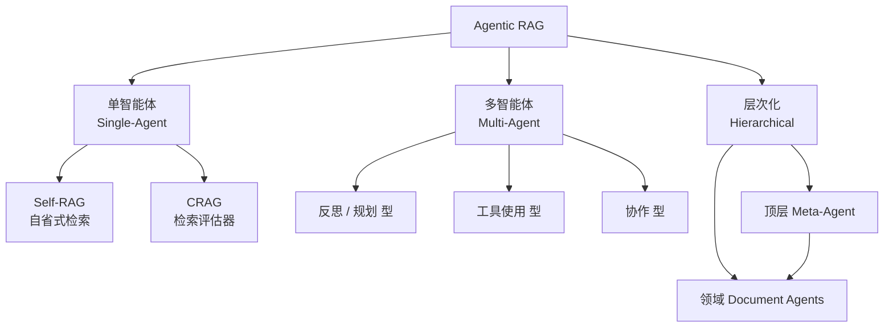
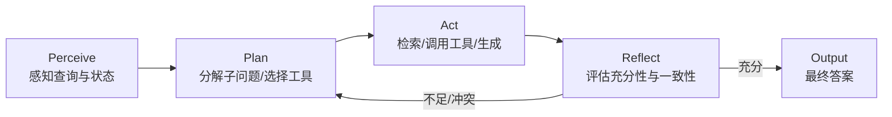

# Agentic RAG 技术深度解析

Agentic RAG 将大语言模型（LLM）从被动的"检索—拼接—生成"流水线升级为主动的、具备规划与自省能力的智能体，通过工具调用、反思与多智能体协作，在开放式与多跳推理场景下显著提升答案的事实性与鲁棒性。

## 摘要

检索增强生成（Retrieval-Augmented Generation, RAG）已经成为将大语言模型（LLM）与外部知识对齐的主流范式[[8]](#ref-8)。然而，传统的"一次性检索"RAG 在面对复杂、多跳或动态问题时存在 retrieval 噪声难以过滤、无法自适应决策、缺乏自我纠错等结构性短板。Agentic RAG 将智能体（Agent）范式引入检索流程，使系统具备**规划（Planning）、工具使用（Tool Use）、反思（Reflection）与多智能体协作（Multi-Agent Collaboration）** 四类核心能力[[1]](#ref-1)。本文系统梳理 Agentic RAG 的架构演进（从单智能体到多智能体）、关键机制（自省式检索、检索评估、自适应路由），并解析 Self-RAG[[2]](#ref-2)、CRAG[[3]](#ref-3)、LlamaIndex Agentic RAG[[4]](#ref-4) 与 Multi-Agent GraphRAG[[6]](#ref-6) 等代表性实现，最后给出能力对比与基准评测结论。

## 1 从 Passive RAG 到 Agentic RAG

传统 RAG 采用固定的三段式流水线：以查询原样检索、拼接上下文、生成答案。该范式在简单事实性问答上有效，但在以下场景表现脆弱：

- **检索质量不可控**：单轮检索难以覆盖多跳问题所需的全部证据，且返回片段可能包含噪声或冲突信息。
- **缺乏自适应决策**：系统无法判断"是否需要检索""检索是否充分""是否应改写查询或换用工具"。
- **无自我纠错**：生成结果一旦基于错误检索，便缺乏反馈回路进行修正。

Agentic RAG 的核心思想是用智能体循环（Agentic Loop）替代固定流水线，将检索视为可规划、可调用、可评估、可重试的**动作（Action）**。其理论框架可被形式化为部分可观测马尔可夫决策过程（POMDP），即 **PPAR**（Perceive–Plan–Act–Reflect）闭环[[10]](#ref-10)。该框架把"检索工具编排"建模为在部分观测状态下，由策略驱动的规划—执行—反思迭代。

## 2 架构分类

根据自主性与协作拓扑，Agentic RAG 可分为单智能体（Single-Agent）、多智能体（Multi-Agent）与层次化（Hierarchical）三类[[1]](#ref-1)。

<b>图1 Agentic RAG 的三类架构分类</b>

### 2.1 单智能体架构

单一智能体在 ReAct 式的"推理—行动"循环中自主决定检索时机与方式[[9]](#ref-9)。代表工作包括 Self-RAG 与 CRAG，分别在"自省式检索"与"检索质量评估"两个正交维度上做出关键贡献（见第 4 节）。

### 2.2 多智能体架构

多个角色化智能体（如规划者、检索者、 critic、合成者）分工协作，适合需要多角度证据整合的复杂任务[[1]](#ref-1)。Multi-Agent GraphRAG 即为典型：由 7 个专用智能体围绕 Memgraph 图数据库协作完成 text-to-Cypher 查询[[6]](#ref-6)。

### 2.3 层次化架构

顶层元智能体（Meta-Agent）负责路由与编排，底层多个领域智能体（Document Agents）各自精通局部知识源，最终由元智能体汇总[[4]](#ref-4)。该架构在知识库规模庞大、子领域异构时兼具可扩展性与精度。

## 3 PPAR 闭环：感知—规划—行动—反思

Agentic RAG 的标准运行模式可抽象为 PPAR 循环[[10]](#ref-10)：

<b>图2 PPAR 闭环 感知—规划—行动—反思</b>

- **感知（Perceive）**：解析用户意图、已检索证据与中间状态。
- **规划（Plan）**：将复杂问题分解为子查询，决定检索策略（向量检索、图遍历、Web 搜索等）。
- **行动（Act）**：执行检索或外部工具调用，并基于证据生成候选答案。
- **反思（Reflect）**：评估检索是否充分、证据是否一致、答案是否可靠；若不足则回到规划阶段迭代，直至满足退出条件。

## 4 关键机制

### 4.1 自省式检索（Self-Reflective Retrieval）

Self-RAG 提出在生成过程中插入**自省令牌（reflection tokens）**，使模型在"是否需要检索""检索到的证据是否相关""生成的陈述是否得到支持"三个层面进行细粒度判断[[2]](#ref-2)。其解码目标可写为：

$$S(y_t, d) = p(y_t \mid x, d, y_{<t}) + \sum_{G \in \mathcal{G}} w_G s_t^G$$

其中 $x$ 为输入，$d$ 为检索文档，$y_{<t}$ 为已生成前缀，$s_t^G$ 为第 $G$ 类自省令牌的判别得分，$w_G$ 为其权重。该机制将"是否检索"从系统级硬编码提升为模型自适应决策，在多个基准上优于标准 RAG 与纯生成[[2]](#ref-2)。

### 4.2 检索评估（Retrieval Evaluation）

CRAG 在检索后引入轻量级**检索评估器（retrieval evaluator）**，对查询—文档相关性打分为 *correct* / *incorrect* / *ambiguous* 三档[[3]](#ref-3)。对于 *correct*，直接采用检索结果；对于 *incorrect*，触发基于 Web 搜索的纠偏检索；对于 *ambiguous*，结合两者。CRAG 在 PopQA、Biography（FactScore）、PubHealth、Arc-Challenge 上相对强基线分别提升约 +7.0%、+14.9%、+36.6%、+15.4%[[3]](#ref-3)。

### 4.3 自适应路由（Adaptive Routing）

LlamaIndex 提出的 "agentic retrieval" 将查询在 `auto_routed` 检索器下进行自适应路由，组合向量检索、关键词检索与结构化查询（如 Text-to-SQL / Text-to-Cypher），并由知识智能体决定何时调用工具、何时直接回答[[5]](#ref-5)。这避免了传统 RAG 对所有查询机械执行同一检索路径的低效。

## 5 代表实现

| 系统 | 核心机制 | 定位 | 关键来源 |
| --- | --- | --- | --- |
| Self-RAG | 自省令牌 + 自适应检索 | 单智能体自省 | [[2]](#ref-2) |
| CRAG | 检索评估器 + Web 纠偏 | 单智能体评测 | [[3]](#ref-3) |
| LlamaIndex Agentic RAG | 多文档智能体 + 顶层路由 + 重排 | 层次化 | [[4]](#ref-4) |
| Multi-Agent GraphRAG | 7 智能体 + 图数据库 text-to-Cypher | 多智能体 + 图 | [[6]](#ref-6) |
| Microsoft Agent Framework + Neo4j | 框架级图检索集成 | 工程化 | [[7]](#ref-7) |

LlamaIndex 的层次化方案让每个文档/子知识源由一个 Document Agent 负责，顶层 Meta-Agent 仅做路由与汇总，配合重排（rerank）在大规模知识库上兼顾精度与成本[[4]](#ref-4)。Multi-Agent GraphRAG 则把图遍历能力赋予多个协作智能体，在复杂关系查询上较单智能体图检索显著提升：相对各基座模型，Gemini 2.5 Pro +10.23%、GPT-4o +6.79%、Qwen3 Coder +7.67%、GigaChat 2 MAX +10.01%[[6]](#ref-6)。

## 6 与 GraphRAG 的关系

图检索增强（GraphRAG）以知识图谱作为结构化知识源，擅长全局性与多跳关系推理[[8]](#ref-8)。Agentic RAG 与之正交且互补：智能体可把"图遍历/Text-to-Cypher"作为一种**工具**纳入行动空间。Microsoft Agent Framework 已提供 Neo4j GraphRAG 的原生集成，将图检索动作封装为智能体可调用工具[[7]](#ref-7)。因此"Agentic GraphRAG"可视为 Agentic RAG 在结构化知识源上的实例化。

## 7 基准与评测

近期研究强调多跳与"逐跳"（hop-aware）评测的重要性。AgenticRAGTracer 构建了 1305 个标注点、跨 1–4 跳的基准，发现即使最强模型（GPT-5）在最难的 4 跳任务上也仅达约 22.6% 的 Exact Match，揭示当前 Agentic RAG 在多跳保真度上仍有巨大提升空间[[11]](#ref-11)。SEAL-RAG 在 HotpotQA 多跳集上，当拼接证据数 $k=3$ 时相对 Self-RAG 提升约 3–13 个百分点[[12]](#ref-12)。CRAG 与 Multi-Agent GraphRAG 的提升数据分别见第 4.2 与第 5 节。

## 8 局限与挑战

- **多跳保真度不足**：如第 7 节所述，长链路推理易在中间跳累积错误[[11]](#ref-11)。
- **成本与延迟**：反思循环与多智能体协作带来多次 LLM 调用，需权衡质量与开销[[4]](#ref-4)。
- **工具编排复杂度**：工具越多，规划与错误传播越难控制，需可靠的反思/终止条件[[10]](#ref-10)。
- **评测缺口**：现有基准多聚焦端到端准确率，缺乏对"逐跳正确性"的细粒度度量[[11]](#ref-11)。

## 9 结论

Agentic RAG 通过规划、工具使用、反思与多智能体协作，将 RAG 从静态流水线升级为具备自主性的知识获取系统。Self-RAG 与 CRAG 确立了单智能体自省与评测的范式，LlamaIndex 与 Multi-Agent GraphRAG 证明了层次化与多智能体在规模化、图结构化场景的有效性。未来研究应聚焦于提升多跳保真度、降低协同成本，并建立 hop-aware 的评测体系。

## 参考文献

[1] A. Singh et al. ["Agentic RAG: A Survey on Multi-Agent Retrieval-Augmented Generation."](https://arxiv.org/abs/2501.09136) *arXiv*, 2025.

[2] A. Asai et al. ["Self-RAG: Learning to Retrieve, Generate, and Critique through Self-Reflection."](https://arxiv.org/abs/2310.11511) *ICLR*, 2024.

[3] S. Yan et al. ["Corrective Retrieval Augmented Generation (CRAG)."](https://arxiv.org/abs/2401.15884) *arXiv*, 2024.

[4] LlamaIndex. ["Agentic RAG with LlamaIndex."](https://www.llamaindex.ai/blog/agentic-rag-with-llamaindex-2721b8a49ff6) *LlamaIndex Blog*, 2024.

[5] LlamaIndex. ["RAG is dead, long live agentic retrieval."](https://www.llamaindex.ai/blog/rag-is-dead-long-live-agentic-retrieval) *LlamaIndex Blog*, 2025.

[6] Anonymous. ["Multi-Agent GraphRAG: A Multi-Agent Framework for Graph Retrieval-Augmented Generation."](https://arxiv.org/abs/2511.08274) *arXiv*, 2025.

[7] Microsoft. ["Agent Framework: Neo4j GraphRAG Integration."](https://learn.microsoft.com/en-us/agent-framework/integrations/neo4j-graphrag) *Microsoft Learn*, 2025.

[8] D. Edge et al. ["From Local to Global: A Graph RAG Approach to Query-Focused Summarization."](https://arxiv.org/abs/2404.16130) *arXiv*, 2024.

[9] S. Yao et al. ["ReAct: Synergizing Reasoning and Acting in Language Models."](https://arxiv.org/abs/2210.03629) *ICLR*, 2023.

[10] Anonymous. ["SoK: Agentic Retrieval-Augmented Generation."](https://arxiv.org/abs/2603.07379) *arXiv*, 2026.

[11] Anonymous. ["AgenticRAGTracer: A Hop-Aware Benchmark for Agentic RAG."](https://arxiv.org/abs/2602.19127) *arXiv*, 2026.

[12] Anonymous. ["SEAL-RAG: A Multi-Hop Retrieval-Augmented Generation Framework."](https://arxiv.org/abs/2512.10787) *arXiv*, 2025.
