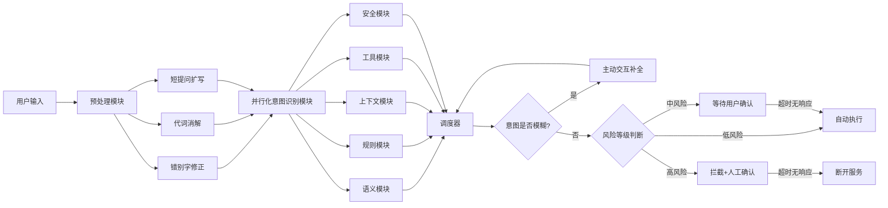

# Agent 意图识别完整落地方案 —— 并行化多模块意图识别

> 本文件由《Agent意图识别设计方案.md》与《Agent意图识别设计方案v1.md》合并而来，内容为三部分输入整合：① 并行化意图识别框架（五模块 + 调度器 + 主动补全 + 风险分级）② 三层识别器（规则→Embedding→LLM）③ 预处理模块（短提问扩写 / 代词消解 / 错别字修正）。

> 状态：设计定稿，实现中
> 定位：**独立模块** `intent/`（与 `agent_mvp/`、`memory/` 同级），agent_mvp 作为消费者
> 关联：memory-system（复用嵌入能力）、agent_mvp（ReAct 主循环）
> 本文整合三部分输入：
>   ① 并行化意图识别框架（语义/规则/上下文/工具/安全五模块 + 调度器 + 主动补全 + 风险分级）
>   ② 三层识别器（规则→Embedding→LLM）
>   ③ 预处理模块（短提问扩写 / 代词消解 / 错别字修正）

---

## 一、方案核心定位

构建 **"预处理净化 + 多维并行校验 + 动态交互补全 + 风险分级执行"** 的全流程意图识别体系：

- **预处理净化**：先修正错别字、消解代词、扩写短提问，保证后续识别输入干净；
- **多维并行校验**：语义/规则/上下文/工具/安全五维度并行，输出"主意图 + 多动作 + 候选工具 + 风险等级 + 置信度"；
- **动态交互补全**：模糊意图主动提问补全；
- **风险分级执行**：低/中/高风险分级配不同执行与超时策略。

解决四类问题：多意图被压扁、临时改口被误解、短提问信息缺失、错别字/代词导致识别失败。

---

## 二、整体流程架构



---

## 三、预处理模块（新增）

> 职责：并行识别前净化输入，**保留用户核心意图，不添加无关信息**。任一子步骤失败 → 置 `ambiguous` 标志，走主动交互补全，避免错误识别。

### 1. 短提问扩写（信息缺失补全）

- **不需要扩写**：
  - 信息完整："查周报"、"发邮件"（有明确动作+目标，上下文/规则可识别）；
  - 高频通用指令："打开文件"、"关闭系统"（有明确标签匹配）。
- **需要扩写**：
  - 存在歧义："处理合同"、"发消息"（动词泛化）；
  - 首次提问且无上下文："帮我弄一下报表"。
- **守卫规则**：`len(text) < 5` 且 **不匹配** 已知动作模式（查/发/打开/关闭/算/记住+目标）且无可用上下文时才扩写。
- **实现**：注入式 `llm_expand(text, history)` 回调（无回调不扩写，返回原样），prompt 要求"扩写补充合理细节、不改变原意"。
- 示例："处理合同" → "帮我查找并审查昨天的合同里有没有风险条款"。

### 2. 代词消解（上下文指代还原）

- **消解对象**：指物代词 `它/这个/那个/这份/这些/它们/此`；
- **不动人称**：`你/我`（分别指向助手/用户，不参与替换）；
- **步骤**：从对话历史提取最近实体（业务词库命中 + 文件/人/事件）→ 替换代词 → 返回消解后文本；
- **失败兜底**：出现代词但无实体可消解 → 置 `ambiguous=true`。
- 示例：历史"帮我把昨天那份合同找出来"，当前"帮我看看它有没有风险条款" → 消解为"帮我看看昨天那份合同有没有风险条款"。

### 3. 错别字修正（业务词库纠错）

- **词库**：业务专属词（周报/合同/客户资料/报表/风险条款…），存 `business_vocab.json` 可扩展；
- **实现**：滑窗 + 编辑距离 ≤1 匹配词库词，命中替换（"周抱"→"周报"）；
- **可选**：LLM 二次确认修正结果（默认关闭，确定性优先，便于测试）；
- **失败兜底**：修正后文本与原文本差异过大 → 置 `ambiguous=true`。

### 预处理流程

```python
def process(text, history):
    text = correct_typos(text)              # ① 错别字
    text, amb = resolve_pronouns(text, history)   # ② 代词
    text = expand_short_query(text, history)      # ③ 短提问
    return text, amb
```

---

## 四、并行化意图识别模块（五维度）

### 1. 语义模块（Semantic）
- 拆解动作列表与优先级（多意图不压扁）+ 主意图粗分类；
- 输出：`actions: [{action, target, priority}]`、`intent`；
- 实现：**Embedding 少样本层**（复用 memory-system 的 BGE，`sim>0.55` 采信）→ 落入模糊带 `0.35~0.55` 交给 **LLM 层**；`<0.35` 默认 `question`；
- LLM 层输出严格 JSON，宽松解析（正则提取首个 `{...}`），失败回退 `question`；回调可注入。

### 2. 规则模块（Rule）
- 确定性硬信号，零成本可解释：命令前缀→`command`；祈使句式（请记住/帮我记住/别忘了/写进记忆）→`memory_write`；疑问句式（记住了吗/还记得吗/记得吗/记起来）→`memory_query`；问候→`chat`；疑问词→`question`；工具线索正则→`tool_use`；
- 输出风险标签与 `slots`。

### 3. 上下文模块（Context）
- 识别修正信号（算了/等等/先别/改成/优先/其实是）→ 对动作重排序；
- 提供历史实体供代词消解；`_recall` 召回的相关记忆作补充。

### 4. 工具模块（Tool）
- 基于工具注册表能力描述 + 线索映射（算→calculator / 几点→get_time / 读→read_file / 记住→remember / 查记忆→memory_query）输出候选工具；
- **具体选择仍由 function calling 决定**，本模块只出候选。

### 5. 安全模块（Safety）
- 风险分级：低（读取/查询/分析，含现有 4 工具与问答）、中（修改/发送/导出，P1 启用）、高（删除/批量/外发敏感信息）；
- 高危关键词（删除/清空/全部/批量/群发/外发/永久）命中即 `high`；
- 权限接口 `check_permission(action, user)` 预留（P2）。

---

## 五、调度器与执行计划

合并五模块 → `ExecutionPlan`：

```json
{
  "intent": "tool_use",
  "actions": [{"action": "查询", "target": "周报人员", "priority": 1}],
  "tools": ["read_file"],
  "risk_level": "low",
  "confidence": 0.9,
  "ambiguous": false,
  "source": "rule|embedding|llm",
  "slots": {"content": "..."},
  "original": "…", "processed": "…"
}
```

取值优先级：**规则命中 > 高相似度 Embedding > LLM**。

---

## 六、主动交互补全与风险分级执行

| 等级 | 触发 | 执行逻辑 | 超时 |
|---|---|---|---|
| 模糊 | confidence<0.7 或 ambiguous | `ask_user` 选项式/问答式，结果回灌重识别 | 30s 无响应→默认方案 |
| 低风险 | — | 自动执行 | 无需等待 |
| 中风险 | 修改/发送/导出动作 | 展示计划等待确认 | 30s 无响应→自动执行 |
| 高风险 | 高危词命中 | 拦截，返回安全提示 | 60s 无响应→断开(P1) |

`ask_user(prompt, timeout) -> str | None` 为可注入回调：REPL 注入 `input()` 包装，API 场景不注入则跳过交互走默认方案。

---

## 七、独立模块结构与类图

### 目录（与 agent_mvp、memory 持平）

```
intent/
├── pyproject.toml                # 包名 intent-recognizer；依赖 memory-system；dev 含 pytest
├── intent_recognizer/
│   ├── __init__.py
│   ├── preprocess.py             # 预处理（错别字/代词/短提问扩写）
│   ├── modules.py                # Rule/Context/Tool/Safety/Semantic 五模块
│   ├── recognizer.py             # ExecutionPlan + IntentRecognizer（调度编排）
│   └── resources/
│       ├── business_vocab.json   # 业务词库（可扩展）
│       └── intent_examples.json  # 各意图少样本示例
└── tests/
    └── test_intent.py            # 单测（pytest）
```

### 类图

```mermaid
classDiagram
    class IntentRecognizer {
        -preprocessor : Preprocessor
        -semantic : SemanticModule
        -rule : RuleModule
        -context : ContextModule
        -tool : ToolModule
        -safety : SafetyModule
        -llm_classify : Callable|None
        +recognize(text, history) ExecutionPlan
    }
    class Preprocessor {
        -business_vocab : dict
        -llm_expand : Callable|None
        +process(text, history) tuple[str, bool]
        +correct_typos(text) str
        +resolve_pronouns(text, history) tuple[str, bool]
        +expand_short_query(text, history) str
    }
    class SemanticModule {
        -embedding_threshold : float
        -embedding_fallback : float
        -llm_classify : Callable|None
        +analyze(text) SemanticResult
        -embedding_recognize(text) tuple[str|None, float]
        -llm_recognize(text) dict
    }
    class RuleModule {
        +match(text) RuleResult
        -_match_persist(text) str|None
        -_match_query(text) str|None
    }
    class ContextModule {
        -correction_markers : list[str]
        +detect_correction(text) bool
        +extract_entities(history) list[str]
    }
    class ToolModule {
        -tool_hints : dict
        +suggest(text, intent) list[str]
    }
    class SafetyModule {
        -high_risk_keywords : list[str]
        +assess(actions, text) str
    }
    class ExecutionPlan {
        +intent : str
        +actions : list
        +tools : list
        +risk_level : str
        +confidence : float
        +ambiguous : bool
        +source : str
        +slots : dict
        +original : str
        +processed : str
        +name : str
    }
    IntentRecognizer --> Preprocessor
    IntentRecognizer --> SemanticModule
    IntentRecognizer --> RuleModule
    IntentRecognizer --> ContextModule
    IntentRecognizer --> ToolModule
    IntentRecognizer --> SafetyModule
    IntentRecognizer --> ExecutionPlan
    SemanticModule ..> memory_system.utils.embeddings : generate_embedding/cosine_similarity
    Preprocessor ..> resources/business_vocab.json
    SemanticModule ..> resources/intent_examples.json
    Agent ..> IntentRecognizer : 注入 llm_classify / llm_expand / ask_user
```

---

## 八、与 agent_mvp 的接入

```
run(user_input):
  history = 最近 N 轮消息文本
  plan = recognizer.recognize(user_input, history)   # ① 预处理+五模块+调度
  if plan.confidence < fuzzy_threshold or plan.ambiguous:
      plan = _interactive_complete(plan, user_input)  # ② 主动补全（ask_user）
  if plan.risk_level == HIGH:
      return _block_high_risk(plan)                    # ③ 拦截
  if plan.risk_level == MID and not _confirm_plan(plan):
      return "已取消"                                  # ④ 中风险确认
  self._persisted_this_turn = False
  if plan.intent == MEMORY_QUERY:
      return _answer_memory_query(user_input)          # ⑤ 查询短路（直查库）
  context = self._recall(user_input)
  user_content = 组装([回忆]【用户意图:… 计划:…】问题)   # ⑥ 意图注入
  ReAct 循环 …
  回合结束: record + (plan.intent==MEMORY_WRITE and not flag) → persist
```

> 关键时序（沿用自检结论）：`memory_write` 持久化放**回合结束时**，由 `_persisted_this_turn` 标志防与 `remember` 工具双写；`memory_query` 直查库不调 LLM。

---

## 九、关键设计决策

| # | 决策 | 备选 | 理由 |
|---|---|---|---|
| 1 | 独立模块 `intent/` 包 | 内置 agent_mvp | 复用、可测、与 memory 同级 |
| 2 | LLM 依赖回调注入，intent 不 import openai | intent 自带 client | 框架无关、单测可注入 fake |
| 3 | 预处理在规则层之前，带"完整短指令守卫" | 一律扩写 | 避免破坏确定性规则识别 |
| 4 | 代词只消解指物，不消解人称 | 全消解 | 人称指向明确，替换反而引入噪声 |
| 5 | 持久化放回合结束，标志防双写 | 意图时立即落库 | 避免与 remember 工具双写 |
| 6 | Embedding 层 mock 模式跳过 + 置信度门控 | 照常/一律 LLM | hash 向量无语义；控制成本 |
| 7 | LLM 宽松解析 + 可注入回调 | 严格 JSON | 代理模型输出不稳 |
| 8 | memory_query 直查库 | LLM 转述 | 零额外往返 |
| 9 | 工具选择交 function calling | 意图层选工具 | 复用 API 原生能力 |
| 10 | 中/高风险按工具能力渐进启用 | 一次全量 | 本项目暂无中高风险工具 |

---

## 十、配置

```yaml
intent:
  embedding_threshold: 0.55
  embedding_fallback: 0.35
  fuzzy_threshold: 0.7
  confirm_timeout: 30
  highrisk_timeout: 60
safety:
  high_risk_keywords: ["删除", "清空", "全部", "批量", "群发", "外发", "永久"]
```

intent 包内置默认值，config 可覆盖。

---

## 十一、测试与验证

### intent 包单测（tests/test_intent.py，pytest）
| 用例 | 期望 |
|---|---|
| "请记住我家在杭州" | `memory_write` |
| "你记住了吗？把从数据库查给我看" | `memory_query`（回归项） |
| "还记得我上次说的吗" | `memory_query` |
| "你好" | `chat` |
| "什么是RAG？" | `question` |
| "帮我算 3*(2+5)" | `tool_use`，候选含 calculator |
| "帮我处理一下合同" | 短提问歧义 → 触发扩写/补全 |
| "把客户资料全删掉" | `high` 风险 → 拦截 |
| "周抱"（历史含"周报"） | 错别字修正为"周报" |
| 历史"昨天那份合同"+ "它有没有风险" | 代词消解为"合同" |
| "算了，先看风险" | 修正信号 → 重排序 |

覆盖：预处理三个子模块、规则层确定性、Embedding 门控（real 模式）、LLM 注入 fake 验证解析与回退、风险分级、mock 模式跳过 Embedding。

### agent_mvp 集成测试（tests/test_intent_integration.py）
- 注入 fake `llm_classify`/`ask_user`，验证 run() 路由：memory_write 落库 1 条无双写、memory_query 返回列表、高风险被拦截、模糊触发补全。

### 端到端（real 优先，内存不足切 mock）
1. "请记住我家在杭州" → 入库 1 条
2. "你记住了吗？把从数据库查给我看" → 返回记忆列表
3. "3*(2+5)" → calculator 正常
4. "把客户资料全删掉" → 被拦截

---

## 十二、已知限制

- LLM 层/扩写额外成本：已用门控与守卫压低频率；
- Embedding 非分类专用，阈值需实测微调；
- 上下文模块为轻量信号词，复杂指代依赖 LLM 兜底；
- 安全基于规则词库，权限系统为 P2；
- 预处理"不添加无关信息"依赖 prompt 约束，极端情况可能偏离原意。

---

## 十三、实施顺序

1. `intent/` 包骨架：pyproject + resources + preprocess
2. modules.py（五模块）+ recognizer.py（调度）
3. intent 包单测（pytest）跑绿
4. agent_mvp 接入：pyproject 依赖、config、agent.py 路由 + `/intent`
5. agent_mvp 集成测试
6. E2E 验证（real / mock）
