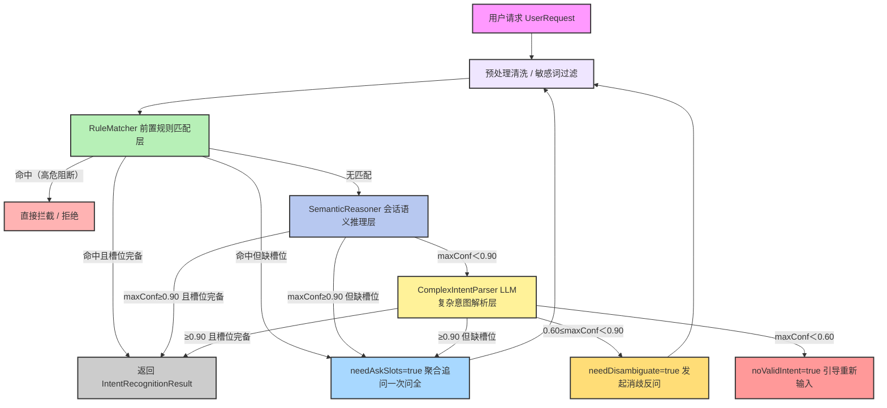

# Agent意图识别三层漏斗架构设计方案（合并 v3 优化点）

> 版本：V3.2 — 三层漏斗框架（规则→轻量语义→LLM）
> 合并记录：
> ① 相对 v3：低成本优先降本；三层输出完全同构；补齐 **槽位完备性 + 缺失聚合一次追问、槽位缓存与检查点、会话持久化、LLM 格式重试/规则降级、参数合法性校验、并行/串行编排预留**。
> ② 相对 草稿.md：并入**完整 Mermaid 实现类图**（类/接口/关系）、`DialogStateTracker` 会话状态、`FunctionCallResolver / FunctionDefineSchema` 工具 Schema、`MatchRule` 规则定义，并将类图字段对齐至 V3 统一 JSON 模型。

## 一、方案概述
本方案采用**三层串行漏斗架构**实现AI Agent意图识别，遵循「低成本优先、逐级兜底、分层降噪」的设计思想。优先使用规则、轻量模型承载绝大多数流量，仅复杂长尾请求走大模型解析，极致平衡**推理成本、响应延迟与识别准确率**。

架构完全支持**多意图识别 + 槽位抽取 + 槽位追问闭环**，三层模块输出结构完全统一，适配对话消解、参数补全、工具调用、人工兜底等全链路业务场景。

## 二、模块最终命名（全局统一）
**顶层调度模块**：IntentRecognition（意图识别总入口、漏斗路由调度）

**三层能力分层**
1. **RuleMatcher**：前置规则匹配层
2. **SemanticReasoner**：会话语义推理层
3. **ComplexIntentParser**：LLM复杂意图解析层

命名规范：统一名词后缀（Matcher / Reasoner / Parser），风格一致、语义各司其职，工程可读性、可维护性极强。

## 三、核心流转策略（阈值定稿、业务分支固定）
### 3.1 整体漏斗顺序
用户输入 → **预处理清洗/敏感词过滤** → RuleMatcher（命中直接返回）→ 未命中进入 SemanticReasoner → 语义置信不足进入 ComplexIntentParser → 三层统一走**四分支交互兜底**

四分支（任意一层输出的结果都收敛到同一套分支）：
1. `maxConf ≥ 阈值` 且 **槽位完备**：直接执行
2. `maxConf ≥ 阈值` 但 **必填槽位缺失**：`needAskSlots=true`，缺失槽位**一次聚合追问**
3. 残留歧义（如 0.6~0.9）：`needDisambiguate=true`，消歧反问
4. 无有效意图（<0.6）：`noValidIntent=true`，引导重新输入

### 3.2 分层阈值策略（固定不变）
- **RuleMatcher**：命中即 1.0 置信度返回；未命中放行。
- **SemanticReasoner 阈值：0.9**
  - 最大置信度 ≥ 0.9：识别可信，进入槽位完备性检查（缺失 → 追问闭环），通过后更新会话状态并返回
  - 最大置信度 ＜ 0.9：语义模糊，下放 LLM 解析层
- **ComplexIntentParser 三段式阈值（核心分支）**
  - ≥ 0.90：高置信有效意图，槽位完备则正常执行，缺失槽位则聚合追问
  - 0.60 ~ 0.90：存在歧义，触发**消歧反问**（AskPromptBuilder 统一追问链路）
  - ＜ 0.60：无有效意图，引导用户**重新输入**

> 槽位完备性检查在每层返回前执行：若意图命中但必填槽位缺失，则将该意图标记 `missSlots`，跨意图统一汇聚为一次追问，禁止逐字段骚扰（复用 v3 聚合追问思想）。

## 四、全局统一数据模型（支持多意图+槽位，三层同构）
整套架构**三层输出完全同构**，调度器无需感知下层实现，天然支持多意图场景。
统一输出采用 **snake_case JSON**，作为全链路通用消息结构：即使是中间态识别结果，也以 `from: "bot"` 的机器人消息形式统一吐给上层（含 SSE 流式），保证协议一致。

### 4.1 输入模型：UserRequest
- content：用户文本内容
- userId：用户唯一标识
- sessionId：会话唯一标识
- extraParamMap：扩展字段

### 4.2 统一输出结构（JSON 定稿，三层通用）
```json
{
  "text": "帮我订张去北京的机票",
  "from": "bot",
  "source_layer": "semantic_reasoner",
  "need_disambiguate": false,
  "no_valid_intent": false,
  "intents": [
    {
      "name": "book_flight",
      "confidence": 0.94,
      "priority": 1,
      "entities": [
        {"entity": "destination", "value": "北京", "normalized_value": "PEK", "raw_text": "北京", "confidence": 0.99}
      ]
    }
  ],
  "intent_ranking": [
    {"name": "book_flight", "confidence": 0.94},
    {"name": "book_train", "confidence": 0.04}
  ],
  "session_id": "sess_123",
  "request_id": "req_abc"
}
```

字段说明（对应实体 4.3/4.4）：
- text：本次识别处理的文本（用户原句或预处理后文本）
- from：消息来源，固定 `"bot"`——识别结果视为机器人产出，统一走 bot 消息管道（含 SSE）
- sourceLayer：识别来源（rule_matcher / semantic_reasoner / complex_parser）
- needDisambiguate：是否需要消歧反问
- noValidIntent：是否无有效意图
- **needAskSlots：是否缺槽位需聚合追问（可选扩展）**
- **askSlots：缺失必填槽位列表，一次问全（可选扩展）**
- **askPrompt：已生成的聚合追问话术（可选扩展）**
- intentRanking：候选意图排序（供消歧 / 日志 / 评估）
- sessionId / requestId：会话与请求链路标识（关联 trace）

### 4.3 单意图单元：IntentItem
- name：意图名称
- confidence：该意图独立置信度
- priority：意图优先级（多意图执行顺序参考）
- entities：槽位列表 `List<EntityItem>`
- **complete：该意图必填槽位是否完备（可选扩展）**
- **missSlots：缺失必填槽位列表（用于聚合追问，可选扩展）**

### 4.4 槽位结构体：EntityItem
- entity：槽位名称
- value：解析结果值
- **normalizedValue：规范化/归一化值（如 `北京 → PEK`，供工具直接消费）**
- rawText：原文匹配片段
- confidence：槽位抽取置信度
- **valid：参数是否通过合法性校验（正则/枚举，可选扩展）**

## 五、各层级详细职责（最终落地版）
### 5.1 RuleMatcher 前置规则匹配层
**定位**：零算力开销、毫秒级响应，负责高频标准化流量削峰。

**能力**：关键词匹配、正则匹配、固定句式识别、静态槽位抽取、**高危词/阻断信号硬拦截**。

**执行流程**
1. 文本清洗归一化
2. 敏感/高危信号硬拦截（最高优先级，不进入语义与 LLM）
3. 按优先级批量匹配规则集（`MatchRule`：ruleId / regexPattern / keywordList / priorityLevel）
4. 命中则生成意图、槽位，并按 `SlotCompletenessChecker` 补齐完备性信息后返回
5. 无匹配放行至语义层

**约束**：只处理**固定、无口语变体**的标准意图，不负责泛语义理解。

### 5.2 SemanticReasoner 会话语义推理层
**定位**：系统主力识别层，承接常规会话流量，解决同义、指代、多轮省略问题。

**能力**：轻量模型分类、Embedding语义相似度匹配、会话状态 DST 推理（含槽位缓存回填）。

**执行流程**
1. `DialogStateTracker.getSessionState(sessionId)` 读取会话状态，**回填已确认槽位与检查点**
2. 上下文拼接推理（含历史 Query 与画像）
3. 双路融合打分（模型分类 + 向量相似度 `SemanticSimilarMatcher`）
4. 输出多意图结果
5. 最高置信 ≥0.9：进入**槽位完备性检查**，缺失 → `needAskSlots` 聚合追问；完备 → 返回并 `updateDialogState`
6. 最高置信 ＜0.9：语义不确定，下放LLM层

**约束**：只处理常规语句，超长/多诉求混行下放 LLM，避免小模型幻觉。

### 5.3 ComplexIntentParser LLM复杂意图解析层
**定位**：全链路兜底层，专门处理模糊、混杂、多诉求、超长、未知长尾Query。

**能力**：FunctionCall 复杂意图解析、多意图识别、复杂槽位抽取、结果合法性校验。

**执行流程**
1. 组装会话上下文 + 意图Schema + 工具定义Prompt（`FunctionDefineSchema`）
2. **硬超时限流**调用大模型（`requestTimeoutMs`），防阻塞
3. `FunctionCallResolver.resolveOutput` 解析输出，失败自动重试 2 次
4. 解析仍失败 → **降级为规则层兜底**（`RuleMatcher` 回退）
5. 槽位合法性校验（`EntityItem.valid`，正则/枚举），非法值纳入追问
6. 按**四分支**收敛：
   - ≥0.9 且槽位完备：正常交付
   - ≥0.9 但需求槽位：聚合追问一次问全
   - 0.6~0.9：需要歧义，消歧反问
   - ＜0.6：无有效意图，引导重新输入

**约束**：仅兜底使用，禁止全量流量打入，控制成本与延迟。

## 六、业务流转流程图


## 七、核心调度伪代码（最终定稿）
```python
def recognize_intent(request: UserRequest) -> IntentRecognitionResult:
    # 0. 预处理 + 会话加载 & 槽位缓存回填
    dialog_state = dialogTracker.getSessionState(request.sessionId)
    request.filled_slots = dialogState.filledSlotMap  # 已确认槽位自动注入

    # 1. 前置规则匹配优先
    rule_result = intentRecognition.ruleMatcher.matchRequest(request)
    if rule_result.intentList:
        return _finalize(request, rule_result)   # 内含槽位完备性与缓存落盘

    # 2. 会话语义推理处理常规 Query
    semantic_result = intentRecognition.semanticReasoner.inferIntent(request)
    if semantic_result.intentList:
        max_conf = max(item.confidence for item in semantic_result.intentList)
        if max_conf >= 0.90:
            return _finalize(request, semantic_result)

    # 3. LLM 复杂解析兜底
    llm_result = intentRecognition.complexIntentParser.parseComplexIntent(request)
    if not llm_result.intentList:
        llm_result.noValidIntent = True
        return _finalize(request, llm_result)

    max_conf = max(item.confidence for item in llm_result.intentList)
    if max_conf < 0.60:
        llm_result.noValidIntent = True
    elif 0.60 <= max_conf < 0.90:
        llm_result.needDisambiguate = True
    return _finalize(request, llm_result)


def _finalize(request: UserRequest, result: IntentRecognitionResult) -> IntentRecognitionResult:
    # 槽位完备性：扣除缓存回填后，跨意图聚合缺失槽位
    missing = slotChecker.collectMissingSlots(result.intentList, request.filled_slots)
    if missing:
        result.needAskSlots = True
        result.askSlots = missing
        result.askPrompt = askPromptBuilder.build(missing)   # 一次问全
    # 会话状态落盘（已确认槽位 / 检查点）
    if result.intentList and not (result.noValidIntent or result.needDisambiguate):
        dialogTracker.updateDialogState(request, result)
    return result
```

## 八、会话状态与槽位缓存（DialogStateTracker）
解决 **会话上下文持久化 + 已填槽位复用 + 中断恢复**（承接 v3 检查点/缓存思想，落地 V3 的 DST 能力）。

**组件结构**（详见 §十 类图）
- `DialogStateTracker`：会话状态管理者，`getSessionState(sessionId)` / `saveSessionState(...)` / `exportFilledSlots(...)`
- `DialogSessionState`：会话快照，字段包括：
  - `lastIntentText`：最近识别的意图
  - `filledSlotMap`：已确认槽位字典（`Map<slotName, EntityItem>`）→ 识别前回填，避免重复询问
  - `missSlotSet`：历史待补槽位
  - `historicalQueryList`：近期用户原始输入（供消解、指代、语义召回）
  - `checkpoint`：上次识别中间态 `IntentRecognitionResult`（中断后恢复进度）

**读写时机**
1. 每个请求进入语义/LLM 层前：读出会话并**回填缓存槽位**；
2. 每层返回且发生槽位更新：`updateDialogState` 写入，回复后持久化；
3. 多实例场景：会话状态外置（Redis / DB），保证横向扩展不丢状态。

**槽位追问闭环（一次问全）**
- `SlotCompletenessChecker.check(intents, filled)`：扣除已填槽位，输出缺失槽位 `askSlots`
- `AskPromptBuilder.build(askSlots)`：跨意图聚合成一条话术（如"请补充：充值手机号、充值金额"）
- 用户补全后携带缓存重新进入漏斗，避免重复询问

## 九、鲁棒性与兜底
1. **硬超时**：LLM 层设 `requestTimeoutMs`，超时快速失败，不阻塞整条链路；
2. **输出格式兜底**：FunctionCall/JSON 解析失败自动重试 2 次 → 仍失败**降级为规则层**识别；
3. **参数合法性校验**：`EntityItem.valid` 经正则/枚举校验，非法槽位转入追问，不直接执行；
4. **槽位一致性**：执行层消费 `normalizedValue`，避免同义值/脏值入工具；
5. **会话降级**：缓存读取失败或格式损坏 → 重建空会话，不抛异常。

## 十、完整实现类图（Mermaid，字段对齐 V3 统一 JSON 模型）

```mermaid
classDiagram
    %% ========== 入口调度 ==========
    class IntentRecognition {
        +RuleMatcher ruleMatcher
        +SemanticReasoner semanticReasoner
        +ComplexIntentParser complexIntentParser
        +SlotCompletenessChecker slotChecker
        +DialogStateTracker dialogTracker
        +recognizeIntent(UserRequest request) IntentRecognitionResult
    }

    %% ========== 请求 / 响应模型 ==========
    class UserRequest {
        +String content
        +String userId
        +String sessionId
        +Map~String,Object~ extraParamMap
    }
    class IntentRecognitionResult {
        +String text
        +String from
        +String sourceLayer
        +boolean needDisambiguate
        +boolean noValidIntent
        +boolean needAskSlots
        +List~String~ askSlots
        +String askPrompt
        +List~IntentItem~ intents
        +List~IntentRankingItem~ intentRanking
        +String sessionId
        +String requestId
    }
    class IntentItem {
        +String name
        +float confidence
        +int priority
        +List~EntityItem~ entities
        +boolean complete
        +List~String~ missSlots
    }
    class EntityItem {
        +String entity
        +String value
        +String normalizedValue
        +String rawText
        +float confidence
        +boolean valid
    }
    class IntentRankingItem {
        +String name
        +float confidence
    }

    %% ========== 第一层：规则匹配 ==========
    class RuleMatcher {
        +List~MatchRule~ ruleList
        +matchRequest(UserRequest request) IntentRecognitionResult
        +addMatchRule(MatchRule rule)
        +removeMatchRule(String ruleId)
    }
    class MatchRule {
        +String ruleId
        +String targetIntentName
        +Pattern regexPattern
        +List~String~ keywordList
        +int priorityLevel
        +isTextMatch(String text) boolean
    }

    %% ========== 第二层：语义推理 ==========
    class SemanticReasoner {
        +LightClassificationModel lightModel
        +SemanticSimilarMatcher semanticMatcher
        +DialogStateTracker dialogTracker
        +float confidenceThreshold
        +inferIntent(UserRequest request) IntentRecognitionResult
        +updateDialogState(UserRequest request, IntentRecognitionResult result)
    }
    class LightClassificationModel {
        +String modelStoragePath
        +predictIntentProb(String text) Map~String,Float~
    }
    class SemanticSimilarMatcher {
        +Map~String,float[]~ intentEmbeddingMap
        +queryTopSimilar(String text) List~IntentItem~
    }
    class DialogStateTracker {
        +Map~String,DialogSessionState~ sessionCache
        +getSessionState(String sessionId) DialogSessionState
        +saveSessionState(String sessionId, DialogSessionState state)
        +exportFilledSlots(String sessionId) Map~String,EntityItem~
    }
    class DialogSessionState {
        +String lastIntentText
        +Map~String,EntityItem~ filledSlotMap
        +Set~String~ missSlotSet
        +List~String~ historicalQueryList
        +IntentRecognitionResult checkpoint
    }

    %% ========== 槽位完备性与追问 ==========
    class SlotCompletenessChecker {
        +collectMissingSlots(List~IntentItem~ intents, Map~String,EntityItem~ filled) List~String~
    }
    class AskPromptBuilder {
        +build(List~String~ askSlots) String
    }

    %% ========== 第三层：LLM 解析 ==========
    class ComplexIntentParser {
        +BaseLlmClient llmClient
        +FunctionCallResolver functionCallResolver
        +int requestTimeoutMs
        +parseComplexIntent(UserRequest request) IntentRecognitionResult
    }
    class BaseLlmClient {
        +String modelIdentifier
        +syncGenerate(String prompt) String
    }
    class FunctionCallResolver {
        +List~FunctionDefineSchema~ schemaList
        +resolveOutput(String llmRaw) List~IntentItem~
        +parseRetry(String llmRaw, int maxRetry) List~IntentItem~
    }
    class FunctionDefineSchema {
        +String functionName
        +String description
        +Map~String,Object~ paramSchema
    }

    %% ========== 关系 ==========
    IntentRecognition --> UserRequest
    IntentRecognition --> RuleMatcher
    IntentRecognition --> SemanticReasoner
    IntentRecognition --> ComplexIntentParser
    IntentRecognition --> SlotCompletenessChecker
    IntentRecognition --> DialogStateTracker
    IntentRecognition --> IntentRecognitionResult

    IntentRecognitionResult "1" --> "*" IntentItem : 多意图
    IntentItem "1" --> "*" EntityItem
    IntentRecognitionResult "1" --> "*" IntentRankingItem

    RuleMatcher "1" --> "*" MatchRule
    MatchRule --> IntentItem

    SemanticReasoner --> LightClassificationModel
    SemanticReasoner --> SemanticSimilarMatcher
    SemanticReasoner --> DialogStateTracker
    DialogStateTracker "1" --> "*" DialogSessionState

    ComplexIntentParser --> BaseLlmClient
    ComplexIntentParser --> FunctionCallResolver
    FunctionCallResolver "1" --> "*" FunctionDefineSchema
```


## 十一、多意图并行/串行编排扩展（可选 · 识别后层）
漏斗定位在"识别"，识别出的多意图交由上层编排：
- `parseDependencies(intents)` 解析意图间并行/串行依赖（继承 v3 `IntentDependService`/`TaskGroup` 思想）；
- **并行意图**：按 `priority` 并发分发至工具/业务执行层；
- **串行意图**：前序结果写回 `DialogSessionState.filledSlotMap`，后续意图缺失槽位自动回填后继续。
> 该编排作为适配层保留在识别层之外，不破坏三层漏斗内部结构。

## 十二、方案核心优势
1. **分层解耦、成本最优**：规则扛高频、小模型扛主力、大模型扛长尾，大幅降低 LLM 调用量与延迟；
2. **全层级同构、统一 JSON 输出**：`sourceLayer + intents + intentRanking + normalizedValue`，业务上层无需适配多套结构；
3. **对话闭环完整**：正常执行 / 消歧反问 / **槽位缺失一次问全** / 无意图重输，覆盖全部对话场景；
4. **会话可恢复**：槽位缓存 + 检查点，中断续聊不重复询问；
5. **鲁棒容错**：超时、格式重试、规则降级、参数合法性校验，降低 LLM 幻觉影响；
6. **工程规范极强**：统一命名 + 完整 Mermaid 类图 + 固定阈值，可直接用于开发落地与技术评审。

> 已从 docs/草稿.md 合并：完整实现类图、`DialogStateTracker` 会话状态/槽位缓存、`FunctionCallResolver` 工具 Schema、`MatchRule` 规则定义，字段均对齐 V3 统一 JSON 模型。