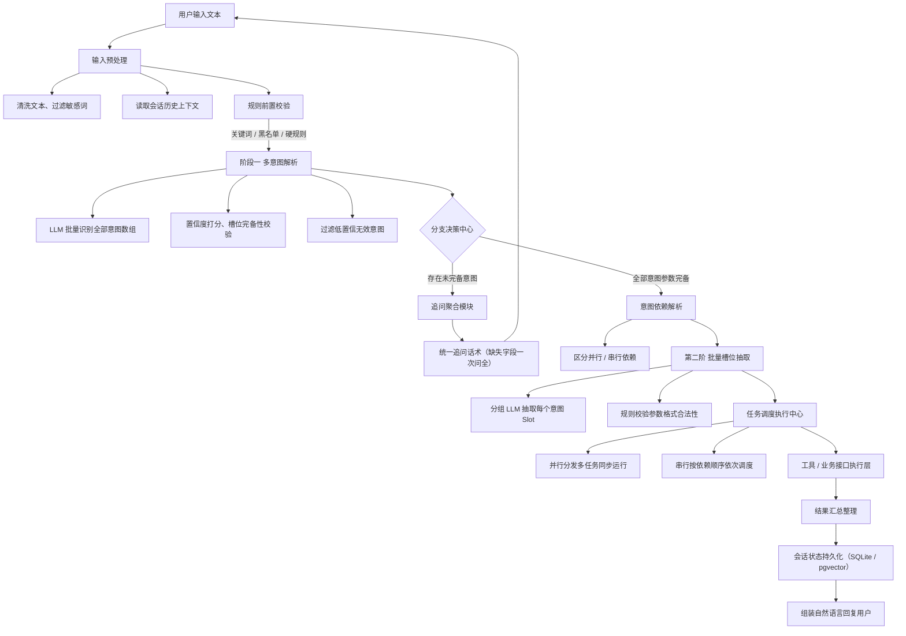

# Agent 意图识别设计方案（V3）—— 两阶段 LLM 多意图识别

> 版本：V3.0（两阶段 LLM 多意图识别，替代 v1/v2 单轮五维度并行方案；已按 intent/ 实际实现校验类图与数据表对接）
> 状态：设计定稿
> 定位：**独立模块** `intent/`，作为 agent_mvp 的依赖子模块接入，替换沿用 v1/v2 的单轮多模块并行方案
> 技术栈：Python ≥ 3.11 + SQLite（sqlite3）+ memory-system（BGE/mock 嵌入）；**不绑定 LangGraph/LangChain 等重框架**，纯自研编排可落地
> 适用范围：对话型 Agent、客服机器人、工具调用智能助手
> 数据对接：复用 agent_mvp/agent_memory.db 现有记忆模块数据表（memory_items / user_profiles / memory_versions / event_stream / kv_items / graph_*），不新建会话表

---

## 目 录
1. 整体需求概述
2. 核心概念定义（意图、槽位、多意图依赖）
3. 系统整体架构流程图
4. 分层模块详细设计
5. 完整模块类图（详细，含数据访问层）
6. 两阶段标准数据结构
7. 三种典型业务流转（单意图 / 多意图并行 / 多意图串行）
8. 数据表对接设计（对齐现有记忆模块数据表）
9. 规则兜底 & 异常容错
10. 技术栈
11. 适用场景与优劣总结
12. 与 v2 的迁移说明

---

## 1. 整体需求概述

### 1.1 核心能力
1. 解析用户自然语言，支持**单意图、一句话多意图**识别；
2. **两阶段 LLM 调用拆分**：
   - 阶段一：意图判定、置信度打分、槽位完备性校验、汇总缺失字段用于追问；
   - 阶段二：已知目标意图集合，批量抽取各意图专属槽位参数；
3. 自动区分意图依赖：无依赖并行执行、存在先后依赖串行执行；
4. 缺失参数**统一聚合追问**，禁止逐字段反复询问；
5. 会话上下文持久存储，对话中断可恢复进度；
6. 规则引擎兜底，降低 LLM 幻觉、格式错误风险；
7. **不绑定 LangGraph/LangChain**，纯自研逻辑可落地（Python）。

### 1.2 非功能要求
- 结构化输出强约束，JSON 格式稳定；
- 模块解耦：意图识别、槽位抽取、追问管理、任务调度可独立迭代；
- 可扩展：新增业务意图仅靠配置，无需修改核心流程代码。

---

## 2. 核心概念定义

### 2.1 Intent 意图
用户想要执行的一项独立业务任务；每个意图预先绑定：唯一标识、名称、业务描述、必填槽位列表、可选槽位列表。
示例：话费充值、账单查询、发送邮件。

### 2.2 Slot 槽位
完成对应意图必须 / 可选的入参字段，依附于意图存在；无意图则无法确定需抽取哪些槽位。

### 2.3 意图完备状态
- **已完备**：当前对话上下文可补齐该意图所有必填槽位；
- **未完备**：缺失部分必填字段，需向用户发起追问收集。

### 2.4 多意图依赖类型
1. **并行无关意图**：多个任务互不影响，可同时执行；
2. **串行依赖意图**：后序任务必须先依赖前序任务执行结果（含条件分支）。

---

## 3. 系统整体架构流程



### 架构分层（自上而下）
1. 接入层：用户交互输入输出
2. 预处理 & 规则层：文本清洗、敏感拦截、规则兜底
3. 一阶推理层：多意图识别 + 完备性判断（第一轮 LLM）
4. 交互控制层：缺失参数追问流转
5. 二阶推理层：槽位结构化抽取（第二轮 LLM）
6. 任务编排层：串行 / 并行调度
7. 业务执行层：工具调用、接口请求
8. 存储层：会话状态、历史记录持久化（SQLite + pgvector）

---

## 4. 分层模块详细设计

### 4.1 输入预处理（TextPreprocessService）
清洗文本、去除噪声、过滤敏感词；读取会话历史作为上下文。

### 4.2 规则前置校验引擎（RuleCheckService）
- 关键词 / 黑名单 / 固定指令硬信号先行；命中高危关键词 → 直接拦截（规则, 不依赖 LLM）；
- 作为 LLM 解析失败时的**兜底识别**回退。

### 4.3 阶段一：多意图解析（FirstStageIntentService）
- 注入 `llm_recognize` 回调，批量识别意图数组；
- 逐条置信度打分 + 槽位完备性校验；
- 汇总 `missSlots`。

### 4.4 调度器置信度三档分发（统一决策路由）
- 高风险拦截先行：规则层命中高危关键词 → 直接拦截（不进入置信度路由）；
- 中低风险并入置信度折算：单一路由口径，无独立风险闸门。

| 置信度 | 分支 | 默认行为 |
| ---- | ---- | ---- |
| ＞ 0.9 | ① | **输出可执行计划** |
| 0.6 ~ 0.9 | ② | 消歧反问用户 |
| ＜ 0.6 | ③ | 请用户重新输入 |

> 追问聚合（AskPromptService）与 0.6~0.9 消歧分支复用同一追问链路：缺失字段一次问全，禁止逐字段骚扰。

### 4.5 追问控制层（AskPromptService）
- 缺失 / 消歧字段**聚合为一条话术**，一次问全，禁止逐字段骚扰；
- 追问回填后带缓存槽位重新走全流程。

### 4.6 意图依赖解析（IntentDependService）
- 解析意图间并行 / 串行依赖关系，输出执行顺序分组。

### 4.7 二阶：槽位批量抽取（SecondStageSlotService）
- 按意图（分批）调用 LLM 抽取各意图专属槽位；
- 正则校验参数格式（手机号 / 时间 / 数字），非法值重新追问。

### 4.8 任务调度中心（TaskScheduleService）
- 并行任务：并发执行同步运行；
- 串行任务：按依赖顺序依次调度。

### 4.9 会话状态持久化（数据访问层）
- 复用 agent_memory.db 现有记忆模块数据表，**不新建会话 / 配置表**；
- 会话历史 / 意图检查点 / 槽位缓存 → `memory_items`（以 `memory_type` 区分）；
- 审计事件 → `event_stream`；规则 / 配置覆盖 → `kv_items`；用户画像 → `user_profiles`；
- 语义召回复用 memory-system 嵌入与 `memory_items.embedding` 列（详见 §8）。

---

## 5. 完整模块类图（详细，含数据访问层）

> intent 整体模块 = 门面编排 + 配置模型 + 预处理/规则 + 两阶段 LLM + 交互/调度 + 数据访问层。
> 数据访问层直接对接现有记忆模块数据表（agent_memory.db），不新建会话表。

```mermaid
classDiagram
    %% ========== 门面编排 ==========
    class IntentRecognizer {
        -preprocess : TextPreprocessService
        -rule : RuleCheckService
        -first_stage : FirstStageIntentService
        -ask : AskPromptService
        -depend : IntentDependService
        -second_stage : SecondStageSlotService
        -scheduler : TaskScheduleService
        -store : MemoryStore
        -profile : ProfileStore
        -events : EventStore
        -kv : KvStore
        +recognize(text, history, user_id, session_id) ExecutionPlan
        +recognize_debug(text, history, user_id, session_id) dict
    }

    %% ========== 配置与模型 ==========
    class ConfigManager {
        -intents : dict[str, IntentMeta]
        -business_vocab : list[str]
        -high_risk_keywords : list[str]
        +load() void
        +get_intent(intent_id) IntentMeta
        +get_all_intents() list[IntentMeta]
        +get_vocab() list[str]
        +get_risk_keywords() list[str]
        +confidence_threshold : float
        +high_confidence_threshold : float
    }
    class IntentMeta {
        +intent_id : str
        +name : str
        +desc : str
        +keywords : list[str]
        +required_slots : list[str]
        +optional_slots : list[str]
        +slots : list[SlotMeta]
    }
    class SlotMeta {
        +slot_key : str
        +slot_desc : str
        +required : bool
        +regex : str
    }

    %% ========== 预处理与规则 ==========
    class TextPreprocessService {
        -business_vocab : list[str]
        -llm_expand : Callable|None
        +process(text, history) tuple[str, bool]
        +correct_typos(text) str
        +resolve_pronouns(text, history) tuple[str, bool]
        +expand_short_query(text, history) tuple[str, bool]
        +extract_entities(history) list[str]
    }
    class RuleCheckService {
        +check(text) RuleHit
        +assess_risk(text, actions) str
        -_match_high_risk(text) str|None
        -_match_persist(text) bool
        -_match_query(text) bool
        -_match_tool(text) str|None
    }
    class RuleHit {
        +intent_id : str|None
        +confidence : float
        +slots : dict
        +actions : list[dict]
        +blocked : bool
        +block_reason : str|None
    }

    %% ========== 两阶段 LLM ==========
    class FirstStageIntentService {
        -llm_recognize : Callable|None
        -config : ConfigManager
        -rule : RuleCheckService
        +recognize(text, history) FirstStageResult
        -llm_parse(text, history) list[IntentRecognizeItem]
        -rule_fallback(text) list[IntentRecognizeItem]
        -check_completeness(items) FirstStageResult
    }
    class SecondStageSlotService {
        -llm_extract_slots : Callable|None
        -config : ConfigManager
        +extract(text, history, intents) SecondStageResult
        -validate(value, regex) bool
    }

    %% ========== 交互与调度 ==========
    class AskPromptService {
        +format_missing(result) str
        +build_prompt(result) str
        +build_confirm_prompt(intents) str
        +build_invalid_prompt(invalid_slots) str
        +ask(prompt, ask_user, timeout) str|None
    }
    class IntentDependService {
        +parse(intents, text) list[TaskGroup]
    }
    class TaskScheduleService {
        +schedule(groups, executor, slots) dict
        +run_parallel(tasks, executor) dict
        +run_serial(tasks, executor) list
        -_run(intent_id, kv, executor) any
    }

    %% ========== 数据访问层（对接现有记忆模块数据表）==========
    class MemoryStore {
        -db_path : str
        +read_memories(user_id, memory_type, limit) list[dict]
        +read_long_term(user_id, limit) list[dict]
        +read_session(user_id, limit) list[dict]
        +read_intent_cache(user_id, session_id) FirstStageResult|None
        +read_slot_cache(user_id, session_id) dict
        +write_intent_cache(user_id, session_id, result) void
        +write_slot_cache(user_id, session_id, slots) void
    }
    class ProfileStore {
        -db_path : str
        +get_profile(user_id) dict
    }
    class EventStore {
        -db_path : str
        +record(event_type, payload) void
        +list(user_id, limit) list[dict]
    }
    class KvStore {
        -db_path : str
        +get(key) any|None
        +set(key, value, ttl) void
        +delete(key) void
    }

    %% ========== 结果模型 ==========
    class IntentRecognizeItem {
        +intent_id : str
        +name : str
        +confidence : float
        +complete : bool
        +miss_slots : list[str]
    }
    class FirstStageResult {
        +intent_list : list[IntentRecognizeItem]
        +all_complete : bool
        +total_miss_slots : list[str]
        +source : str
    }
    class SlotExtractResult {
        +intent_id : str
        +slot_kv : dict
    }
    class SecondStageResult {
        +slot_results : list[SlotExtractResult]
        +invalid_slots : list[dict]
    }
    class TaskGroup {
        +group_id : int
        +dependency : list[int]
        +intents : list[IntentRecognizeItem]
    }
    class ExecutionPlan {
        +intents : list[IntentRecognizeItem]
        +slots : dict
        +task_groups : list[TaskGroup]
        +risk_level : str
        +blocked : bool
        +ambiguous : bool
        +source : str
        +original : str
        +processed : str
        +ask_prompt : str|None
        +execution_results : dict
        +primary_intent : str|None
    }

    %% ========== 关系 ==========
    IntentRecognizer --> ConfigManager
    IntentRecognizer --> TextPreprocessService
    IntentRecognizer --> RuleCheckService
    IntentRecognizer --> FirstStageIntentService
    IntentRecognizer --> AskPromptService
    IntentRecognizer --> IntentDependService
    IntentRecognizer --> SecondStageSlotService
    IntentRecognizer --> TaskScheduleService
    IntentRecognizer --> MemoryStore
    IntentRecognizer --> ProfileStore
    IntentRecognizer --> EventStore
    IntentRecognizer --> KvStore

    ConfigManager --> IntentMeta
    IntentMeta --> SlotMeta
    FirstStageIntentService --> ConfigManager
    FirstStageIntentService --> RuleCheckService
    SecondStageSlotService --> ConfigManager
    FirstStageResult --> IntentRecognizeItem
    ExecutionPlan --> IntentRecognizeItem
    ExecutionPlan --> TaskGroup
    TaskScheduleService --> TaskGroup

    MemoryStore ..> memory_items : SQL 读/写（memory_type=long_term/intent_cache/slot_cache）
    ProfileStore ..> user_profiles : SQL 读（base_info/preferences/scene_profiles）
    EventStore ..> event_stream : SQL 写（intent_recognized/ask_prompt/slot_extracted/task_scheduled）
    KvStore ..> kv_items : SQL 读写（规则清单/配置覆盖）
    MemoryStore ..> memory_system : generate_embedding（语义召回）
```



---

## 6. 两阶段标准数据结构

### 6.1 第一阶段 LLM 输出（多意图数组）
```json
[
  {"intent_id": "bill_query", "intent": "月度账单查询", "confidence": 0.96,
   "complete": "参数已齐全", "miss_slots": []},
  {"intent_id": "phone_recharge", "intent": "手机话费充值", "confidence": 0.94,
   "complete": "缺失：phone_number、recharge_amount",
   "miss_slots": ["phone_number", "recharge_amount"]}
]
```

### 6.2 第二阶段槽位抽取输出
```json
[
  {"intent_id": "bill_query",
   "slot_info": {"start_time": "2026-07-01", "end_time": "2026-07-31", "bill_type": "消费账单"}},
  {"intent_id": "phone_recharge",
   "slot_info": {"phone_number": "13800138000", "recharge_amount": "50"}}
]
```

---

## 7. 三种典型业务流转

### 场景1：单意图 + 槽位缺失追问
1. 用户：帮我充话费；
2. 读取空会话 → 规则校验无风险；
3. 一轮 LLM：话费充值意图，缺失手机号、金额；
4. 聚合追问：请告诉我充值手机号和充值金额；
5. 用户补充：13800138000，充 50；
6. 重跑一轮识别：参数完全；
7. 二轮 LLM 抽取全部槽位；
8. 调度执行充值接口；
9. 结果入库，恢复会话上下文。

### 场景2：多意图并行无依赖
用户：查 7 月账单 + 话费充 50
1. 一轮识别两个独立意图，参数齐全；
2. 依赖解析：并行任务；
3. 二轮批量抽取两套槽位；
4. 两个任务并发执行；
5. 结果合并返回。

### 场景3：串行依赖
用户：先查账户余额，余额充足就充值 100 元
1. LLM 识别先后依赖：查询余额 → 话费充值；
2. 一轮校验参数齐全；二轮抽取槽位；
3. 串行调度：先查余额，拿到结果后再充值；
4. 全程状态写入会话。

---

## 8. 数据表对接设计（对齐现有记忆模块数据表）

> 原则：**不新建会话/检查点表**。意图模块所需的会话上下文、检查点、槽位缓存、审计日志
> 全部落到 agent_mvp/agent_memory.db 现有记忆模块数据表中；语义召回复用 memory-system 的
> BGE 嵌入与 `memory_items.embedding` 列，mock 模式（哈希向量）自动降级。

### 8.1 现有数据表清单（agent_memory.db）

| 表名 | 关键列 | 用途（记忆模块视角） |
| ---- | ---- | ---- |
| memory_items | memory_id / content / metadata(JSON) / memory_type / score / version / user_id / session_id / embedding | 记忆主表：long_term / session / working 三层记忆 |
| user_profiles | user_id / base_info / preferences / scene_profiles / config / lock_keys / current_version / last_updated / embedding | 用户画像（基础信息、偏好、场景） |
| memory_versions | version_id / memory_id / content / created_at | 记忆内容版本留痕 |
| event_stream | event_id / event_type / payload(JSON) / timestamp | 事件流（memory_added 等审计事件） |
| kv_items | key / value / expires_at | 键值对（规则清单、配置覆盖） |
| graph_nodes / graph_edges | node_id / label / properties / relationship | 实体知识图谱（P2 槽位推导） |

### 8.2 意图模块 ↔ 数据表映射

| 意图模块存储需求 | 落表 | 读写方式 | 说明 |
| ---- | ---- | ---- | ---- |
| 会话上下文 / 历史 | memory_items | SQL 读（user_id + memory_type='session'） | 供代词消解、槽位回填、语义召回 |
| 记忆查询短路 | memory_items | SQL 读（memory_type='long_term'） | memory_query 直查库，不调 LLM |
| 阶段一意图结果缓存（checkpoint） | memory_items | SQL 写（memory_type='intent_cache'） | content=JSON(FirstStageResult)，按 user_id+session_id 唯一 |
| 已填槽位缓存 | memory_items | SQL 写（memory_type='slot_cache'） | 聚合追问后累积，避免重复询问 |
| 用户画像上下文（消歧/槽位默认值） | user_profiles | SQL 读 | base_info / preferences / scene_profiles |
| 意图识别审计 | event_stream | SQL 写 | intent_recognized / ask_prompt / slot_extracted / task_scheduled |
| 规则清单 / 配置覆盖 | kv_items | SQL 读写 | 高危关键词、意图配置可后台覆盖 |
| 配置变更留痕 | memory_versions | SQL 写（P2） | 意图配置版本记录 |
| 实体关系消歧 / 槽位推导 | graph_nodes / graph_edges | SQL 读写（P2） | 如"合同↔客户"关系辅助槽位填充 |

### 8.3 数据访问层（stores.py）设计

- **MemoryStore**：`memory_items` 读写。`read_long_term(user_id, limit)`、`read_intent_cache(user_id, session_id)`、`write_intent_cache(...)`、`read_slot_cache(...)`、`write_slot_cache(...)`、`read_memories(user_id, memory_type, limit)`。
- **ProfileStore**：`user_profiles` 读。`get_profile(user_id) -> {base_info, preferences, scene_profiles, config}`，返回用户上下文供消歧。
- **EventStore**：`event_stream` 写。`record(event_type, payload)`，统一审计入口。
- **KvStore**：`kv_items` 读写。`get(key)` / `set(key, value, ttl)`，支持规则清单/配置覆盖。

> 写入约定：**长期记忆写入仍走 memory-system 的 UserMemory.add_long_term_memory（治理裁决），
> 意图模块只直接写内部检查点（intent_cache / slot_cache）与审计事件，不绕过记忆治理。**

### 8.4 关键列约定

- `memory_type` 扩展值：`intent_cache`（阶段一结果缓存）、`slot_cache`（已填槽位）；
- `metadata` 约定：`{"importance":…, "role":"intent", "source":"first_stage|rule"}`；
- `embedding`：写入检查点时同样计算语义向量，支持按语义召回历史意图（P2）。

---

## 9. 规则兜底 & 异常容错

1. **LLM 格式异常兜底**：输出非标准 JSON 自动重试 2 次；仍失败降级为规则关键词意图识别；
2. **置信度阈值过滤**：统一阈值 0.6，低于直接丢弃，回复无法理解需求；
3. **参数格式校验**：抽取后正则校验手机号 / 时间 / 数字，非法值重新追问；
4. **重复槽位复用**：会话已填槽位永久缓存，无需用户重复提供；
5. **超时控制**：两轮 LLM 均设超时，避免阻塞整条链路。

---

## 10. 技术栈

| 层 | 选型 | 说明 |
| ---- | ---- | ---- |
| 语言 | Python ≥ 3.11 | 与 agent_mvp / memory 一致 |
| 构建/依赖 | uv + hatchling | 包名 `intent-recognizer`，editable 安装进 agent_mvp |
| 存储 | SQLite（sqlite3 标准库） | 直连 agent_memory.db，复用现有表，零部署 |
| 向量 | memory-system（BGE-small-zh-v1.5） | 复用 `generate_embedding` / `cosine_similarity`；`MEMORY_EMBED_MODE=mock` 哈希向量秒级降级 |
| LLM | 注入式回调（宿主 agent_mvp 提供 openai client） | `llm_recognize`（阶段一）/ `llm_extract_slots`（阶段二）/ `ask_user`（追问）/ `llm_expand`（预处理），**intent 不 import openai** |
| 框架 | 无（纯自研编排） | 不绑定 LangGraph / LangChain |
| 测试 | pytest + mock 嵌入模式 | CI 秒级、确定性可回归 |
| 配置 | resources/*.json + kv_items 覆盖 | 意图/槽位/词库/高危清单可后台配置 |

> 依赖关系：`intent-recognizer -> memory-system`；`agent-mvp -> intent-recognizer`。

---

## 11. 适用场景 & 优缺总结

### 适用
✅ 企业办公助手、在线客服、工具调用型 Agent、车载 / 智能家居语音助手
✅ 一句话多需求、多轮对话、上百种业务意图的中台系统

### 不适用
❌ 纯知识库问答、闲聊陪伴机器人（无槽位无工具调用）
❌ 毫秒级高吞吐物联网指令、风控系统（LLM 延迟过高）
❌ 仅 1~2 个功能的极简小工具（架构过重）

### 优点
1. 两层解耦，意图识别 / 槽位抽取可分开优化；
2. 天然支持多意图、并行 / 串行任务编排；
3. 统一追问不反复骚扰用户；
4. 无框架绑定、自研可控，可对接任意大模型；
5. 会话持久化，中断可恢复。

### 缺点
1. 两次 LLM 调用，Token 消耗、延迟高于单轮；
2. 需维护意图、槽位配置后台，前期基建有一定工作量。

---

## 12. 与 v2 的迁移说明

| 维度 | v2 | v3 |
| ---- | ---- | ---- |
| 核心模型 | 单轮五维度并行 + 调度器置信度三档 | **两阶段 LLM**：阶段一识别多意图，阶段二批量抽槽位 |
| 多意图 | 规则/语义层近似 | 天然多意图数组 + 并行/串行依赖 |
| 追问 | `ask_user` 单条补全 | 缺失字段聚合一次问全 + 槽位缓存复用 |
| 槽位 | 隐性（action/target/slots） | 显式 IntentMeta/SlotMeta 配置驱动 |
| 存储 | 内存态 ExecutionPlan | SQLite 会话持久化 + pgvector 语义召回 |
| 兜底 | 规则五模块 | 规则引擎重试 2 次 + 关键词兜底 |

> 复用：v2 的 `RuleModule`（高频硬信号）、`SafetyModule`（高风险拦截）、`Preprocessor`（错别字/代词）可迁移为 v3 的规则前置校验引擎；调度器保留置信度（并入风险折算），首档（＞0.9）直接返回可执行计划。