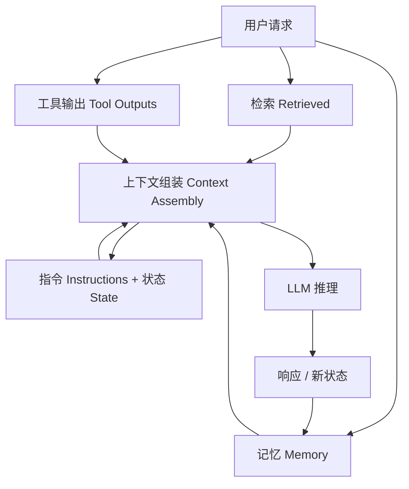
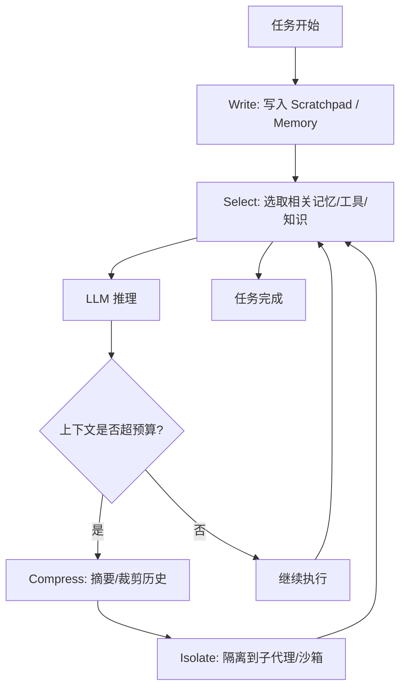

# Context Engineering

> Context Engineering 是 2025 年起取代"提示词工程"成为生产级 AI 核心技能的范式：它不再只打磨一句话，而是系统化地设计、检索、压缩、隔离与持久化模型在生成前能看到的一切信息。

---

## 摘要

Context Engineering（上下文工程）指对 LLM 上下文窗口中的全部信息进行工程化设计——指令、对话状态、检索知识、工具输出与记忆。本文从概念起源、与 Prompt Engineering 的本质差异、上下文的五类组成、核心双操作（压缩 / 检索）、四大策略（写入 / 选择 / 压缩 / 隔离）、关键失效模式"上下文腐烂"、与前缀缓存的关系，到生产实践清单做深度解析，并给出可落地的工程建议。

## 1. 概念与起源

"Context Engineering"一词由 Andrej Karpathy 于 2025 年 6 月公开提出，用以替代"Prompt Engineering"——他认为提示只是真实问题的一小部分[[1]](#ref-1)。Gartner 同期断言"上下文工程正在取代提示词工程"[[2]](#ref-2)。其经典类比为：LLM 如 CPU，上下文窗口如 RAM（工作内存），上下文工程即决定"把哪些信息装进有限内存"的调度器[[1]](#ref-1)。Anthropic 将其正式定义为：在构建跨多轮、长时程的智能体时，管理"系统指令、工具、示例、消息历史"等**整个上下文状态**的策略[[3]](#ref-3)。

## 2. 与 Prompt Engineering 的本质区别

Prompt Engineering 关注"怎么问"，Context Engineering 关注"模型需要**知道**什么才能做好"[[5]](#ref-5)。二者是包含关系：提示是上下文的一个子集[[5]](#ref-5)。

| 维度 | Prompt Engineering | Context Engineering |
|------|-------------------|---------------------|
| 设计单元 | 单条提示 | 完整信息环境 |
| 作用范围 | 单次交互 | 端到端系统 |
| 状态 | 无状态 | 有状态 |
| 知识来源 | 嵌入提示 | 检索 / 处理 / 管理 |
| 工具使用 | 可选、手动 | 集成、受治理 |
| 可扩展性 | 有限 | 为规模设计 |
| 风险控制 | 低 | 高 |
| 生产就绪度 | 实验级 | 生产级 |

行业实测：在生产智能体中，每生成 1 token 通常要处理约 100 token 输入；上下文组装质量对任务成功率的影响可达两位数百分点，而提示措辞改动几乎不改变结果[[7]](#ref-7)。

## 3. 上下文的五类组成

企业级系统的上下文通常由五类信息构成[[5]](#ref-5)：

- **指令（Instructions）**：规则、响应标准、风格、格式、约束、定义
- **任务与对话状态（State）**：正在做什么、已决策什么、还差什么
- **检索到的外部知识（Retrieved）**：文档、数据库、API、搜索结果（RAG）
- **工具输出（Tool Outputs）**：已执行软件返回的结果（查询、计算、校验）
- **记忆（Memory）**：偏好、领域事实、已确认决策等跨会话持久信息

从"素材来源"视角，Elastic 综合 Philipp Schmid 的框架将上下文归纳为七要素[[16]](#ref-16)：

| 要素 | 作用 |
| --- | --- |
| System Prompt | 定义任务类型、约束、输出格式的主指令 |
| User Prompt | 用户的具体请求 |
| Retrieval (RAG) | 从外部存储检索相关文档注入上下文 |
| Memory（短期/长期） | 当前会话状态 + 跨会话持久化信息 |
| Tools | 模型可调用的函数，用于取数或执行操作 |
| Structured Outputs | 通过 Schema 约束输出结构 |
| Few-shot Examples | 展示期望行为的范例 |

LangChain 进一步将以上要素归为三大类：**Instructions**（提示、记忆、few-shot、工具描述）、**Knowledge**（事实、记忆）、**Tools**（工具调用反馈）[[4]](#ref-4)。三种切法不冲突——七要素偏"来源"，五类偏"管理动作"，三分类偏"生命周期"，本质是对同一上下文集合的不同投影。

其规模受硬约束：上下文窗口有限，即便 1M+ token，系统提示、检索、历史、工具输出、示例也会快速竞争同一预算[[15]](#ref-15)。用公式表达预算约束：

$$
C=c_{\text{sys}}+c_{\text{retrieval}}+c_{\text{history}}+c_{\text{tool}}+c_{\text{memory}}+c_{\text{user}}\le C_{\max}
$$

其中 $c_i$ 为各组件 token 数，$C_{\max}$ 为窗口上限。工程目标是在约束下最大化相关性信息占比。

### 3.1 注意力预算的数学视角

Transformer 自注意力使每个 token 与所有其他 token 交互：

$$
\mathrm{Attention}(Q,K,V)=\mathrm{softmax}\!\left(\frac{QK^{T}}{\sqrt{d_k}}\right)V
$$

当上下文长度为 $n$ 时，成对关系数为 $\Theta(n^2)$；Chroma 对 18 个主流模型（GPT-4.1、Claude 4、Gemini 2.5、Qwen3 等）的实证表明，随 $n$ 增大模型在简单任务上的准确率非线性下降（即上下文腐烂）[[17]](#ref-17)。这可形式化为注意力效用预算模型：

$$
U(c)=\sum_{t=1}^{|c|} s(t)\cdot a(t),\quad \text{s.t.}\ \sum_{t=1}^{|c|} a(t)\le B
$$

其中 $c$ 为上下文 token 序列，$s(t)$ 为第 $t$ 个 token 的信号量，$a(t)$ 为其消耗的注意力份额，$B$ 为总注意力预算[[17]](#ref-17)。需注意：token 预算 $C\le C_{\max}$ 是窗口的硬上限（容量），本注意力预算 $B$ 是有效信号的软上限（质量）——容量够不代表信号够。好上下文工程即"寻找最大化任务成功概率的最小高信号 token 集合"。压缩的信息论下界可写为：在保任务关键信息 $I(C;Y)$（其中 $Y$ 为期望输出）不损失的前提下最小化 $|C'|$[[22]](#ref-22)：

$$
\min_{C'}|C'|\quad \text{s.t.}\quad I(C';Y)\ge I(C;Y)-\epsilon
$$

实践中该目标退化为"LLM 自摘要 + 保留近期完整轮次"的启发式策略。



<p align="center"><b>图2 上下文组装与五类信息流向</b></p>

## 4. 核心双操作：压缩与检索

Anthropic 的官方指导可归结为两个基本操作[[3]](#ref-3)（业界归纳另见 [[10]](#ref-10)）：

- **Compression（压缩）**：减少信息量——清掉旧工具输出、必要时摘要对话。
- **Retrieval（检索）**：筛选相关信息——预加载（CLAUDE.md/系统指令）、按需加载（Skill 触发时）、即时检索（JIT）。

智能体循环本质是 `检索 → 动作 → 检索` 的迭代[[10]](#ref-10)。长上下文**不能**替代检索：语料小且需全局推理时用长上下文，语料大且单查询大多无关或需新鲜度时用检索，二者常结合[[15]](#ref-15)。

## 5. 四大策略

DevToolLab 将生产上下文问题归纳为四类策略：写入（Write）、选择（Select）、压缩（Compress）、隔离（Isolate）[[6]](#ref-6)。它与 §4 的 Anthropic 双操作是一体两面：检索≈选择（Select）、压缩≈压缩（Compress），写入与隔离是工程化扩展。整体循环如图 1 所示：



<p align="center"><b>图1 Agent 场景下 Write-Select-Compress-Isolate 循环</b></p>

### 5.1 上下文增强（Retrieval / 写入）

通过 RAG、工具接入、知识图谱把相关信息注入窗口[[5]](#ref-5)[[13]](#ref-13)。结构化上下文的实证研究（9649 次实验）证实上下文组织方式本身显著影响智能体表现[[14]](#ref-14)。成本最低的有效性提升来自"检索更少更好的块"：10 块中 9 块相关，优于 30 块中 10 块相关、20 块干扰[[15]](#ref-15)。建议显式声明 groundedness："仅依据下列段落作答，缺失则说不知道"并标注可引用 ID[[11]](#ref-11)。

写入侧（Write）的工程化要点：Anthropic 多智能体研究系统将 LeadResearcher 的计划先写入 Memory 持久化，因上下文超 200,000 token 会被截断[[19]](#ref-19)；其 Think Tool 允许 Agent 在工具调用间显式记录思考，避免长链推理丢失[[24]](#ref-24)。检索侧正从"推理前预向量化"转向 **Just-in-Time 上下文**——维护轻量标识符（文件路径、查询、URL），运行时经工具动态加载，如 Claude Code 用 `head`/`tail` 分析海量数据而无需整对象入窗[[3]](#ref-3)。

### 5.2 上下文优化（Compression）

基础两层压缩（激进度递增）[[10]](#ref-10)：

| 层 | 机制 | 信息损失 |
|----|------|----------|
| 工具结果清除 | 删原始输出、保留"曾调用"事实 | 低，可重取 |
| 对话摘要 / Compaction | LLM 生成结构化摘要 | 较高，细节可能丢失 |

进阶方法：

- **选择性上下文（Selective Context）**：按需压缩长上下文[[9]](#ref-9)。
- **ACON（失败驱动上下文优化）**：对比"完整上下文成功 vs 压缩失败"的轨迹，迭代改进压缩提示，无需微调，峰值 token 降 **26–54%** 且保 95%+ 准确率[[8]](#ref-8)。
- **嵌入式压缩**：历史存为稠密向量，按需重建相关段，存储降 **80–90%**，代价是检索延迟与逐字精度损失[[8]](#ref-8)。
- **文件系统即外部记忆**：Manus 把文件系统当无限外部记忆，实现约 **100:1** 压缩比且可完整恢复[[7]](#ref-7)。
- Claude Code 的典型做法是把上下文"总结进 Markdown 文件"（如 TODO 列表），实现"压缩即持久化"[[3]](#ref-3)。

### 5.3 上下文隔离（Isolate）

把互不相关的上下文分到独立窗口，避免相互污染——最适合可并行、只读任务（如 research 子代理）[[7]](#ref-7)[[4]](#ref-4)。隔离可遏制"上下文腐烂"（见 §6）。Anthropic 多智能体研究系统即让多个并行 sub-agent 各自搜不同方向、独享上下文窗口[[19]](#ref-19)；但 Cognition 警告多 Agent 会引入"决策不连贯"与"上下文分裂"，需谨慎设计共享协议[[18]](#ref-18)。

### 5.4 上下文持久化（Memory）

建立记忆层级以突破窗口限制[[5]](#ref-5)：

- **短期记忆**：上下文窗口内，会话期有效。
- **长期记忆**：跨会话保存。

需显式策略：

- **写入策略**：只存稳定有用信息（偏好、领域定义、已确认决策），任务结束或强信号时写，不存噪声与瞬态。
- **读取策略**：按触发（主题/实体/目标）或打分（相似度+新鲜度+优先级）检索，压缩后注入而非全量倾倒。
- **维护**：遗忘无关项、矛盾时取最新且已验证版、区分个人/项目/公共记忆与权限[[5]](#ref-5)。

反思式写入已有实证：Reflexion 在每回合后做 verbal reinforcement learning 式自我反思并复用[[20]](#ref-20)；Generative Agents 周期性从历史交互综合生成记忆[[21]](#ref-21)。

### 5.5 策略落地：主流框架与可运行示例

| 框架/产品 | Context Engineering 关键能力 | 来源 |
| --- | --- | --- |
| **LangGraph** | Checkpointer 管理短期记忆（状态），Long-term Store 管理跨会话记忆，原生支持 Write/Select/Compress/Isolate | LangChain[[4]](#ref-4) |
| **Claude Code** | Just-in-Time 数据加载（Bash + SQL）、TODO 列表持久化、上下文压缩进 Markdown | Anthropic[[3]](#ref-3) |
| **Anthropic 多智能体研究系统** | LeadResearcher 写计划入 Memory、并行 sub-agent 各自独立上下文、Think Tool 记录思考 | Anthropic[[19]](#ref-19) |
| **Elasticsearch** | 兼作向量库（RAG 检索层）、长期记忆存储、工具调用后端 | Elastic[[16]](#ref-16) |

最小可运行示例（LangGraph，演示 Write + Select，API 细节以官方文档为准）[[4]](#ref-4)：

```python
from langgraph.graph import StateGraph, MessagesState, START
from langgraph.checkpoint.memory import MemorySaver

class State(MessagesState):
    scratchpad: list[str]

def call_model(state: State):
    recent = state["messages"][-5:]                      # Select：仅最近 5 条
    notes = "\n".join(state.get("scratchpad", [])[-3:]) # Select：草稿最近 3 条
    context = f"Notes:\n{notes}\n\n{recent}"
    # ... 调用 LLM，返回 AIMessage ...
    return {"messages": [...]}

def update_scratchpad(state: State):
    return {"scratchpad": state.get("scratchpad", []) + ["<本轮结论>"]}  # Write

graph = StateGraph(State)
graph.add_node("call_model", call_model)
graph.add_node("scratchpad", update_scratchpad)
graph.add_edge(START, "call_model")
graph.add_edge("call_model", "scratchpad")
graph.add_edge("scratchpad", "call_model")
app = graph.compile(checkpointer=MemorySaver())
```

该示例 `update_scratchpad` 实现 **Write**，`call_model` 对历史截断实现 **Select + Compress** 的简化版。

## 6. 关键失效模式：上下文腐烂（Context Rot / Drift）

最重要的实践认知是：**模型常在触及硬上限前就因上下文变长变密而退化**——即"上下文腐烂"[[9]](#ref-9)。

- 2025 年约 **65%** 企业 AI 失败归因于多步推理中的上下文漂移或记忆丢失，而非窗口耗尽[[8]](#ref-8)。

上述 65%、−39% 与 9649 次实验分属 Zylos、TuringCollege、McMillan 三篇独立研究，仍建议以自有评测集复核[[8]](#ref-8)[[12]](#ref-12)[[14]](#ref-14)。
- Microsoft 与 Salesforce 研究发现：跨多轮投喂碎片化上下文，LLM 性能骤降 **39%**[[12]](#ref-12)。
- 论文《Less Context, Better Agents》指出，在工具型长时程智能体中，"更少上下文"反而更好，因 context rot 随 token 增长使有效召回退化[[9]](#ref-9)。
- 漂移信号：Agent 重复已完成工作、目标措辞逐轮偏移、技术细节（变量名/路径/错误码）失真、系统指令被"遗忘"[[8]](#ref-8)。


<p align="center"><b>图3 上下文腐烂的退化循环</b></p>

应对：在窗口容量 70–80% 时触发 compaction、分层加载（最相关信息贴近用户指令）、按预算强制截断[[6]](#ref-6)[[8]](#ref-8)。

Drew Breunig 进一步把长上下文失效拆为四类典型模式（其中 Context Confusion 与 context rot 同源，均源于冗余信息干扰）[[23]](#ref-23)：

| 失效模式 | 表现 | 典型修复 |
| --- | --- | --- |
| **Context Poisoning** | 幻觉进入上下文被反复引用，错误随轮次累积 | 写入前校验、独立子代理生成事实 |
| **Context Distraction** | Agent 沉迷重复历史动作而非推进任务 | 裁剪历史、明确"下一步"指令 |
| **Context Confusion** | 冗余信息致模型调用错误工具/文档 | 精选工具集、Just-in-Time 检索 |
| **Context Clash** | 上下文各部分相互矛盾，推理脱轨 | 单一来源真相、定期去重与合并 |

## 7. 与前缀缓存的关系

上下文工程的"稳定前置"原则直接决定前缀缓存命中率（详见 [Prompt Engineering.md](Prompt%20Engineering.md) §4.7 与 [KV Cache.md](KV%20Cache.md)）：把不变的指令、记忆、工具定义放前缀，易变的检索片段与每轮用户输入放末尾，可缓存前缀最长、成本最低[[3]](#ref-3)。即：上下文工程决定"装什么"，前缀缓存决定"装进来的稳定部分能否跨请求复用"。

## 8. 生产实践清单（12 点精要）

综合 SurePrompts 与 DevToolLab 实践[[6]](#ref-6)[[11]](#ref-11)：

- [ ] 给窗口做预算：检索 ≤ X、历史 ≤ Y，在组装代码层强制而非仅口头约束[[11]](#ref-11)
- [ ] 缓存稳定前缀（系统提示 / 工具定义 / 记忆）[[11]](#ref-11)
- [ ] 分层加载：最相关信息贴近用户指令[[11]](#ref-11)
- [ ] 选择性检索：更少更好的块，优于大量含干扰块[[11]](#ref-11)
- [ ] 显式 groundedness 与引用 ID[[11]](#ref-11)
- [ ] 用对的记忆形状：会话滚动摘要 / 研究草稿板 / 长程用户级记忆[[11]](#ref-11)
- [ ] 70–80% 容量触发 compaction[[6]](#ref-6)
- [ ] 隔离可并行只读子任务[[7]](#ref-7)
- [ ] 工具结果先清后摘，保留可重取[[10]](#ref-10)
- [ ] 监控上下文密度与记忆饱和，早期检测漂移[[8]](#ref-8)
- [ ] 跨会话记忆写/读/忘策略明确[[5]](#ref-5)
- [ ] 在自有评测集上测"腐烂"，不盲信厂商基准[[15]](#ref-15)

## 9. 相关文档

- [Prompt Engineering.md](Prompt%20Engineering.md)（提示词工程，含前缀缓存 §4.7）
- [KV Cache.md](KV%20Cache.md)（前缀缓存与 KV Cache 原理）
- [RAG.md](RAG.md)（检索增强生成）
- [GraphRAG.md](GraphRAG.md)（图谱检索增强）

## 10. 参考文献

<a id="ref-1"></a>[1] NextAgile. ["Context Engineering Vs Prompt Engineering: The Real Difference."](https://nextagile.ai/blogs/gen-ai/context-engineering-vs-prompt-engineering) *NextAgile*, 2026-06-30.

<a id="ref-2"></a>[2] Gartner. ["Context Engineering: Why It's Replacing Prompt Engineering for Enterprise AI Success."](https://www.gartner.com/en/articles/context-engineering) *Gartner*, 2025-10.

<a id="ref-3"></a>[3] Anthropic. ["Effective context engineering for AI agents."](https://www.anthropic.com/engineering/effective-context-engineering-for-ai-agents) *Anthropic Engineering*, 2025-09-29.

<a id="ref-4"></a>[4] LangChain. ["Context Engineering."](https://www.langchain.com/blog/context-engineering-for-agents) *LangChain Blog*, 2026-04-27.

<a id="ref-5"></a>[5] Abstracta. ["Context Engineering vs Prompt Engineering."](https://abstracta.us/blog/ai/context-engineering-vs-prompt-engineering) *Abstracta*, 2026-01-22.

<a id="ref-6"></a>[6] DevToolLab. ["Context Engineering in 2026: Developer Guide for LLM Applications."](https://devtoollab.com/blog/context-engineering-guide) *DevToolLab*, 2026-06-18.

<a id="ref-7"></a>[7] Galileo. ["Deep Dive into Context Engineering for Agents."](https://galileo.ai/blog/context-engineering-for-agents) *Galileo*, 2025-09-24.

<a id="ref-8"></a>[8] Zylos. ["AI Agent Context Compression: Strategies for Long-Running Sessions."](https://zylos.ai/research/2026-02-28-ai-agent-context-compression-strategies/) *Zylos Research*, 2026-02-28.

<a id="ref-9"></a>[9] Anonymous. ["Less Context, Better Agents: Efficient Context Engineering for Long-Horizon Tool-Using LLM Agents."](https://arxiv.org/html/2606.10209) *arXiv*, 2026.

<a id="ref-10"></a>[10] LLM Agent Research. ["Anthropic Context Engineering: Official Guidance vs Industry Practice."](https://lin-guanguo.github.io/llm-memory-research/anthropic-context-engineering.research/) *LLM Agent Research*, 2026-03-23.

<a id="ref-11"></a>[11] SurePrompts. ["Context Engineering Best Practices (2026): A 12-Point Checklist."](https://sureprompts.com/blog/context-engineering-best-practices-2026) *SurePrompts*, 2026-04-23.

<a id="ref-12"></a>[12] TuringCollege. ["Context Engineering Guide in 2025."](https://www.turingcollege.com/blog/context-engineering-guide) *TuringCollege*, 2026-06-04.

<a id="ref-13"></a>[13] IntuitionLabs. ["Context Engineering vs. Prompt Engineering Explained."](https://intuitionlabs.ai/pdfs/context-engineering-vs-prompt-engineering-explained.pdf) *IntuitionLabs*, 2026-04-01.

<a id="ref-14"></a>[14] McMillan D. ["Structured Context Engineering for File-Native Agentic Systems."](https://arxiv.org/abs/2602.05447) *arXiv:2602.05447*, 2026-02.

<a id="ref-15"></a>[15] SurePrompts. ["Context Engineering: The 2026 Replacement for Prompt Engineering."](https://sureprompts.com/blog/context-engineering-the-2026-replacement-for-prompt-engineering) *SurePrompts*, 2026-05-05.

<a id="ref-16"></a>[16] Tuana Çelik, Logan Markewich. ["What is Context Engineering? Components, Techniques, and Best Practices."](https://www.elastic.co/search-labs/blog/context-engineering-overview) *Elastic Search Labs*, 2025.

<a id="ref-17"></a>[17] Kelly Hong, Anton Troynikov, Jeff Huber. ["Context Rot: How Increasing Input Tokens Impacts LLM Performance."](https://research.trychroma.com/context-rot) *Chroma Technical Report*, 2025.

<a id="ref-18"></a>[18] Cognition. ["Don't Build Multi-Agents."](https://cognition.ai/blog/dont-build-multi-agents) *Cognition AI Blog*, 2025.

<a id="ref-19"></a>[19] Anthropic. ["How We Built Our Multi-Agent Research System."](https://www.anthropic.com/engineering/built-multi-agent-research-system) *Anthropic Engineering Blog*, 2025.

<a id="ref-20"></a>[20] N. Shinn et al. ["Reflexion: Language Agents with Verbal Reinforcement Learning."](https://arxiv.org/abs/2303.11366) *arXiv:2303.11366*, 2023.

<a id="ref-21"></a>[21] J. Park et al. ["Generative Agents: Interactive Simulacra of Human Behavior."](https://arxiv.org/abs/2304.03442) *arXiv:2304.03442*, 2023.

<a id="ref-22"></a>[22] A. Vaswani et al. ["Attention Is All You Need."](https://arxiv.org/abs/1706.03762) *arXiv:1706.03762*, 2017.

<a id="ref-23"></a>[23] Drew Breunig. ["How Long Contexts Fail and How to Fix Them."](https://www.dbreunig.com/2025/06/22/how-contexts-fail-and-how-to-fix-them.html) *dbreunig.com*, 2025.

<a id="ref-24"></a>[24] Anthropic. ["Claude Think Tool."](https://www.anthropic.com/engineering/claude-think-tool) *Anthropic Engineering Blog*, 2025.
