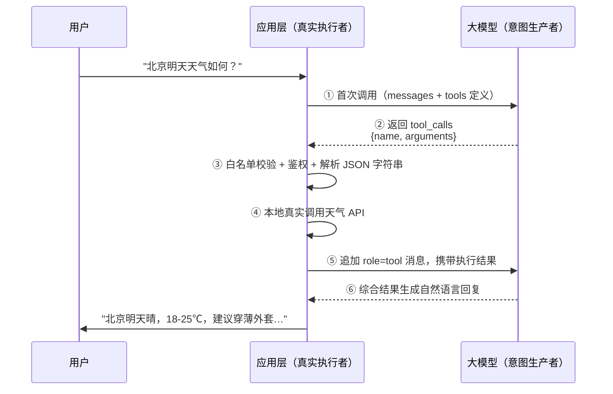
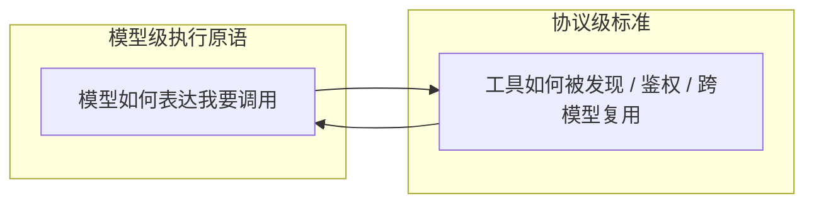

# Function / Tool Calling 深度解析

> Function Calling 让大模型从"只会生成文本"升级为"能输出结构化行动意图"的模型级执行原语——模型负责"理解 + 决策 + 生成结构化参数"，应用层负责"真实执行"，二者通过多轮消息循环衔接，构成现代 AI Agent 的行动基石 [[1]](#ref-1)。

---

## 摘要

大模型本质是文本生成器，其输出无法直接驱动真实世界动作。Function Calling（Tool Calling）通过让模型输出符合预定义 JSON Schema 的结构化调用请求（函数名 + 入参），把"意图生产"与"真实执行"解耦：模型只生成"想调用什么、传什么参数"的 JSON 文本，应用层经白名单校验、鉴权后在本地真实执行并把结果回填给模型继续推理。本文系统梳理其本质边界（与 RAG、Agent 的区分）、六步执行闭环、JSON Schema 设计五条铁律、端到端代码示例、生产陷阱与防御性编程，并厘清 FC / ReAct / Agent 三层递进关系，最后给出 MCP 标准化协议与选型决策指南。

---

## 一、本质概念：它是什么，它不是什么

**定义**：Function Calling（Tool Calling，FC）是一种让大模型在对话中输出符合预定义 JSON Schema 的结构化调用请求（函数名 + 入参）的能力。开发者拿到这个"意图"后在本地真实执行函数，再把结果回填给模型继续推理 [[1]](#ref-1)。

三层容易混淆的概念需要厘清：

| 概念 | 它是什么 | 它"不是"什么 |
|------|---------|-------------|
| **FC ≠ 模型执行函数** | 模型只生成"想调用什么、传什么参数"的 JSON 文本 | 真正跑代码、访问数据库、发 HTTP 请求的永远是应用层代码 |
| **FC ≠ RAG** | 解决"能力外延"（让模型表达"我要调 X 工具"） | RAG 解决"知识时效性"（把检索文档塞进上下文） |
| **FC ≠ Agent** | 单步结构化输出原语 | Agent 是把 FC、记忆、规划、反思组合起来的自治系统 |

其中 **FC ≠ 模型执行函数** 这一边界决定了安全模型：模型是不可信的"意图生产者"，应用层是必须严格鉴权的"执行者"。Agent 必然用到 FC，但仅用 FC 不构成 Agent。

**典型适用场景**：

- 实时数据查询（天气 / 股票 / 物流）
- 任务自动化（发邮件、智能设备控制）
- 复杂流程编排（多工具串并联、跨工具参数传递）
- 企业系统集成（创建会议 → 建群 → 派任务）

---

## 二、完整执行流程：六步闭环

FC 的核心是一个由应用层驱动的消息循环。以 OpenAI 风格协议为例的标准链路如图1 所示：



<p align="center"><b>图1 Function Calling 六步执行闭环</b></p>

每一步的关键细节：

1. **首次调用**：应用把用户消息 + 完整 tools 列表发给模型，`tool_choice` 通常设为 `auto` 让模型自主决定是否调用。
2. **模型判断与结构化输出**：模型输出 `finish_reason="tool_calls"`，附带函数名——注意 **arguments 是 JSON 字符串而非对象**，需要二次解析。
3. **应用层校验与鉴权**：检查函数名是否在白名单、参数是否合法、当前用户是否有权执行，这一步是安全防线。
4. **真实执行**：调用你写的 Python/JS 函数或外部 API。
5. **结果回填**：以 `role="tool"`（OpenAI 风格）或 `tool_use`/`tool_result`（Claude 风格）追加到 messages，再次调用模型。
6. **循环直至收敛**：复杂任务下模型可能再次返回 `tool_calls`（链式调用），应用层用 `while` 循环处理直到 `finish_reason="stop"`。

`tool_choice` 三种模式：

| 模式 | 行为 |
|------|------|
| `auto`（默认） | 模型自主判断是否调用 |
| `required` | 强制必须调用某个工具 |
| `none` | 禁止调用，强制纯文本回答 |

也支持指定具体函数名以强制路由到特定工具。

---

## 三、工具定义：JSON Schema 设计是 FC 成败的一半

模型"选哪个工具、怎么填参数"完全依赖你写的 `name` + `description` + `parameters`。Schema 不只是文档，更是运行时校验的合同。

一个生产级的工具定义示例：

```json
{
  "type": "function",
  "function": {
    "name": "query_order",
    "description": "根据订单号查询订单当前状态与物流轨迹。当用户询问'我的订单到哪了''退款到哪了'时使用。订单号是 13 位数字。",
    "parameters": {
      "type": "object",
      "properties": {
        "order_id": {
          "type": "string",
          "pattern": "^\\d{13}$",
          "description": "13 位数字订单号，例如 2024010112345"
        },
        "status": {
          "type": "string",
          "enum": ["pending", "shipped", "done"],
          "description": "订单状态过滤条件"
        }
      },
      "required": ["order_id"],
      "additionalProperties": false
    }
  }
}
```

**Schema 设计五条铁律**：

1. **description 必须回答三问**：这个函数做什么、参数是什么格式、什么场景下该调用。比"查询订单"这种废话式描述准确率高一个量级。
2. **用约束拦截幻觉**：`pattern`、`enum`、`minimum`、`maximum` 是最便宜的幻觉拦截器。不写约束，模型就会编出 `"order_id": "第3个订单"` 这种值。
3. **日期/数值格式写死在 description**：明确写"格式必须为 YYYY-MM-DD"，避免模型填"明天"。
4. **控制工具数量**：单次暴露 30+ 个工具会让选择准确率断崖下跌，生产上应按意图预路由，只给模型当前场景需要的 3~5 个。
5. **required + 默认值搭配**：必填参数靠 `required`，可选参数提供清晰默认值描述。

---

## 四、端到端代码示例：完整可跑的天气查询

以 OpenAI 兼容协议为例（Qwen、DeepSeek、GLM、Kimi 等均支持此格式）：

```python
import json
from openai import OpenAI

client = OpenAI()

# ① 定义工具 Schema
tools = [{
    "type": "function",
    "function": {
        "name": "get_weather",
        "description": "获取指定城市当前天气，包含温度、天气状况、湿度。当用户询问天气时调用。",
        "parameters": {
            "type": "object",
            "properties": {
                "location": {"type": "string", "description": "城市名，如'北京'"},
                "unit": {"type": "string", "enum": ["celsius", "fahrenheit"]}
            },
            "required": ["location"]
        }
    }
}]

# ② 本地真实执行函数（带白名单校验）
def get_weather(location: str, unit: str = "celsius"):
    # 实际场景调用天气 API
    return {"location": location, "temp": 22, "condition": "晴", "humidity": 45}

AVAILABLE_TOOLS = {"get_weather": get_weather}

# ③ 首次调用
messages = [{"role": "user", "content": "北京今天天气怎么样？适合穿什么？"}]
resp = client.chat.completions.create(
    model="gpt-4o", messages=messages, tools=tools, tool_choice="auto"
)
msg = resp.choices[0].message

# ④ 模型要求调用工具 → 应用层执行 → 结果回填 → 二次调用
if msg.tool_calls:
    messages.append(msg)  # 保留 assistant 的 tool_calls 消息
    for tc in msg.tool_calls:
        fn_name = tc.function.name
        args = json.loads(tc.function.arguments)  # 注意：是 JSON 字符串
        result = AVAILABLE_TOOLS[fn_name](**args)  # 真实执行
        messages.append({
            "role": "tool",
            "tool_call_id": tc.id,
            "content": json.dumps(result, ensure_ascii=False)
        })
    # ⑤ 二次调用，模型综合工具结果生成自然语言回答
    final = client.chat.completions.create(model="gpt-4o", messages=messages)
    print(final.choices[0].message.content)
```

**进阶要点**：

- **API 演进提醒**：上例用的是 Chat Completions 形态（`role=tool` / `tool_call_id`）。OpenAI 自 2025 年起主推 **Responses API**（`function_call_output` / `call_id`），这是面向 Agent 与工具编排的当前推荐方向，官方正推动从 Chat Completions 迁移 [[7]](#ref-7)。非 OpenAI 兼容模型（Qwen/DeepSeek/GLM 等）仍以 Chat 形态为主，故本文保留两种记法。
- GPT-4o 等模型支持单次响应返回多个并行 `tool_calls`，后端需遍历执行后一次性回填所有结果；可用 `parallel_tool_calls=false` 强制单次至多调用一个工具 [[4]](#ref-4)[[7]](#ref-7)。
- **strict 模式**：Responses API 的函数 schema 默认比 Chat Completions 更严格，能显著降低"幻觉函数 / 乱填参数"。Chat 侧则需显式开启 `"strict": true` 并配合 Structured Outputs 约束 [[7]](#ref-7)。
- 流式场景下需用增量拼接还原完整参数。
- GLM 系列需额外传 `extra_body={"tool_stream": True}` 才能返回 `tool_calls`。

---

## 五、常见陷阱与解决方案（生产必读）

| 陷阱类型 | 典型表现 | 解决方案 |
|---------|---------|---------|
| 参数幻觉 | 模型编造不存在的参数值（`"date": "明天"`、`"city": "用户所在地"`） | Schema 写死格式示例 + `enum`/`pattern` 约束 + 运行时校验 |
| 选错函数 | 相似函数之间误判（如 `get_user` vs `list_users`） | description 差异化描写"何时用"，必要时加 few-shot |
| 幻觉函数 | 模型调用根本不存在的工具名 | strict 模式 / 白名单校验，未命中直接返回错误信息 |
| Schema 爆炸 | 塞几百个工具进上下文，Token 暴涨、选择混乱 | 意图分类预路由，单次只暴露 3~5 个候选工具 |
| Token 成本失控 | 每轮都传完整 tools 定义，几百 Token × 多轮 | 用 Assistants API 预存工具，或动态裁剪本轮所需工具 |
| 多轮上下文漂移 | 长对话中工具描述被压缩，导致重复调用或参数错乱 | 把关键工具契约放进稳定记忆/系统消息 |
| 安全越权 | 提示注入诱导模型调用 `delete_user`、执行 SQL | 铁律：函数内永远不放裸 SQL/文件删除代码，应用层必须有鉴权中间件 |
| 奖励黑客（训练侧） | RL 阶段模型学会无意义狂调工具刷分 | 奖励锚定真实任务成功率，而非"是否调用工具" |

**防御性编程模板**：所有工具执行都应包裹一层 `SafeFunctionExecutor`，做 **白名单校验 → 参数校验 → 鉴权 → 超时控制 → 错误信息回填**。以 `role="tool"` 返回 `{"error": "..."}` 让模型向用户解释，而非直接抛异常中断会话。

---

## 六、与 ReAct、Agent 的关系：三层递进

理解 FC 在 AI 系统中的位置，需要看这三层的递进关系：

| 层级 | 是什么 | 适用场景 | 控制权 | 可预测性 |
|------|--------|---------|--------|---------|
| **FC（原语层）** | 单次"模型输出结构化意图 → 应用执行 → 结果回填"的循环 | 任务清晰、单步或少量多步即可完成 | 应用侧 | 高 |
| **ReAct（模式层）** | Reasoning + Acting，模型在每次行动前先输出思考文本，再行动、观察、再思考 | 复杂多步、需根据中间结果动态调整计划 | 模型侧 | 中 |
| **Agent（系统层）** | 在 ReAct/FC 之上叠加记忆、规划、反思、多 Agent 协作，形成自治系统 | 开放式、长程、需自主规划 | 系统侧 | 低 |

**ReAct 与 FC 的关系**：ReAct 是"思考 → 行动 → 观察"的循环模式 [[2]](#ref-2)，可以基于 FC 实现（思考过程就是普通文本，行动就是 `tool_calls`），也可以基于纯 Prompt 解析实现。相比裸 FC，ReAct 在复杂多步任务中表现更好，代价是 Token 消耗更高、循环更长。

**Agent 的核心循环**：接收目标 → 分解子任务 → 决定何时调哪个工具 → 评估结果 → 调整策略。

**选型直觉**：

- 单工具或 2~3 步的确定性任务 → 用裸 FC
- 需要根据中间结果动态调整的多步任务 → 用 ReAct + FC
- 开放式、长程、需自主规划的任务 → 用完整 Agent 架构

---

## 七、演进方向：MCP 与工具使用协议

Function Calling 当前最大的痛点是**厂商碎片化**：

| 厂商 | 工具定义 | 调用返回 |
|------|---------|---------|
| OpenAI（Responses） [[7]](#ref-7) | `tools`（内部标记）+ `function_call_output` | `output[]` 中的 `function_call` 项 |
| Anthropic（Claude） [[5]](#ref-5) | `input_schema` + `tool_use` 块 | `tool_use` |
| Gemini [[6]](#ref-6) | `functionDeclarations` + `functionCall` | `functionCall` |

同一套业务逻辑要为不同模型重写接入层。**MCP（Model Context Protocol）** 是 Anthropic 2024 年 11 月开源的标准化协议，定位为"AI 应用的 USB-C 接口"：工具统一托管在 MCP Server 上，任何支持 MCP 的模型都能通过标准协议发现、调用、管理这些工具，将工具定义与应用解耦 [[3]](#ref-3)。

**MCP 的演进现状（2025–2026）**：

- **治理中立化**：MCP 已于 2025 年 12 月捐赠给 Linux Foundation 发起成立的 **Agentic AI Foundation（AAIF）**，实现厂商中立治理，Anthropic、OpenAI、Google、Microsoft、AWS 等共同参与 [[8]](#ref-8)。
- **全面落地**：ChatGPT、Cursor、Gemini、Microsoft Copilot、Visual Studio Code 等主流 AI 产品均已原生支持 MCP；OpenAI 的 Agents SDK 与 Responses API、Google Gemini/Vertex、AWS Bedrock、Azure 等均有 MCP 兼容集成 [[8]](#ref-8)[[9]](#ref-9)。
- **规模数据**：活跃公共 MCP Server 超过 10,000 个，Python + TypeScript 双 SDK 月下载量突破 9,700 万；企业侧已从"开发工具"向"业务工作流"扩展 [[9]](#ref-9)[[10]](#ref-10)。
- **协议规范演进**：规格持续迭代，2026 年聚焦传输可扩展性、Agent 间通信、治理成熟度与企业级就绪；Streamable HTTP 成为远程传输主流方向 [[11]](#ref-11)。

**FC 与 MCP 不是竞争而是分层关系**：



<p align="center"><b>图2 FC 与 MCP 的分层关系</b></p>

- FC 是模型级执行原语（模型如何表达"我要调用"）
- MCP 是协议级标准（工具如何被发现、鉴权、跨模型复用）
- MCP Server 暴露的工具，最终仍通过 FC 机制被模型调用

企业级 Agent 架构的演进路径：**FC 解决"能不能调"，MCP 解决"如何规模化、跨模型、可维护地调"**。

配套地，Agent 执行框架也在向"完整执行环境"演进：OpenAI 的 **Agents SDK** 已从纯编排器升级为包含原生沙箱执行、可配置记忆、文件系统工具（如 `apply_patch`）与 MCP 集成的一体化执行环境，并支持接入 100+ 非 OpenAI 模型 [[12]](#ref-12)。

模型侧的演进方向还包括：

- **并行工具调用**：一次响应返回多个 `tool_calls`
- **工具学习**：few-shot 即可使用新工具
- **多模态工具**：参数含图像/视频等非结构化模态
- **端到端工具使用**：工具调用像语言生成一样自然融入解码过程

---

## 八、何时该用 Function Calling：决策指南

**适合用 FC 的信号**：

- 用户请求涉及实时数据（天气、股价、订单状态、库存）——模型训练数据必然过期
- 需要触发外部副作用（发邮件、创建工单、控制设备、执行代码）
- 需要结构化输出而非自由文本（提取实体、生成表单、API 参数）
- 任务在 1~5 步内可确定性完成，流程清晰可枚举

**不适合的信号**：

- 纯内容创作、闲聊、知识问答（无外部依赖）——强行上 FC 徒增延迟和成本
- 需要长程自主规划、开放式探索的任务——直接上 Agent 框架，FC 只是其中一个组件
- 工具间无明确依赖关系、只是简单的知识检索——用 RAG 比用 FC 更轻量

**一句话总结**：当"语言理解"需要和"真实世界动作"打通时，Function Calling 是目前最成熟、生态最完善的第一选择 [[1]](#ref-1)。

---

## 九、相关文档

- [Agent工具系统设计方案.md](Agent工具系统设计方案.md)（工具与执行层对接设计）
- [Agent意图识别设计方案v3.md](Agent%20意图识别设计方案v3.md)（意图识别与槽位解析）
- [AI Agent系统设计方案.md](AI%20Agent系统设计方案.md)（Agent 系统整体架构）
- [Prompt Engineering.md](Prompt%20Engineering.md)（指令与工具描述撰写）
- [Context Engineering.md](Context%20Engineering.md)（上下文与工具列表组装策略）

---

## 十、参考文献

<a id="ref-1"></a>[1] OpenAI. ["Function calling and other API updates."](https://openai.com/blog/function-calling-and-other-api-updates) *OpenAI Blog*, 2023.

<a id="ref-2"></a>[2] S. Yao et al. ["ReAct: Synergizing Reasoning and Acting in Language Models."](https://arxiv.org/abs/2210.03629) *ICLR*, 2023.

<a id="ref-3"></a>[3] Anthropic. ["Introducing the Model Context Protocol."](https://www.anthropic.com/news/model-context-protocol) *Anthropic News*, 2024.

<a id="ref-4"></a>[4] OpenAI. ["How to call tools with the Responses API."](https://platform.openai.com/docs/guides/function-calling) *OpenAI Docs*, 2024.

<a id="ref-5"></a>[5] Anthropic. ["Tool use."](https://docs.anthropic.com/en/docs/build-with-claude/tool-use) *Anthropic Docs*, 2024.

<a id="ref-6"></a>[6] Google. ["Function calling."](https://ai.google.dev/docs/function_calling) *Google AI Docs*, 2024.

<a id="ref-7"></a>[7] OpenAI. ["Migrate to the Responses API."](https://platform.openai.com/docs/guides/migrate-to-responses) *OpenAI Docs*, 2025.

<a id="ref-8"></a>[8] Anthropic. ["Open-sourcing the Model Context Protocol and establishing the Agentic AI Foundation."](https://www.anthropic.com/news/donating-the-model-context-protocol-and-establishing-of-the-agentic-ai-foundation) *Anthropic News*, 2025.

<a id="ref-9"></a>[9] Model Context Protocol. ["First MCP Anniversary: A year of open collaborative work."](https://blog.modelcontextprotocol.io/posts/2025-11-25-first-mcp-anniversary/) *MCP Blog*, 2025.

<a id="ref-10"></a>[10] Digital Applied. ["MCP Adoption Statistics 2026."](https://www.digitalapplied.com/blog/mcp-adoption-statistics-2026-model-context-protocol) *Digital Applied*, 2026.

<a id="ref-11"></a>[11] Model Context Protocol. ["The 2026 MCP Roadmap."](https://blog.modelcontextprotocol.io/posts/2026-mcp-roadmap/) *MCP Blog*, 2026.

<a id="ref-12"></a>[12] OpenAI. ["The next evolution of the Agents SDK."](https://openai.com/index/the-next-evolution-of-the-agents-sdk/) *OpenAI*, 2026.
