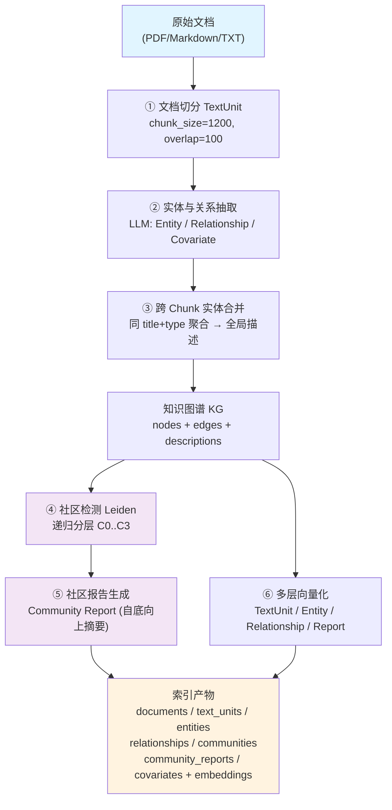
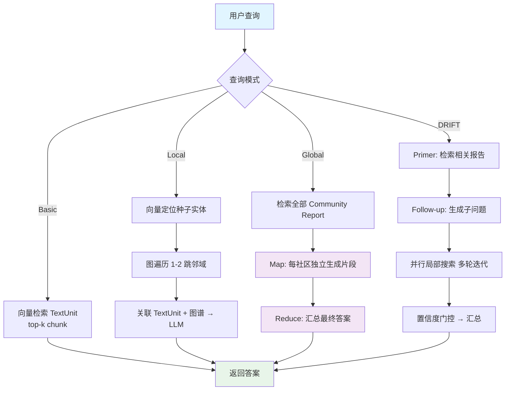
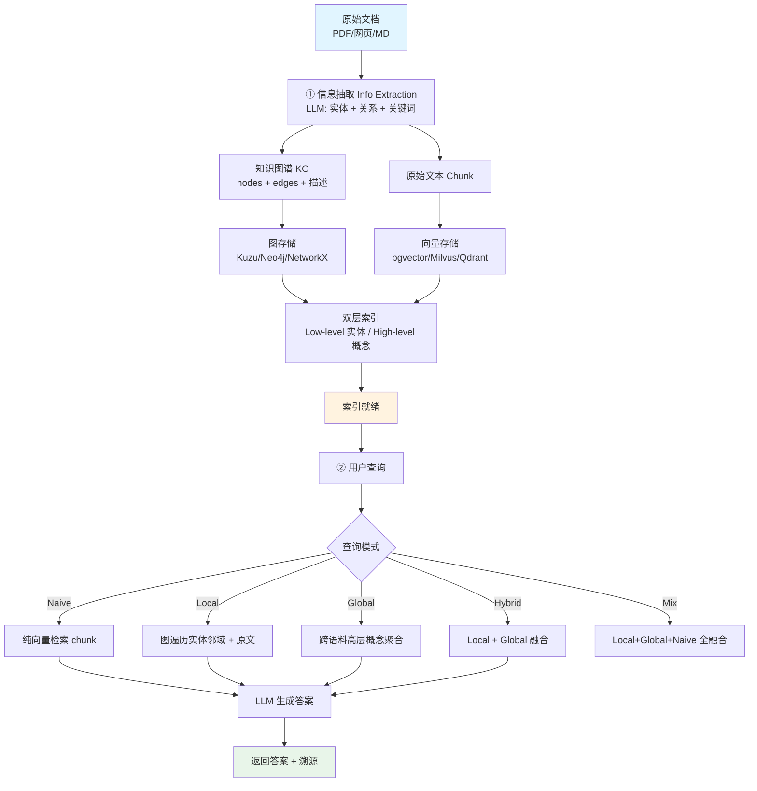

# GraphRAG（图检索增强生成）技术深度解析

> **一句话总结**：GraphRAG = LLM 抽取实体关系图 + Leiden 层级社区发现 + 社区摘要层级化 + 多模式检索（Global/Local/DRIFT/Lazy），解决朴素 RAG 在全局综合类问题上的失效。

---

## 摘要

检索增强生成（Retrieval-Augmented Generation, RAG）通过将外部知识检索融入大语言模型（LLM）生成过程，有效缓解了幻觉与知识时效性问题。然而，基于向量相似度的朴素 RAG 在处理**跨文档多跳推理**与**全局性综合总结**任务时存在结构性缺陷。微软研究院于 2024 年提出 GraphRAG（Graph-based RAG）[[1]](#ref-1)，首次将知识图谱（Knowledge Graph）与层级社区摘要结合，把"集合级问答"（community-level QA）转化为查询聚焦摘要（Query-Focused Summarization, QFS）任务。本文系统梳理 GraphRAG 的索引流水线、查询引擎、成本模型与前沿演进（LazyGraphRAG [[2]](#ref-2)、LightRAG [[3]](#ref-3)、HippoRAG 2 [[4]](#ref-4) 等），并结合 GraphRAG-Bench（ICLR 2026）[[5]](#ref-5) 等最新基准给出工程选型建议。

---

## 1. 引言与问题根源

朴素 RAG 将知识库视为一组独立的文本片段，通过向量相似度搜索检索相关内容。其瓶颈在于：

- **局部性过强**：embedding 检索天然偏向 chunk 级语义相似，容易漏掉"跨文档隐含关系"[[1]](#ref-1)
- **无结构感知**：chunk 之间扁平排列，缺乏显式的实体、关系、主题层次
- **全局性问题失效**：当 query 为"这家公司有哪些主要业务线？"这类集合性问题时，单段检索给不出完整画像[[6]](#ref-6)

GraphRAG 的核心突破在于：用知识图谱取代平面文档集合作为知识的组织形式。它从非结构化文本中提取实体与关系，构建结构化知识图谱，再通过图算法进行层级社区检测与分层摘要，最终在回答问题时基于图结构进行多层次信息检索[[1]](#ref-1)[[6]](#ref-6)。

---

## 2. 索引阶段：从非结构化文本到可推理的知识图谱

以微软 GraphRAG v1 标准实现为例，索引流水线包含六个核心步骤[[1]](#ref-1)[[7]](#ref-7)。



<p align="center"><b>图1 GraphRAG 离线索引建立流程</b></p>

### 2.1 文档切分（TextUnit Generation）

原始文档被切分为 **TextUnit**——最小分析单元。与传统 RAG 的 chunk 不同，TextUnit 不仅用于向量检索，更是后续实体抽取、关系抽取和溯源的最小粒度。官方默认 `chunk_size=1200` token，重叠 `overlap=100`[[7]](#ref-7)。

### 2.2 实体与关系抽取（Entity & Relation Extraction）

系统对每个 TextUnit 调用 LLM 进行图抽取，输出三类信息[[7]](#ref-7)：

- **Entity（实体）**：人、组织、地点、概念等
- **Relationship（关系）**：实体之间的语义连接
- **Covariate/Claim（可选）**：声明、事实、时间约束等附加信息

抽取依赖精心设计的 Prompt 模板，指导 LLM 按预定义实体类型（如 `[organization, market, location, financial metric, product, time]`）提取。每个实体和关系都被赋予描述文本[[7]](#ref-7)。

### 2.3 跨 Chunk 实体合并与摘要归一化

同一实体（如"苹果公司"）可能出现在数十个 TextUnit 中。GraphRAG 将所有局部描述合并，对同 `title+type` 的实体描述数组聚合，对同 `source-target` 关系做同样处理，再让 LLM 生成单一全局描述[[7]](#ref-7)。这一步将碎片化信息压缩成稳定、紧凑的全局知识表示，消除传统 RAG 中同一实体表述不一致的问题。

### 2.4 社区检测（Community Detection）

图谱构建完成后，使用 **Hierarchical Leiden 算法**[[8]](#ref-8)（Louvain 改进版）进行层级社区检测。算法通过优化**模块度（Modularity）**识别联系紧密的节点群，递归切割至设定粒度阈值[[1]](#ref-1)[[7]](#ref-7)：

$$Q = \frac{1}{2m}\sum_{ij}\left[A_{ij}-\frac{k_i k_j}{2m}\right]\delta(c_i,c_j)$$

其中 $A_{ij}$ 为边权重，$k_i$ 为节点 $i$ 的度，$m$ 为总边数，$\delta$ 为指示函数。Leiden 比 Louvain 更稳定，保证社区内部连通性[[8]](#ref-8)。

### 2.5 社区报告生成（Community Report Generation）

对每个社区生成面向检索与推理的"社区级知识压缩表示"——Community Report。报告引用社区内关键实体、关系及 claims，可覆盖不同层级：顶层接近全局主题，底层接近局部细节[[1]](#ref-1)[[7]](#ref-7)。

### 2.6 多层向量化（Multi-level Embedding）

GraphRAG 并非"不用向量"，而是给多个层级做向量化：TextUnit 文本、Entity/Relationship 描述、Community Report 内容。最终索引产物为三层结构[[7]](#ref-7)：

| 层级 | 内容 |
|------|------|
| 原始文本层 | documents / text_units |
| 图结构层 | entities / relationships / communities |
| 摘要与检索层 | community_reports + embeddings |

官方默认产出核心表：`documents`、`text_units`、`entities`、`relationships`、`communities`、`community_reports`、`covariates`（其中 `communities` 含 parent/children/level/entity_ids 字段）[[7]](#ref-7)。

### 2.7 备选索引方法：FastGraphRAG（NLP 管径）

微软官方除 Standard 方法外，还提供 **`--method fast`（FastGraphRAG）**：用传统 NLP（NLTK 正则 / spaCy 语义解析 / CFG）抽取名词短语作为实体，实体关系定义为"TextUnit 共现"，**不做实体/关系摘要与 claim 抽取**，text chunk 缩至 50–100 token[[7]](#ref-7)。官方估计图抽取约占索引总成本 **75%**，故 NLP 管径大幅降费，代价是图谱噪声更高、实体描述缺失，仅适合"以 Global Search 宏观总结为主"的场景[[7]](#ref-7)。

> **⚠️ 成本警告**：微软官方明确警告"GraphRAG indexing can be an expensive operation"。基准测试显示 GraphRAG 索引耗时可达 **11,181 秒**（约 3 小时），处理约 7,990 万数据单元[[9]](#ref-9)。

---

## 3. 查询阶段：四种模式，两种机制

### 3.1 Local Search（局部搜索）

**适用场景**：针对具体实体的事实性问题（"iPhone 15 发布时间？"）

**工作机制**：
1. 向量检索定位相关"种子"实体节点
2. 从节点出发沿图边进行**图遍历**（1–2 跳邻域扩展）
3. 结合原始 TextUnit 文本片段
4. 结构化图谱数据与非结构化文本联合作为上下文输入 LLM[[1]](#ref-1)[[5]](#ref-5)

本质：**以实体为中心的推理**——既利用图谱结构化关系，又保留原始文本细节。

### 3.2 Global Search（全局搜索）

**适用场景**：需纵览整个语料库的宏观问题（"总结年报核心观点"）

**工作机制**：不依赖具体实体定位，直接在所有 AI 生成的 Community Report 上检索，采用 **Map-Reduce** 风格：先让 LLM 对每个相关社区报告独立生成答案片段（Map），再汇总合成最终答案（Reduce）[[1]](#ref-1)[[6]](#ref-6)。

本质：**社区级知识合成**——绕过具体实体与图遍历，在更高抽象层（社区摘要）推理。

### 3.3 DRIFT Search（进阶混合模式）

DRIFT（Dynamic Reasoning and Inference with Flexible Traversal）是 Local Search 增强版[[10]](#ref-10)，三阶段：
1. **Primer**：向量检索最相关社区报告作为起点
2. **Follow-up**：LLM 基于报告生成初步答案与后续子问题
3. **Output Hierarchy**：并行局部搜索抓取实体/关系/更多社区报告，迭代多轮汇总

引入"置信度门控"迭代深化，动态决定是否继续扩展子问题，平衡成本与细节[[10]](#ref-10)。

### 3.4 Basic Search（朴素基线）

即**退化为标准向量检索**——不经由 GraphRAG 索引产物，直接对 TextUnit 做 top-k 向量相似检索，完全等效于传统 RAG。作用是作为 GraphRAG 性能提升的**对照基线**：当查询无需结构化推理时（如简单 fact 召回），优先用 Basic 以省去 GraphRAG 构建成本。



<p align="center"><b>图2 GraphRAG 查询阶段四种模式流程</b></p>

---

## 4. 核心算法：Leiden 社区检测与 Map-Reduce 摘要

### 4.1 层级社区发现

Leiden 算法[[8]](#ref-8)输出分层社区树：每个层级是一组社区 $C=\{C_1,C_2,\dots,C_k\}$，不同 resolution 参数 $\gamma$ 控制粒度。这一层将"扁平实体网络"变为"主题层次知识结构"——GraphRAG 能回答全局性问题的关键所在[[1]](#ref-1)[[7]](#ref-7)。

### 4.2 社区摘要生成的 Map-Reduce

Global Search 的 Map-Reduce 形式化为：

$$\text{Map}: a_i = \text{LLM}(q, R_i),\quad \forall R_i \in \text{top-}k\text{ communities}$$

$$\text{Reduce}: A = \text{LLM}\left(q, \{a_1, a_2, \dots, a_k\}\right)$$

其中 $R_i$ 为社区 $i$ 的报告，$a_i$ 为子答案，$A$ 为最终全局答案。社区层级选择策略见下表[[1]](#ref-1)[[11]](#ref-11)：

| 层级 | 含义 | 推荐场景 |
|------|------|----------|
| C0 (叶子) | 最细粒度，实体级 | 细节极丰富、Token 预算充足 |
| C1 | 中等粒度 | 平衡质量/成本，默认推荐 |
| C2 | 粗粒度，主题级 | 大语料、低 Token 成本 |
| C3 Dynamic | 动态选择相关社区 | Global Search 成本优化版 |

---

## 5. 性能与成本基准

### 5.1 准确性提升

微软原始评估（LLM-as-Judge，GPT-4）显示：GraphRAG 在任何层级社区摘要上均优于朴素 RAG，**综合性 +70–80% 胜率**，多样性同等提升；中低层社区摘要比源文本摘要 Token 成本低 20–70%，最高层社区仅 2–3% Token 成本即达可比质量[[1]](#ref-1)[[6]](#ref-6)。

### 5.2 代价：延迟与成本

- 微软 GraphRAG 单次 Global Search 延迟约 **20–24 秒**，Local Search 类似[[9]](#ref-9)
- Fast GraphRAG（Circlemind）《绿野仙踪》案例成本仅 **$0.08 vs $0.48**（约 1/6），文本越长收益越大[[17]](#ref-17)
- 索引构建是最大成本来源：实体+关系抽取、社区摘要生成需大量 LLM 调用[[7]](#ref-7)
- GraphRAG（Local 模式）在 2WikiMultihopQA 上完美检索率 0.75（多跳 0.68），显著优于 VectorDB（0.49/0.32）与 LightRAG（0.47/0.32）[[12]](#ref-12)

### 5.3 GraphRAG-Bench（ICLR 2026）关键发现

Xiang 等[[5]](#ref-5) 提出 GraphRAG-Bench，系统评估"何时图结构真正有效"：

- **Obs.5**：问题越复杂，GraphRAG 优势越明显。Novel 数据集 Level 2–3 上 HippoRAG 2 证据召回率达 87.9–90.9%
- **Obs.8**：GraphRAG 显著增加 prompt 长度。MS-GraphRAG(global) prompt 达 $4\times10^4$ token，LightRAG ≈ $10^4$，HippoRAG 2 仅 ≈ $10^3$（效率更优）
- **结论**：单跳/细节查询 RAG 更优；多跳推理/全局总结 GraphRAG 显著更强[[5]](#ref-5)

### 5.4 RAG vs GraphRAG 系统评估（2025）

Han 等[[13]](#ref-13) 在 QA 与 Query-based Summarization 上统一评估三类 GraphRAG（KG-based、Community-based、Text-based）：发现 RAG 在单跳与细节查询更优，GraphRAG（Community Local）在多跳推理更强。提出 Selection/Integration 混合策略，MultiHop-RAG 上 QA 准确率提升最高 +6.4 点。

---

## 6. 前沿演进：2024–2026 技术突破

### 6.1 LazyGraphRAG：惰性图检索（2024-11）

**核心思想**："惰性"推迟 LLM 使用至查询期，**索引期零 LLM 调用**，用 NLP 短语抽取替代 LLM 实体抽取，社区摘要全删，查询时用**相关性测试预算** $Z$ 控制成本[[2]](#ref-2)。

关键数据：
- 索引成本仅为全量 GraphRAG 的 **0.1%**（≈ 向量 RAG 成本）
- $Z=500$ 时仅 4% 查询成本即超越 GraphRAG Global Search（C2 层级）
- 单参数 $Z$ 实现成本-质量平滑可控，可作 RAG 基准基线[[2]](#ref-2)

### 6.2 LightRAG：轻量双层架构（HKUDS, EMNLP 2025）

**核心定位**：轻量、快、增量更新友好。双层架构同时管理知识图谱（KG）与向量嵌入，桥接传统向量 RAG 与图 RAG[[3]](#ref-3)。相比微软 GraphRAG 的"实体→社区→层级摘要"重流水线，LightRAG 直接基于图结构做**双层检索**，省去昂贵的社区摘要生成步骤。

**架构与索引流水线**：

1. **信息抽取（Info Extraction）**：LLM 从文档抽取实体节点与关系边，生成带描述的 KG，同时保留原始文本 chunk。
2. **图存储（Graph Storage）**：KG 存入图库（可选 Kuzu / Neo4j / NetworkX），实体/关系描述与原始 chunk 同时向量化存入向量库。
3. **双层检索（Dual-level Retrieval）**[[3]](#ref-3)：
   - **底层（Low-level）**：针对**具体实体及其关系**的查询，基于图遍历定位相关节点与边。
   - **高层（High-level）**：针对**跨语料的抽象主题/概念**的查询，聚合相关子图与全局语义。



<p align="center"><b>图3 LightRAG 索引与四种查询模式流程</b></p>

**五种查询模式**（默认 `mix`）[[3]](#ref-3)：

| 模式 | 检索内容 | 适用场景 |
|------|---------|---------|
| `Naive` | 纯向量检索原始 chunk | 退化为传统 RAG |
| `Local` | 图结构（实体/关系）+ 原始文本 | 具体事实、实体属性 |
| `Global` | 跨语料高层概念聚合 | 宏观总结、主题归纳 |
| `Hybrid` | Local + Global 融合 | 兼顾细节与全局 |
| `Mix` | Local + Global + Naive 全融合 | **默认**，检索最全面丰富 |

**增量更新机制（核心差异化能力）**：原版微软 GraphRAG 新增文档需**全量重建索引**（社区检测、社区摘要全部重算），是工程落地最大障碍；LightRAG 支持**异步增量索引**——新文档抽取出的实体/关系直接并入既有 KG，仅对新增部分做图更新，不触发全量重算[[3]](#ref-3)。这一设计使 LightRAG 在持续更新的知识库场景下显著优于原版 GraphRAG。

**成本与性能对比**[[3]](#ref-3)[[16]](#ref-16)：
- GraphRAG 生成 1,399 社区、610 level-2 社区用于检索，每次 Global Search 约 **610K token**；LightRAG 检索 **< 100 token + 单次 API 调用**。
- 法律文档基准（CEUR-WS）中 LightRAG Mix 取得最优：平均 AA **0.86**、平均 PG **89.23%**，索引时间 397s、查询时间 14.5s[[16]](#ref-16)。
- 多模态解析支持 MinerU / Docling / Native，适配 PDF、网页、Markdown 等异构源。

**存储后端**：LightRAG 提供 `LightRAG<->DB` 适配器，支持 PostgreSQL、Milvus、Neo4j、MongoDB、Redis 等，生产环境可图库+向量库分离部署[[3]](#ref-3)。

### 6.3 Fast GraphRAG：轻量低成本变体（Circlemind, 2024）

**核心定位**：Circlemind 开源的精简框架，以 **Personalized PageRank (PPR)** 替代社区检测与摘要，面向**可解释、高精度、代理驱动**的检索流程[[17]](#ref-17)。

**关键技术**：
- 省去社区检测与社区摘要生成，直接以实体/关系图 + 原始 chunk 参与检索
- 使用 **Personalized PageRank (PPR)** 进行图遍历，可自定义 domain/entity_types 引导
- 支持**增量更新**与 checkpointing（防数据损坏）
- 成本对比：《绿野仙踪》案例仅 **$0.08 vs GraphRAG $0.48**（≈1/6），文本越长收益越大[[17]](#ref-17)

**局限**：实体描述与关系描述**自动从 source text 提取**，不用 LLM 摘要，全局宏观总结能力弱于微软标准版；更适合高-queries 场景（"Fast" in name）

### 6.4 HippoRAG 2：类海马体持续记忆（OSU-NLP, ICML 2025）

**核心定位**：神经生物学启发的长期记忆框架。使用 Personalized PageRank（PPR）做多跳检索，在线检索增强 LLM 作用[[4]](#ref-4)。

关键数据：
- HotpotQA/2Wiki/MuSiQue 上 F1：75.5/71.0/48.6，优于 GraphRAG（68.6/58.6/38.5）[[14]](#ref-14)
- 索引成本比 GraphRAG 低 **12 倍**，耗时下降更高[[14]](#ref-14)
- 持续学习能力：factual memory / sense-making / associativity 三维全面超越[[4]](#ref-4)

### 6.5 其他变体

| 框架 | 核心创新 | 参考 |
|------|---------|------|
| **KAG** | 知识对齐生成，HotpotQA F1 76.2 | [[14]](#ref-14) |
| **PIKE-RAG** | 领域自适应管线，MuSiQue F1 56.62 | [[14]](#ref-14) |
| **LinearRAG** | 无关系方法，ICLR 2026 | [[5]](#ref-5) |
| **Agentic GraphRAG** | 多智能体 + GraphRAG 中间件，Multi-hop QA +46% | [[15]](#ref-15) |
| **Fast GraphRAG** | Circlemind 开源版，Personalized PageRank，**成本仅 1/6**（《绿野仙踪》$0.08 vs $0.48），支持增量更新 | [[17]](#ref-17) |

---

## 7. 主流开源实现对比

| 项目 | 核心定位 | 图构建 | 存储后端 | 查询模式 | 许可证 |
|------|---------|-------|---------|---------|--------|
| **Microsoft GraphRAG** | 官方参考，重全局质量 | LLM 抽取 + Leiden | 文件/内存（建议外挂 DB） | Global/Local/DRIFT/Basic | MIT |
| **LazyGraphRAG** | 低成本、单参数可控 | NLP 短语 + 共现 | 同上 | 统一迭代深化 | MIT |
| **LightRAG** (HKUDS) | 轻量、增量友好 | LLM 抽取（双层 KG+向量） | 文件/PostgreSQL/Milvus/Neo4j/MongoDB | Global/Local/Hybrid/Naive | MIT |
| **HippoRAG 2** (OSU-NLP) | 持续记忆、关联推理 | LLM 抽取 + PPR | 向量库 + 图库 | 单跳/多跳/感知 | MIT |
| **Neo4j GraphRAG** | 企业级、GraphCypher QA | SimpleKGPipeline / Pipeline | Neo4j 原生 | Vector/GraphCypher/Text2Cypher/Hybrid | 商业友好 |
| **LlamaIndex GraphRAG** | 模块化、PropertyGraph | GraphRAGExtractor + Leiden | Neo4j / 文件 | Global(社区摘要)+Local | MIT |
| **Fast GraphRAG** (Circlemind) | 轻量低成本、可解释 | LLM 抽取 + PPR 遍历（免社区摘要） | 文件（可外挂） | 图检索（PPR）+ 增量更新 | MIT |

### 7.1 法律文档基准对比（2025）

CEUR-WS 法律 QA 基准[[16]](#ref-16)（6 份法规文档，AA=Answer Accuracy，PG=Good Answer %）：

| 框架 | 平均 AA | 平均 PG | 索引时间(s) | 查询时间(s) |
|------|--------|--------|-----------|-----------|
| LightRAG Mix | 0.86 | 89.23% | 397.00 | 14.50 |
| LlamaIndex Hybrid | 0.85 | 85.31% | 103.00 | 3.05 |
| HippoRAG 2 | 0.78 | 76.53% | — | — |
| Naïve RAG | — | — | 5.90 | 1.76 |

结论：GraphRAG 类框架准确性优于朴素 RAG，但计算开销近乎 2 倍查询时间；选择应依应用需求[[16]](#ref-16)。

---

## 8. 工程要点与避坑指南

### 8.1 Prompt Tuning（必做）

官方强烈建议：针对领域微调抽取 Prompt，否则开箱即用效果差[[11]](#ref-11)：
```
graphrag prompt-tune --root . --domain "金融研报分析" --limit 5
```

### 8.2 存储后端生产化建议

| 存储类型 | 推荐方案 |
|---------|---------|
| 向量索引 | pgvector / Qdrant / Milvus |
| 图存储 | Neo4j / Memgraph / Kuzu |
| 文档/元数据 | PostgreSQL / MongoDB |
| 全能单库 | PostgreSQL (pgvector+age) / OpenSearch |

### 8.3 常见误区

| 误区 | 事实 |
|------|------|
| "GraphRAG 只要建图就强" | Prompt Tuning 必须，未调优比朴素 RAG 还差 |
| "全局查询一定要用 Global Search" | DRIFT 在局部+全局混合题更均衡；LazyGraphRAG 单模式全覆盖 |
| "LazyGraphRAG 是 GraphRAG 简化版" | 架构根本不同：NLP 短语 vs LLM 实体、无摘要 vs 全摘要 |
| "长上下文窗口能替代 GraphRAG" | GraphRAG-Bench 实测 1M 窗口向量 RAG 仍不敌 LazyGraphRAG[[5]](#ref-5) |

### 8.4 工程坑点

1. **索引成本巨大**：建索引大量调用 LLM，大文档集耗时久[[7]](#ref-7)
2. **抽取质量依赖 LLM**：小模型抽实体关系质量差，造垃圾图谱；中文需调 prompt[[7]](#ref-7)
3. **原版无真正增量更新**：新增文档需重建索引；LightRAG/HippoRAG 解决[[3]](#ref-3)[[4]](#ref-4)
4. **幻觉向下传导**：实体/关系抽取错误向下传播；需实体归一、冲突消解[[7]](#ref-7)
5. **存储**：默认 parquet 文件，生产建议对接 Neo4j/NebulaGraph[[7]](#ref-7)

---

## 9. 最小可运行示例（Microsoft GraphRAG CLI）

```bash
# 1. 安装
pip install graphrag

# 2. 初始化项目（生成 settings.yaml + prompts/）
graphrag init --root ./my_rag

# 3. 放入语料到 ./my_rag/input/
# 4. 调优 Prompt（强烈建议，一次性成本）
graphrag prompt-tune --root ./my_rag --domain "金融研报分析" --limit 5

# 5. 构建索引（昂贵、耗时，建议小规模先跑通）
graphrag index --root ./my_rag

# 6. 查询（四种模式）
graphrag query --root ./my_rag --method global "数据集的主要风险主题有哪些？"
graphrag query --root ./my_rag --method local "张三在哪些报告中被提及？"
graphrag query --root ./my_rag --method drift "张三的投资策略演变如何？"
graphrag query --root ./my_rag --method basic "什么是 VaR？"
```

---

## 10. 相关文档

- [RAG.md](RAG.md)：基础 RAG 流程、混合检索、Rerank、评估闭环
- [KV Cache.md](KV%20Cache.md)：长上下文推理显存与速度，GraphRAG 查询 Token 预算直接相关
- [量化.md](量化.md)：本地 LLM 量化部署，降低 GraphRAG 索引/查询成本
- [Transformer架构.md](Transformer架构.md)：Cross-Encoder/Attention 机制，支撑 Rerank 与图抽取

---

## 11. 参考文献

<a id="ref-1"></a>[1] D. Edge et al. ["From Local to Global: A Graph RAG Approach to Query-Focused Summarization."](https://arxiv.org/abs/2404.16130) *arXiv:2404.16130*, 2024. (微软研究院官方论文)

<a id="ref-2"></a>[2] Microsoft Research. ["LazyGraphRAG: Setting a New Standard for Quality and Cost."](https://www.microsoft.com/en-us/research/blog/lazygraphrag-setting-a-new-standard-for-quality-and-cost/) 官方博客, 2024-11-25.

<a id="ref-3"></a>[3] HKUDS. ["LightRAG: Simple and Fast Retrieval-Augmented Generation."](https://arxiv.org/abs/2410.05779) *EMNLP*, 2025. / GitHub: https://github.com/HKUDS/LightRAG

<a id="ref-4"></a>[4] B. J. Gutiérrez et al. ["HippoRAG: Neurobiologically Inspired Long-Term Memory for Large Language Models."](https://arxiv.org/abs/2405.14831) *NeurIPS*, 2024. / ["From RAG to Memory: Non-Parametric Continual Learning for Large Language Models."](https://arxiv.org/abs/2502.14802) *ICML*, 2025.

<a id="ref-5"></a>[5] Z. Xiang et al. ["When to use Graphs in RAG: A Comprehensive Analysis for Graph Retrieval-Augmented Generation."](https://mlanthology.org/iclr/2026/xiang2026iclr-use/) *ICLR*, 2026. / arXiv:2506.05690

<a id="ref-6"></a>[6] Microsoft Research. ["GraphRAG: Unlocking LLM Discovery on Narrative Private Data."](https://www.microsoft.com/en-us/research/blog/graphrag-unlocking-llm-discovery-on-narrative-private-data/) 官方博客, 2024.

<a id="ref-7"></a>[7] Microsoft GraphRAG. ["Welcome - GraphRAG."](https://microsoft.github.io/graphrag/) 官方文档. / GitHub: https://github.com/microsoft/graphrag

<a id="ref-8"></a>[8] V. A. Traag et al. ["From Louvain to Leiden: Guaranteeing Well-Connected Communities."](https://arxiv.org/abs/1810.08473) *Scientific Reports*, 2019. (Leiden 算法原论文)

<a id="ref-9"></a>[9] Microsoft Community Hub. ["GraphRAG Costs Explained: What You Need to Know."](https://techcommunity.microsoft.com/blog/azure-ai-foundry-blog/graphrag-costs-explained-what-you-need-to-know/4207978) 2024-08.

<a id="ref-10"></a>[10] Microsoft Research. ["Introducing DRIFT Search: Combining Global and Local Search Methods."](https://www.microsoft.com/en-us/research/blog/introducing-drift-search-combining-global-and-local-search-methods-to-improve-quality-and-efficiency/) 官方博客, 2024.

<a id="ref-11"></a>[11] Microsoft GraphRAG. ["Prompt Tuning Guide."](https://microsoft.github.io/graphrag/prompt_tuning/overview/) 官方文档.

<a id="ref-12"></a>[12] Circlemind. ["Fast-GraphRAG Benchmarks."](https://github.com/circlemind-ai/fast-graphrag/blob/main/benchmarks/README.md) GitHub, 2024.

<a id="ref-13"></a>[13] H. Han et al. ["RAG vs. GraphRAG: A Systematic Evaluation and Key Insights."](https://arxiv.org/abs/2502.11371) *arXiv:2502.11371*, 2025.

<a id="ref-14"></a>[14] 腾讯云开发者社区. ["深度解析仿人脑记忆搜索的 HippoRAG2，全面对比 GraphRAG、KAG、LightRAG 和 PIKE-RAG."](https://cloud.tencent.com/developer/article/2505959) 2025.


<a id="ref-15"></a>[15] Nature Scientific Reports. "GraphRAG + Multi-Agent + 多模态生产级平台（五层架构）." 2026-05. (里程碑式论文)

<a id="ref-16"></a>[16] CEUR-WS. ["Benchmarking KG-based RAG Systems: A Case Study of Legal Documents."](https://ceur-ws.org/Vol-4079/paper6.pdf) Vol-4079, 2025.

<a id="ref-17"></a>[17] Circlemind. ["Fast GraphRAG: Streamlined and Promptable GraphRAG Framework."](https://github.com/circlemind-ai/fast-graphrag) GitHub, 2024. (3.8k stars, PPR-based graph exploration)


