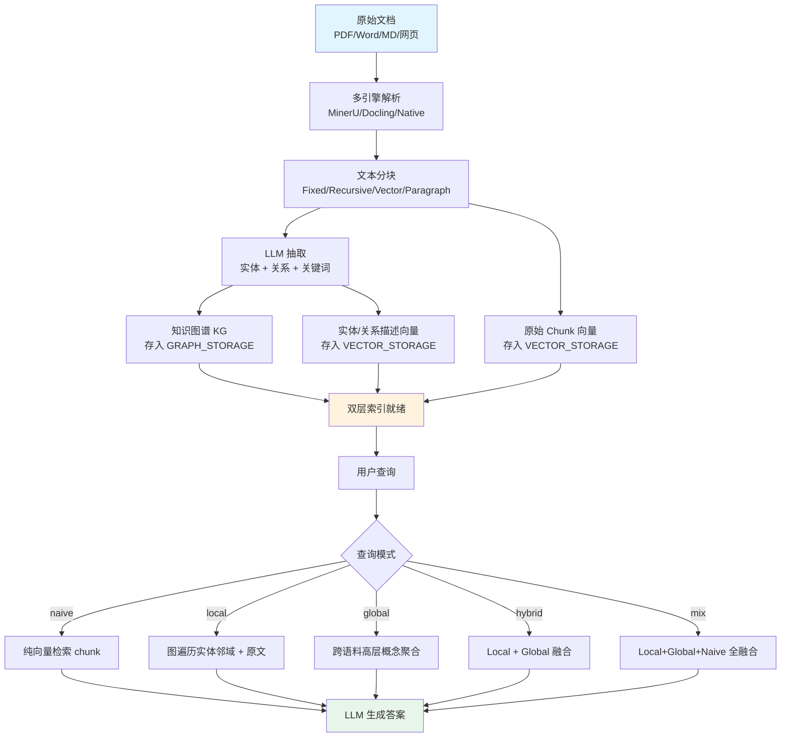
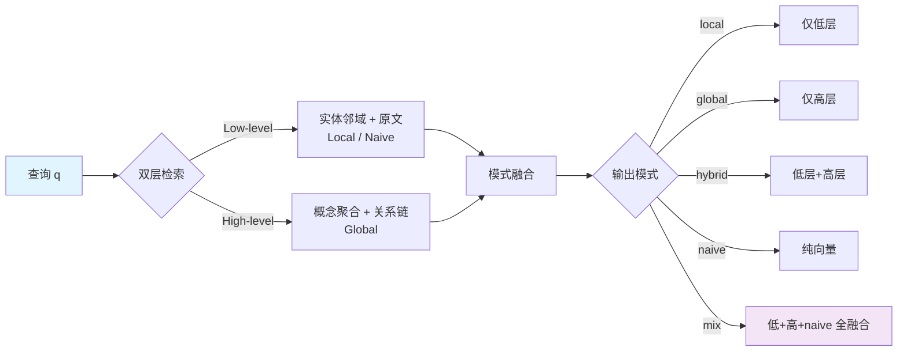

# LightRAG 技术深度解析

> **一句话总结**：LightRAG 是 HKUDS 提出的轻量图检索增强框架，以"双层检索（Low-level 实体 / High-level 概念）+ 知识图谱与向量双存储"桥接传统向量 RAG 与图 RAG，省去社区摘要生成，支持增量更新与选择性删除，默认 `mix` 查询模式覆盖局部与全局推理。

---

## 摘要

检索增强生成（RAG）通过外部知识检索增强大语言模型（LLM），但传统向量 RAG 依赖扁平文本表示、缺乏上下文感知，难以捕捉跨文档复杂依赖。微软 GraphRAG 虽引入知识图谱与层级社区摘要，却因昂贵的社区报告生成与全量重建索引而难以落地[[1]](#ref-1)。为此，香港大学数据智能实验室（HKUDS）于 2024 年提出 LightRAG[[2]](#ref-2)，将图结构融入文本索引与检索，采用**双层检索系统**（dual-level retrieval）从低层（具体实体）与高层（抽象概念）两个维度全面召回；同时将图结构与向量表示结合，显著降低 LLM 调用与响应延迟，并提出**增量更新算法**保证动态数据环境下的时效性。本文系统梳理 LightRAG 的双层架构、索引流水线、检索算法、五种查询模式与工程实践。

---

## 1. 引言与动机

### 1.1 传统 RAG 的局限

- **扁平表示**：以 chunk 为单位的向量检索缺乏显式实体/关系结构，答案碎片化
- **上下文缺失**：难以捕捉跨文档的语义依赖与全局主题

### 1.2 微软 GraphRAG 的代价

- 索引需 LLM 抽取实体/关系 + Leiden 社区检测 + **社区报告生成**，计算开销大
- 新增文档需**全量重建**索引，动态数据场景难以为继[[1]](#ref-1)

### 1.3 LightRAG 的设计目标

LightRAG 以"轻量、快速、可增量"为核心理念[[2]](#ref-2)：

- 不依赖低效的社区报告与多跳推理即可处理复杂查询
- 双层检索同时覆盖细节事实与抽象概念
- 增量更新 + **选择性删除**（文档删除时复用索引期 LLM 缓存快速重建受影响实体/关系）

---

## 2. 核心架构：双层图 + 双存储

LightRAG 采用**双层架构**同时管理知识图谱（KG）与向量嵌入，桥接传统向量 RAG 与图 RAG[[2]](#ref-2)。

### 2.1 四大存储后端

LightRAG 生产环境需要四类存储[[2]](#ref-2)：

| 存储类型 | 作用 |
|---------|------|
| **KV_STORAGE** | LLM 响应缓存、文本分块结果、实体-关系抽取结果 |
| **VECTOR_STORAGE** | 文本 chunk、实体、关系的向量 |
| **GRAPH_STORAGE** | 知识图谱（实体 + 关系） |
| **DOC_STATUS_STORAGE** | 文档列表与状态 |

默认后端为文件持久化的内存数据库（仅适合开发调试）；生产可选 PostgreSQL / MongoDB / OpenSearch 统一承载四类存储，或用 Milvus / Qdrant 做向量、Neo4j / Memgraph 做图存储[[2]](#ref-2)。

### 2.2 两层知识抽象

- **低层知识（Low-level）**：具体实体及其属性、关系——支撑精确的事实性问答
- **高层知识（High-level）**：跨语料的抽象主题与概念依赖——支撑宏观总结与跨文档推理

<p align="center"><b>图1 LightRAG 索引与检索流程</b></p>



---

## 3. 索引流水线

### 3.1 文档解析与分块

LightRAG 支持多解析引擎：MinerU、Docling、Native，并可扩展第三方解析器[[2]](#ref-2)。Native 引擎能高效解析 Word/Markdown 中的图片、表格与公式，并自动检测/修正 Word 文档的章节标题。

提供四种文本分块策略[[2]](#ref-2)：

| 策略 | 说明 |
|------|------|
| `Fixed (F)` | 定长切分 |
| `Recursive (R)` | 递归字符切分 |
| `Vector (V)` | 向量语义切分 |
| `Paragraph (P)` | 段落语义切分，**对齐文档原生语义边界**（标题/段落/表格），减少长表拆分错位 |

### 3.2 实体与关系抽取

对每个文本 chunk，LLM 抽取实体节点、关系边及关键词（keyword），生成带描述的 KG，同时保留原始文本 chunk 供向量检索[[2]](#ref-2)。LightRAG 对 LLM 的能力要求高于传统 RAG——抽取阶段需从文档执行复杂实体-关系抽取，查询阶段需在长而噪声的上下文中生成高质量回答。

**四种 LLM 角色**（按能力/速度分别配置）[[2]](#ref-2)：

| 角色 | 职责 | 建议模型 |
|------|------|---------|
| `EXTRACT` | 实体-关系抽取（每个 chunk 都跑） | 快速非思考模型，官方示例用 `gpt-4o-mini`（`gpt_4o_mini_complete`） |
| `QUERY` | 从长噪声上下文写最终答案 | 能力更强的模型（如 `gpt-4o`，可思考） |
| `KEYWORD` | 关键词抽取（随 EXTRACT 一并生成，延迟敏感） | 与 EXTRACT 同款快速模型 |
| `VLM` | 多模态图片输入（需配置 MinerU/Docling 的 VLM 通道） | 任一主流多模态模型（如 `gpt-4o`、Qwen-VL 类） |

### 3.3 嵌入与向量化

实体/关系描述与原始 chunk 均做向量化存入 VECTOR_STORAGE。嵌入模型选择建议低维快速模型（本地 `BAAI/bge-m3`）[[2]](#ref-2)**重要约束**：嵌入模型须在索引前确定且查询阶段保持一致，一经选定通常不可更换；更换需重新嵌入全部文本/实体/关系（LightRAG 不提供重嵌入工具）。

---

## 4. 检索算法：双层检索与图遍历

### 4.1 低层检索（Local）

针对具体实体/关系，从命中种子实体出发沿图边做 **k-hop 邻域扩展**，收集相关子图（实体+关系）并召回关联原始 chunk[[2]](#ref-2)：

$$N_k(S)=\{v\mid \exists u\in S,\ d(u,v)\le k\}$$

其中 $S$ 为种子实体集，$N_k(S)$ 为 k 跳邻域，最终子图 $G'=(V',E')$，$V'=N_k(S)$。本质：**以实体为中心的精确事实召回**。

### 4.2 高层检索（Global）

针对跨语料的抽象主题，聚合相关子图与全局语义，召回覆盖广主题的关系链，适合多上下文总结与趋势分析[[2]](#ref-2)。本质：**概念级宏观推理**。

### 4.3 双路融合

图检索（结构化关系）与文本检索（原始 chunk 细节）并行召回后合并，保证"结构关系"与"原文细节"双路互补[[2]](#ref-2)。

<p align="center"><b>图2 LightRAG 五种查询模式与双层检索映射</b></p>



---

## 5. 五种查询模式

LightRAG 支持五种查询模式，默认 `mix`[[2]](#ref-2)：

| 模式 | 检索内容 | 适用场景 |
|------|---------|---------|
| `naive` | 纯向量检索原始 chunk，不用 KG | 退化为传统 RAG |
| `local` | 图检索（实体/关系）+ 关联原文 | 具体对象、具体事实的精确问答 |
| `global` | 跨语料高层概念与关系链聚合 | 宏观总结、趋势分析、跨文档推理 |
| `hybrid` | Local + Global 融合 | 同时召回实体与全局关系，综合推理 |
| `mix` | Local + Global + Naive 全融合 | **默认**，检索最全面丰富 |

`mix` 模式通常给出最理想结果，耗时略高于 `naive`，其余模式延迟大致相当[[2]](#ref-2)。

---

## 6. 增量更新与选择性删除

### 6.1 增量更新

新文档抽取出的实体/关系直接并入既有 KG，仅对新增部分做图更新，不触发全量重算[[2]](#ref-2)。这解决了原版微软 GraphRAG 新增文档需全量重建索引的工程障碍。

### 6.2 选择性删除

LightRAG 进一步支持**文档级选择性删除**：删除某文档时，系统利用索引期生成的 LLM 缓存快速重建受影响的实体与关系，显著提升更新效率[[2]](#ref-2)。关键环境变量：

- `SOURCE_IDS_LIMIT_METHOD`：实体/关系超出关联文本块上限后是否继续更新（默认停止，因描述已足够丰富）
- `MAX_FILE_PATHS`：单个实体/关系可关联的最大源文件数

---

## 7. 成本、性能与对比

### 7.1 成本优势

LightRAG 不依赖社区报告与多跳推理，大幅减少索引与查询阶段的 LLM 调用[[2]](#ref-2)：

- 微软 GraphRAG 生成 1,399 社区、610 level-2 社区用于检索，每次 Global Search 约 **610K token**[[2]](#ref-2)
- LightRAG 检索 **< 100 token + 单次 API 调用**[[2]](#ref-2)

### 7.2 法律文档基准（CEUR-WS 2025）

| 框架 | 平均 AA | 平均 PG | 索引时间(s) | 查询时间(s) |
|------|--------|--------|-----------|-----------|
| LightRAG Mix | 0.86 | 89.23% | 397.00 | 14.50 |
| LlamaIndex Hybrid | 0.85 | 85.31% | 103.00 | 3.05 |
| HippoRAG 2 | 0.78 | 76.53% | — | — |
| Naïve RAG | — | — | 5.90 | 1.76 |

结论：LightRAG 类框架准确性优于朴素 RAG，但查询开销约 2 倍；`mix` 模式在该基准取得最优[[3]](#ref-3)。

### 7.3 与微软 GraphRAG 架构对比

| 维度 | 微软 GraphRAG | LightRAG |
|------|--------------|----------|
| 图构建 | LLM 抽取 + Leiden + 社区摘要 | LLM 抽取（无社区摘要） |
| 检索机制 | Community Report Map-Reduce | 双层图遍历 + 向量 |
| 增量更新 | 需全量重建 | 增量 + 选择性删除 |
| 查询模式 | Global/Local/DRIFT/Basic | naive/local/global/hybrid/mix |
| 索引成本 | 高（摘要生成） | 低 |
| 存储后端 | 文件/内存（建议外挂 DB） | 四类存储，多后端可选 |

---

## 8. 工程实践

### 8.1 安装与服务器

```bash
# 推荐 uv 管理
uv tool install "lightrag-hku[api]"
cp env.example .env   # 配置 LLM / Embedding
lightrag-server        # 默认绑定 0.0.0.0，生产需配置鉴权
```

### 8.2 最小可运行示例（Python SDK）

```python
import asyncio
from lightrag import LightRAG, QueryParam
from lightrag.llm.openai import gpt_4o_mini_complete, openai_embedding
from lightrag.utils import setup_env

setup_env()

rag = LightRAG(
    working_dir="./lightrag_work",
    llm_model_func=gpt_4o_mini_complete,
    embedding_func=openai_embedding,
)

async def main():
    # 1. 插入文档（增量索引）
    await rag.ainsert("LightRAG 是一种轻量图检索增强生成框架。")
    # 2. 查询（默认 mix 模式）
    print(await rag.aquery("LightRAG 的核心特点是什么？",
                            param=QueryParam(mode="mix")))
    # 3. 局部 / 全局
    print(await rag.aquery("LightRAG 与 GraphRAG 有何不同？",
                            param=QueryParam(mode="local")))

asyncio.run(main())
```

### 8.3 关键配置建议

- **解析引擎**：启用 MinerU + VLM 图片分析以提升索引质量[[2]](#ref-2)
  ```
  LIGHTRAG_PARSER=*:native-teP,*:legacy-R   # MinerU/Docling 需另配 endpoint 后加路由规则
  VLM_PROCESS_ENABLE=true                    # 启用 VLM 图片分析
  ```
- **并发调优**：`MAX_PARALLEL_INSERT ≈ MAX_ASYNC_LLM / 3`，`EMBEDDING_BATCH_NUM` 增大以减少嵌入 API 调用[[2]](#ref-2)
- **Rerank**：查询阶段启用 Reranker（本地 `BAAI/bge-reranker-v2-m3`）显著提升质量，引入 1–2s 延迟，可随时更换[[2]](#ref-2)
- **抽取超时**：模型慢或 chunk 实体过多时调大 `EXTRACT_LLM_TIMEOUT`；参考文献块用 `CHUNK_P_DROP_REFERENCES=true` 防超时[[2]](#ref-2)
- **多语言**：`SUMMARY_LANGUAGE=Chinese` 控制实体/关系名称与摘要语言

### 8.4 评估与可观测性

LightRAG 已集成 **RAGAS**（评估）与 **Langfuse**（链路追踪），API 可返回检索上下文以支持上下文精度指标[[2]](#ref-2)。

---

## 9. 相关文档

- [GraphRAG.md](GraphRAG.md)：微软 GraphRAG 原理、查询引擎与演进对比
- [RAG.md](RAG.md)：基础 RAG 流程、混合检索、Rerank、评估闭环
- [KV Cache.md](KV%20Cache.md)：长上下文推理显存与速度，LightRAG 查询 Token 预算相关
- [量化.md](量化.md)：本地 LLM 量化部署，降低 LightRAG 索引/查询成本（如 Qwen3-30B-A3B）

---

## 10. 参考文献

<a id="ref-1"></a>[1] D. Edge et al. ["From Local to Global: A Graph RAG Approach to Query-Focused Summarization."](https://arxiv.org/abs/2404.16130) *arXiv:2404.16130*, 2024. (微软 GraphRAG 官方论文)

<a id="ref-2"></a>[2] Z. Guo, L. Xia, Y. Yu, T. Ao, C. Huang. ["LightRAG: Simple and Fast Retrieval-Augmented Generation."](https://arxiv.org/abs/2410.05779) *EMNLP*, 2025. / GitHub: https://github.com/HKUDS/LightRAG

<a id="ref-3"></a>[3] CEUR-WS. ["Benchmarking KG-based RAG Systems: A Case Study of Legal Documents."](https://ceur-ws.org/Vol-4079/paper6.pdf) Vol-4079, 2025.
