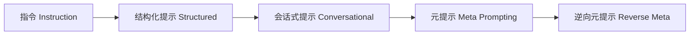
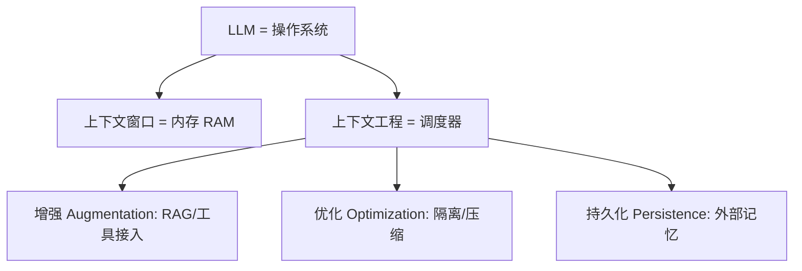
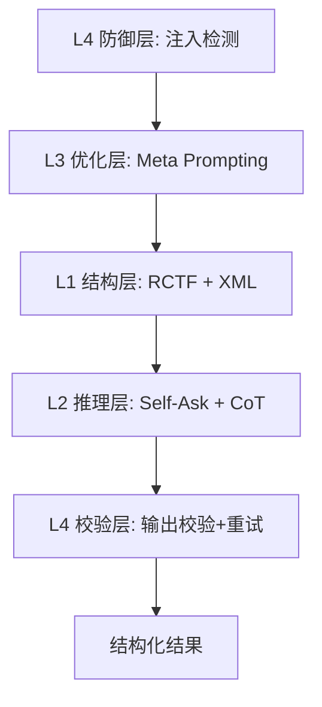

# Prompt Engineering

> Prompt Engineering 已从"怎么把一句话写清楚"演化为"怎么管理模型看到的上下文（Context Engineering）"，其核心价值在于用结构化、可复现、可验证的指令稳定撬动大模型能力。

---

## 摘要

本文基于 2025–2026 年业界一线厂商与研究机构的公开资料，系统梳理 Prompt Engineering 的定义、核心框架、基础与进阶技巧，从零编写一个 Prompt 的逐步范例，以及如何量化评估 Prompt 效果，并覆盖从"提示词工程"到"上下文工程"的范式转移、生产级防御（注入防御、输出校验）与常见陷阱，给出可落地的速查清单。

$$
\text{Prompt}=\text{System Prompt}+\text{User Profile}+\text{History}+\text{User Prompt}+\text{Dynamic}
$$

## 1. 什么是 Prompt Engineering

Prompt Engineering（提示词工程）是通过结构化指令引导大语言模型产出更高质量输出的技艺[[1]](#ref-1)。本质是给模型下达"要做什么、怎么做、什么能做、什么不能做"的指令——因为模型并不真正"理解意思"，而是在预测下一个最可能出现的 token，结构化指令能缩小正确答案的搜索空间，从而提升效果[[9]](#ref-9)。

Anthropic 团队将其定义为"structuring instructions to get better outputs from AI models"[[1]](#ref-1)；2026 年的行业共识更进一步：单独写提示词已不足以支撑生产级 AI，82% 的数据与工程负责人认为"仅做 Prompt Engineering 是不够的"，技能边界已扩展到上下文窗口管理、工具编排、评测流水线与提示安全[[3]](#ref-3)[[2]](#ref-2)。

## 2. 核心框架

### 2.1 RCTF / 四要素模型

2026 年被验证最多的通用结构为 **RCTF**：`Role（角色）+ Context（上下文）+ Task（任务）+ Format（格式）`[[11]](#ref-11)。等价地，JavaGuide 将其拆为四要素 `Role、Task、Context、Format`[[9]](#ref-9)，AI 铺子也用"指令 / 上下文 / 输入数据 / 输出约束"四段组织提示词[[8]](#ref-8)。

```text
<role>你是一名资深 SRE 工程师</role>
<context>以下是一段线上告警日志与变更记录</context>
<task>定位最可能的根因，按概率排序给出 Top3 诊断结论</task>
<format>严格按 JSON 输出：{cause, probability, verification, fix_steps}</format>
```

### 2.2 C.L.E.A.R 自检原则

工程团队可用 C.L.E.A.R 框架评估提示词质量：`Concise（简洁）`、`Logical（有逻辑）`、`Explicit（明确）`、`Adaptive（可迭代）`、`Reflective（可复盘）`[[10]](#ref-10)。

### 2.3 提示词的层级进化

提示词形态会随工程复杂度从"指令"演化为"协议"[[10]](#ref-10)：

| 层级 | 类型 | 适用场景 |
|------|------|----------|
| 结构化提示 | 模板化指令 | 明确任务、新手 |
| 会话式提示 | 多轮交互 | 模糊需求探索 |
| 元提示（Meta Prompting） | 提示词优化 | 自动改写与改进 |
| 逆向元提示 | 知识提炼 | 自动总结与模板生成 |



### 2.4 如何编写一个 Prompt（逐步范例）

以"排查线上告警"为例，展示从模糊需求到结构化 Prompt 的改写：

**改写前（模糊）**

```
帮我看看这个日志，好像有问题，分析下原因。
```

**改写后（RCTF + 界定符隔离 + 前缀缓存友好排序）**

```
<role>你是一名资深 SRE 工程师，熟悉 Kubernetes 与微服务链路追踪</role>
<constraints>仅基于给定信息推理，不臆测未提及的组件；不确定时显式说明。</constraints>
<format>严格按 JSON 输出：{"diagnosis":[{"rank":1,"cause":"","probability":"高/中/低","verification":"","fix_steps":[]}],"summary":""}</format>
<task>定位最可能的根因，按概率从高到低给出 Top3 诊断结论；每条含原因分析、验证方法、修复步骤。</task>
<context>
以下是本次告警事件与时间线（每次请求不同的动态部分，置最末）：
<timeline>
- 02:14 收到 5xx 告警，错误率 12%
- 02:15 发布 v2.3.1 上线
- 02:20 错误率升至 35%
</timeline>
</context>
```

改写要点：补角色与受众、用 XML 标签隔离指令与素材、显式约束边界、锁定输出 Schema[[8]](#ref-8)[[9]](#ref-9)。**关键是把稳定的角色 / 约束 / 输出格式 / 任务指令放在 prompt 前缀，把每次不同的事件数据（context）放末尾**——这样同一模板跨请求可命中前缀缓存（KV Cache），见 4.7 节[[16]](#ref-16)[[17]](#ref-17)。

## 3. 基础技巧（让输出可控）

- **无歧义指令**：用正面表述替代负面表述，"请使用正式学术语调"优于"语气别太随意"[[8]](#ref-8)。
- **提供充足上下文**：领域背景、对话历史、参考材料三类上下文帮助模型定位正确知识库，但**并非越多越好**，过长会稀释关键信息[[8]](#ref-8)。
- **指定受众**：给 5 岁小孩 vs 给博士写，会触发截然不同深度的输出[[8]](#ref-8)。
- **界定符 / 分隔符**：用 ` ``` `、`<context>…</context>`、`# 指令 #`、`---` 把指令、素材、示例、问题清晰隔开，消除指令与素材混淆[[8]](#ref-8)[[9]](#ref-9)。
- **角色设定（Persona）**：在写作风格、语气、创意任务上效果显著；但在纯事实问答上过度强调"你是专家"反而可能降低准确度[[8]](#ref-8)。
- **规定输出格式**：JSON（程序解析）、Markdown（工具渲染）、项目符号（快速浏览）、表格（结构化数据）[[8]](#ref-8)。
- **输出启动（Output Priming）**：结尾给出 ` ```python ` 等起手式，引导模型顺格式续写[[8]](#ref-8)。
- **礼貌≠更优**："请"不会提升输出质量，把 token 留给有用上下文更直接[[3]](#ref-3)。

## 4. 进阶技巧（激活深度能力）

### 4.1 零样本 / 少样本（Zero-shot / Few-shot）

不给示例直接下达任务（零样本），或提供 0~N 个示例引导输出模式（少样本）。Few-shot 对领域特定任务、格式化输出一致性提升明显[[10]](#ref-10)[[9]](#ref-9)。

### 4.2 思维链（Chain-of-Thought, CoT）

让模型先输出中间推理步骤再给最终答案，在推理任务上可带来 **15–40%** 的准确率提升[[3]](#ref-3)。变体包括 Self-Consistency（自洽性投票）、Self-Ask（自问自答分解复杂查询）、Least-to-Most（由易到难梯度推理）[[11]](#ref-11)。

### 4.3 XML 标签隔离与先引后析

当 Prompt 含大量文档、代码、用户输入时，用 XML 标签做语义隔离（Claude 与 GPT 均原生支持）[[9]](#ref-9)[[11]](#ref-11)：

```
<documents>
  <document index="1"><source>annual_report.pdf</source><document_content>{{REPORT}}</document_content></document>
</documents>
分析以上文档，识别战略优势。
```

长文档任务推荐"先引后析"：先让模型提取 `<quotes>` 逐字引用，再在 `<analysis>` 中基于引用分析，可显著降低幻觉[[9]](#ref-9)。

### 4.4 结构化输出与预填响应

用 JSON Schema / XML Schema 精确定义输出；或通过"预填响应"强制格式（如先写 `{ "sentiment":` 让模型续写）[[9]](#ref-9)。CoT 与 JSON Mode、Few-shot 组合仍是 2026 生产环境最有效的技巧集[[3]](#ref-3)。

### 4.5 链式提示（Prompt Chaining）

将复杂任务拆为多个独立子任务，每步单一目标、用 XML 标签在步骤间交接输出，适合多步骤分析、需对中间结果做质量检查的场景[[9]](#ref-9)。

### 4.6 减少幻觉的工程手段

显式承认不确定性（"信息不足时直接说没有足够信息"）、引用验证、N 次最佳验证（多次调用比较一致性）、迭代改进[[9]](#ref-9)。

### 4.7 前缀缓存（KV Cache / Prompt Caching）

Prompt Caching 是 2025–2026 最具杠杆的降本技巧：provider 把重复 prompt 前缀的 KV 计算缓存复用，命中后跳过 prefill，输入 token 最高可降 90%（Anthropic 显式 `cache_control` 达 90%、OpenAI 自动前缀缓存 50%、Gemini 隐式/显式约 90%），且输出质量不变、仅输入 token 计费受益[[16]](#ref-16)[[17]](#ref-17)。

这直接改变**写 prompt 的方式**——按"从长久稳定到频繁变化"分层排布，让可缓存前缀尽可能长：

| 层（顺序从上到下） | 内容 | 稳定性 |
|------|------|--------|
| 系统提示 System | 角色、常驻指令、输出 Schema、Few-shot 示例 | 最高，跨请求不变 |
| 用户画像 Profile | 用户长期偏好、权限、固定上下文 | 高，会话内基本不变 |
| 历史消息 History | 已发生的多轮对话 | 中，前缀随轮增长，但已有部分在下一轮仍稳定 |
| 当前输入 User Prompt | 本轮用户问题 / 任务 | 每轮变化 |
| 其他易变片段 | 实时检索、临时注入、动态示例 | 最高频变动，置最末 |

前缀缓存从 prompt 开头逐字节匹配，一旦遇到首个变动 token，其后内容都不再命中[[17]](#ref-17)。因此把稳定层尽量前置：系统提示 → 用户画像 → 历史消息 → 当前输入 → 其他易变片段，可缓存前缀越长、命中率越高、成本越低。注意历史消息虽逐轮增长，但其已有前缀在下一轮仍稳定，故置于用户画像之后、当前输入之前；不要每轮重写系统提示，仅往后追加新消息[[16]](#ref-16)。

机制细节参见仓库内 [KV Cache.md](KV%20Cache.md)。

### 4.8 自动化提示优化与推理模型适配

除手工技巧外，2026 年两类趋势值得关注：

- **元提示与自动提示优化（Meta Prompting / DSPy / APE）**：用 LLM 自身去改写、搜索或编译出更优提示，把提示当作可优化变量而非一次性文本；CSDN 实战将其列为 L3 自动化优化层（含 Meta Prompting、DSPy）[[11]](#ref-11)。
- **推理模型（o3 级）新范式**：对具备强推理能力的模型，"Plan-then-Execute"（先输出规划块再答）、显式推理力度校准、逐步验证指令、结构化输出块正在取代早期开放闲聊式提示[[18]](#ref-18)。
- **提示压缩与精简**：结构优于长度，生产提示甜区约 150–300 词；能用界定符与 Schema 消除歧义就勿堆字数[[3]](#ref-3)。

## 5. 范式转移：从 Prompt Engineering 到 Context Engineering

2025 下半年起，行业术语转向 **Context Engineering（上下文工程）**：Prompt Engineering 关注"如何表达问题"，Context Engineering 关注"模型生成回答时可访问什么信息"——记忆、检索文档、工具定义、对话历史，以及提示词本身[[3]](#ref-3)[[4]](#ref-4)[[5]](#ref-5)。

一个直观类比：把 LLM 比作操作系统，上下文窗口相当于内存（RAM），上下文工程相当于调度器——负责把最关键的信息装载进有限内存[[6]](#ref-6)。Gartner 指出，上下文工程正在取代提示词工程成为企业 AI 成功的关键[[4]](#ref-4)。



上下文工程面临的典型挑战与对策[[6]](#ref-6)：

| 挑战 | 表现 | 对策 |
|------|------|------|
| 上下文长度限制 | 太少推理不足，太多注意力分散 | 平衡长度，只保留最相关信息 |
| 污染（Poisoning） | 错误信息滞留致重复错误/死循环 | 定期清理、引入多样性 |
| 注意力偏移（Misalignment） | 焦点被无关信息带偏 | 用 todo list 锁定注意力 |
| 语义冲突 | 信息矛盾致混乱 | 确保一致性、逻辑自洽 |

## 6. 生产级实践与防御

### 6.1 提示词即代码（Prompt-as-Code）

把提示词当代码管理：版本控制（V1/V2）、占位符 `{{变量}}` 模板复用、A/B 测试对比输出质量[[8]](#ref-8)。成熟的标志是从单次交互走向系统协作，形成可复现、可评估、可协作的 AI 开发流程[[10]](#ref-10)。

### 6.2 防御提示注入（Prompt Injection）

OWASP 将提示注入列为 LLM 应用头号安全风险[[3]](#ref-3)。2026 生产系统推荐的分层防御栈（按优先级）[[3]](#ref-3)：

1. 结构化提示格式 + 清晰分隔符
2. 输出 Schema 校验
3. 限流（Rate Limiting）
4. 基于 LLM 的注入过滤（误报/漏报 < 1%）
5. Agent 行为级工具调用监控
6. 敏感操作多模型投票

单层技术不够，必须**分层防御**。

### 6.3 端到端技巧分层（参考 15 技巧实战）

CSDN 一项 2026 实战将高级技巧分为四层，组合后任务完成率从 58% 提升到 93%、格式合规率从 45% 提升到 97%[[11]](#ref-11)：



## 7. 如何评估 Prompt 效果

Prompt 效果必须可量化、可回归，而非"感觉变好了"。2026 年行业共识把评测列为生产 AI 的必需环节[[3]](#ref-3)[[7]](#ref-7)。

### 7.1 核心指标

| 指标 | 含义 | 数据来源 |
|------|------|----------|
| 任务完成率 / 准确率 | 输出是否满足任务目标 | 标注集 / 自动判定 |
| 格式合规率 | 是否严格符合 JSON/XML Schema | 解析校验 |
| 一致性 | 同 prompt 多次调用的稳定度 | N 次自洽投票[[9]](#ref-9) |
| 幻觉率 | 事实错误 / 无依据断言占比 | 引用验证 + 人工抽检 |

实战基准显示：系统化优化后任务完成率可从 58% 升至 93%、格式合规率从 45% 升至 97%[[11]](#ref-11)。

### 7.2 评估方法

- **版本控制 + A/B 测试**：把提示词当代码管理，V1/V2 用占位符模板，并行跑对比输出质量[[8]](#ref-8)。
- **N 次最佳验证（自洽性）**：同一 prompt 多次调用比较一致性，不一致即疑似幻觉[[9]](#ref-9)。
- **LLM-as-Judge / 评测流水线**：用模型或脚本对批量样本打分，纳入 CI/CD 做回归门禁[[3]](#ref-3)。
- **固化回归测试集**：把历史复现步骤固化为用例，每次改 prompt 跑回归，防止退化[[9]](#ref-9)。
- **人工 Rubric 评分**：对风格、安全性、合规性用评分卡抽检，补自动评测盲区。

### 7.3 流程与平台

将评测嵌入 PromptOps 闭环：编写 → 批量评测 → 对比基线 → 合入/回滚。可借助提示管理与评测平台（如 IBM 的 2026 指南与 Lakera 的评测实践）沉淀数据集与基线[[7]](#ref-7)[[12]](#ref-12)。

**是否需要专门工具？** 不一定。最小可行评估可零工具完成：用同一 prompt 跑 N 次比对一致性（N 次最佳验证）、用脚本解析 JSON 校验格式合规率、用 diff/表格人工核对任务完成率[[9]](#ref-9)。只有当提示词数量多、需回归门禁或多人协作时，才值得引入提示管理与评测平台把数据集、基线与 CI 门禁沉淀下来[[7]](#ref-7)[[12]](#ref-12)。

### 7.4 主流评估工具与平台

按"能否自托管、是否管提示"可分为两类（综合对比见 [[13]](#ref-13)[[14]](#ref-14)[[15]](#ref-15)）：

**开源评测框架（适合本地 / CI 跑单测式评测）**

| 工具 | 定位 | 许可 |
|------|------|------|
| DeepEval | Pytest 风格 LLM 单测，含 RAG/Agent/安全指标 | Apache-2.0 |
| RAGAs | RAG / Agent 检索与忠实度指标 | 开源 |
| Promptfoo | CLI 驱动的 prompt/模型/安全评测，红队与 CI 门禁 | 开源 |
| Phoenix Evals | 模型无关评测器，可独立或接 Phoenix/Arize | Elastic-2.0 |
| lm-evaluation-harness | 基础模型基准评测 | 开源 |

**可自托管 / SaaS 平台（追踪 + 数据集 + 实验 + 生产监控）**

| 工具 | 特点 | 许可 / 部署 |
|------|------|------------|
| Langfuse | 开源 LLM 工程平台：追踪、evals、提示管理 | MIT 核心，可自托管 |
| Comet Opik | Agent 追踪 + 离线/在线评测 + 提示优化 | Apache-2.0，可自托管 |
| LangSmith | LangChain 原生调试/测试/监控，四类评估器 | 商业，企业可自托管 |
| Braintrust | Eval-first 平台，提示版本化 | 商业 |
| Galileo | GenAI 可观测与评测 | 商业 |
| Maxim AI | 端到端仿真/评测/可观测，跨职能协作 | 商业 |
| Future AGI | Apache-2.0 全栈（网关+仿真+护栏） | 开源+商业 |
| PromptLayer | 提示注册 + A/B + 页面级评测 | 商业 |

选型要点：开发期用开源框架（DeepEval / RAGAs）快速迭代并接 CI 门禁；生产期需多人治理、实时监测与成本控制时再上企业平台（LangSmith / Arize / Maxim 等）[[14]](#ref-14)[[15]](#ref-15)。

## 8. 常见陷阱与规避

| 问题 | 典型表现 | 改进方法 |
|------|----------|----------|
| 任务模糊 | "帮我优化下这个应用" | 拆为多个明确子任务 |
| 缺少上下文 | 模型误解业务目标 | 嵌入 Schema / 背景数据 |
| 无安全限制 | 模型误改文件 | 明确约束 + 工具校验 |
| 过度依赖常识 | 输出错误假设 | 显式提供定义与示例 |
| 一次性复杂请求 | 超出上下文窗口 | 分阶段提示 + 自动校验 |
| 提示过长 | 矛盾指令、注意力稀释 | 控制在 150–300 词甜区[[3]](#ref-3) |

## 9. 速查清单

- [ ] 是否用 RCTF（角色/上下文/任务/格式）组织指令？
- [ ] 是否用界定符隔离指令与素材？
- [ ] 是否显式规定了输出格式（JSON / Markdown / 表格）？
- [ ] 复杂推理是否加了 CoT / 自洽性验证？
- [ ] 是否用 Few-shot 固定领域输出模式？
- [ ] 长文档是否"先引后析"以降低幻觉？
- [ ] 生产环境是否做了分层注入防御 + 输出 Schema 校验？
- [ ] 提示词是否纳入版本控制 / A/B 测试（Prompt-as-Code）？
- [ ] 上下文是否平衡长度、清理污染、锁定注意力焦点？
- [ ] 是否对 Prompt 做了量化评测（完成率/合规率/一致性）与回归测试？

## 10. 参考文献

<a id="ref-1"></a>[1] Anthropic. ["Best practices for prompt engineering for 2026."](https://claude.com/blog/best-practices-for-prompt-engineering) *Claude Blog*, 2025-11-10.

<a id="ref-2"></a>[2] Microsoft. ["What's Next in AI: 7 Trends to Watch in 2026."](https://news.microsoft.com/source/features/ai/whats-next-in-ai-7-trends-to-watch-in-2026/) *Microsoft Source*, 2026-01.

<a id="ref-3"></a>[3] JobsByCulture. ["Prompt Engineering Best Practices in 2026: What Actually Works."](https://jobsbyculture.com/blog/prompt-engineering-best-practices-2026) *AI Skills Hub*, 2026-05-09.

<a id="ref-4"></a>[4] Gartner. ["Context Engineering: Why It's Replacing Prompt Engineering for Enterprise AI Success."](https://www.gartner.com/en/articles/context-engineering) *Gartner*, 2025-10.

<a id="ref-5"></a>[5] KDnuggets. ["Context Engineering is the New Prompt Engineering."](https://www.kdnuggets.com/context-engineering-is-the-new-prompt-engineering) *KDnuggets*, 2025-12.

<a id="ref-6"></a>[6] ByronFinn. ["Prompt Engineering 完全指南：从提示工程到上下文工程的实战教程."](https://byronfinn.github.io/prompt-engineering-context-management-complete-guide/) *技术博客*, 2025-08-13.

<a id="ref-7"></a>[7] IBM. ["The 2026 Guide to Prompt Engineering."](https://www.ibm.com/think/prompt-engineering) *IBM Think*, 2026-01.

<a id="ref-8"></a>[8] AI 铺子. ["万字长文：Prompt Engineering 完全指南——从入门到专家的 30 个核心技巧."](https://www.aipuzi.cn/ai-tutorial/prompt-engineering-complete-guide.html) *AI 铺子*, 2026-06-15.

<a id="ref-9"></a>[9] Snailclimb / JavaGuide. ["大模型提示词工程实践指南."](https://github.com/Snailclimb/JavaGuide/blob/main/docs/ai/agent/prompt-engineering.md) *GitHub JavaGuide*, 2025.

<a id="ref-10"></a>[10] Jimmy Song. ["提示词工程高级技巧."](https://jimmysong.io/zh/book/ai-handbook/prompt/advanced/) *智能体构建指南*, 2025-11-08.

<a id="ref-11"></a>[11] fox0329. ["大模型 Prompt 工程 15 个高级技巧：从 Context Engineering 到鸿蒙端侧实战."](https://gitcode.csdn.net/69e574b10a2f6a37c5a0ed29.html) *AtomGit / CSDN*, 2026-04-20.

<a id="ref-12"></a>[12] Lakera. ["The Ultimate Guide to Prompt Engineering in 2026."](https://www.lakera.ai/blog/prompt-engineering-guide) *Lakera*, 2026-01.

<a id="ref-13"></a>[13] Maxim AI. ["Top 5 LLM Evaluation Platforms in 2026."](https://www.getmaxim.ai/articles/top-5-llm-evaluation-platforms-in-2026/) *Maxim AI*, 2026.

<a id="ref-14"></a>[14] Arize. ["The Best AI Agent Evals & LLM Evaluation Platforms (2026)."](https://arize.com/resources/llm-and-agent-evaluation-platforms) *Arize*, 2026-08-25.

<a id="ref-15"></a>[15] Future AGI. ["Best LLM Evaluation Tools in 2026: 7 Compared."](https://futureagi.com/blog/best-llm-evaluation-tools-2026) *Future AGI*, 2025-10-22.

<a id="ref-16"></a>[16] OpenAI. ["Prompt caching."](https://developers.openai.com/api/docs/guides/prompt-caching) *OpenAI API*, 2025.

<a id="ref-17"></a>[17] Anthropic. ["Prompt caching."](https://platform.claude.com/docs/en/build-with-claude/prompt-caching) *Claude Docs*, 2025.

<a id="ref-18"></a>[18] PromptBestie. ["AI and Prompt Engineering Trends for 2026: The Definitive Guide."](https://promptbestie.com/en/ai-prompt-engineering-trends-2026-definitive-guide) *PromptBestie*, 2026.
