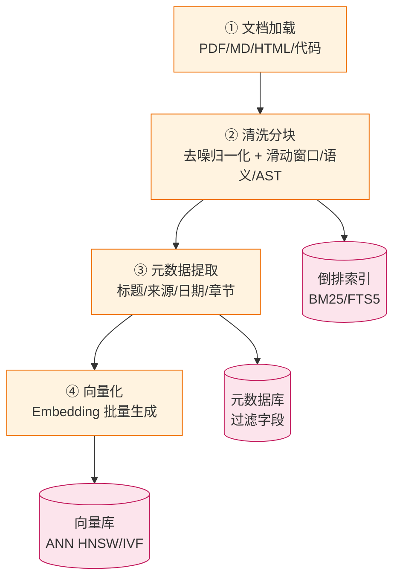
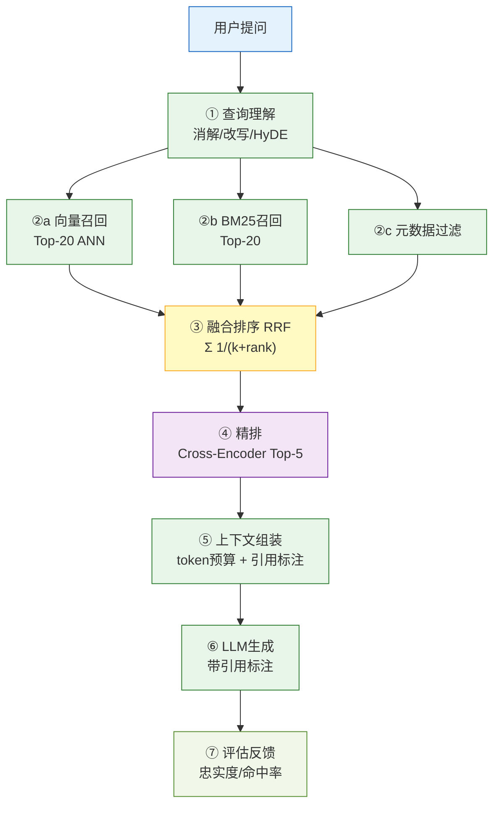
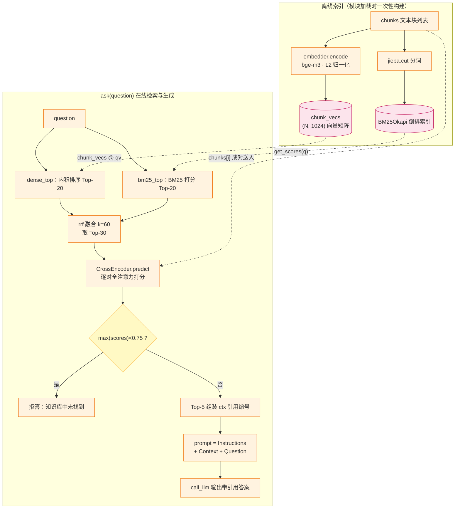

# RAG 索引建立与检索生成过程

检索增强生成（Retrieval-Augmented Generation, RAG）由 Lewis 等人在 2020 年 NeurIPS 上首次系统提出：在 LLM 生成阶段，从外部知识库检索相关文档片段拼入上下文，以抑制参数化知识幻觉，提升知识密集型任务的准确性 [\[1\]](#ref-1)。其核心流程分为**离线索引建立**与**在线检索生成**两个分离但反馈互联的阶段。系统综述可参考 Zhao 等[\[2\]](#ref-2)与《软件学报》中文综述[\[3\]](#ref-3)。

> **一句话总结**：索引 = 结构化存储（向量库 + 倒排 + 元数据），检索 = 语义匹配（向量/BM25）+ 智能融合（RRF）+ 精细排序（Reranker）+ 预算组装 + 评估闭环。

---

## 1. 离线索引建立阶段

### 1.1 文档加载与解析

异构文档抽取是索引入口。PDF 常用 `PyMuPDF` / `Unstructured`；Markdown/HTML 用 `markdown-it` / `BeautifulSoup`；代码仓库按语言解析器（Python `ast`、TS `ts-morph`、Java `JavaParser`）按函数/类拆分。

### 1.2 清洗与规范化

- **去噪**：移除页眉页脚、导航、广告、乱码。
- **编码归一化**：`unicodedata.normalize("NFC", text)`，修复 UTF-16/CP1252 混入。
- **长度过滤**：剔除 < 50 token 的无意义片段。

### 1.3 分块 — 最关键设计决策

分块策略直接影响召回精度与生成质量。主流四类策略：

| 策略 | 方法 | 优势 | 适用场景 |
|------|------|------|---------|
| **固定大小 + 滑动窗口** | 512 token，重叠 15–20% | 实现简单、延迟可控 | 通用非结构文本 |
| **句子级分块** | 按句号/换行切分，合并至上限 | 语义边界对齐 | 长篇文档 |
| **语义分块** | 相邻句子嵌入余弦相似度骤降处切分 | 块内语义高度一致 | 长文章、报告 |
| **结构感知 / AST 分块** | 代码按函数/类、文档按章节切 | 引用指向源码 | 技术文档、代码仓库 |

工程细节：使用目标模型对应 tokenizer（如 `tiktoken` for BPE）；**父子 Chunk 设计**（父 1024 token 综合回答，子 256 token 精确召回）是工业界兼顾精度与上下文的常见解法[\[4\]](#ref-4)。注意：一旦配备了高质量 Reranker，分块粒度的影响会显著下降——512–1024 token 加 10–20% 重叠对多数散文文本已经足够。

### 1.4 向量化（Embedding）

| 类别 | 代表模型 | 维度 / 上下文 | 场景 |
|------|---------|-----------|------|
| 通用多语言 | `BGE-M3`（BAAI，开源）[\[5\]](#ref-5) | 1024 维 / 8192 token | 多语言首选 |
| 通用多语言（大模型路线） | `Qwen3-Embedding`（0.6B/4B/8B，Apache 2.0，MRL + 指令感知）[\[7\]](#ref-7) | 1024–4096 维 / 32K token | 效果优先、可自部署 |
| 通用英文 | `text-embedding-3-large`（OpenAI）[\[6\]](#ref-6) | 3072 维 / 8191 token | 英文精度优先 |
| 代码专用 | `voyage-code-3` | 2048 维（MRL）/ 32K token | 代码仓库 |
| 长文档 | `jina-embeddings-v2/v3` | 8192 token | 超长全文，配合 Late Chunking[\[15\]](#ref-15) |

**部署**：隐私敏感用 `llama.cpp` + 量化模型；精度优先用远程 API。工程上应对 `hash(content)` 去重，避免重复调用。

**相似度度量**：文本检索默认用余弦相似度$\cos(a,b)=\frac{a\cdot b}{\lVert a\rVert\lVert b\rVert}$。主流嵌入模型的输出已做 L2 归一化（$\lVert a\rVert=1$），此时余弦与内积 $a\cdot b$ 完全等价，且与 L2 距离 $\lVert a-b\rVert^2=2-2a\cdot b$ 单调等价——三者给出的**排序完全一致**，选哪个不影响召回结果，按索引实现的计算速度选择即可。这也解释了拒答阈值的直觉：归一化后余弦取值 $[-1,1]$，无关文本对通常落在 0.1–0.4，强相关对在 0.6 以上，0.75 一类阈值起的是"宁缺毋滥"的作用。

### 1.5 多路存储与索引构建

现代 RAG 系统普遍采用 **"向量库 + 倒排索引 + 元数据库"** 三库并行架构。

**① 向量库（ANN Index）**

- **HNSW**：当前最主流，百万级数据 Recall@10 > 0.95，P99 < 50 ms。参数 `M`（连接数，16–64）与 `ef_construction`（建索深度，64–256）控制构建时间与查询精度权衡。
- **IVF-Flat / IVF-PQ**：分桶检索，内存效率高，适合千万级，召回略低于 HNSW。
- **Flat**：< 10 万数据最精确，O(N) 暴力余弦。

**② 倒排索引（BM25 / FTS）**

用于精确关键词匹配（API 路径、错误码、版本号），弥补向量检索在精确术语上的盲区。工具：SQLite `FTS5`、PostgreSQL `GIN`、Elasticsearch。

**③ 元数据存储**

对 `project_id`、`doc_type`、`created_at`、`tags` 等建立 B-tree 索引；检索期先过滤后检索，缩小候选空间。

### 1.6 索引更新与版本管理

监听文件变更（`watchdog` / Git hook / CI），以 `doc_path + content_hash` 幂等去重；删除时三库级联清除；记录 schema 版本支持回滚。



<p align="center">图 1：RAG 离线索引建立流程</p>

---

## 2. 在线检索与生成阶段

### 2.1 查询理解

用户原始 Query 通常简短、模糊或含指代，需多步预处理：

- **指代消解**（代词还原）、**查询扩展**：LLM 生成 3–5 个同义 Query。
- **HyDE（Hypothetical Document Embeddings）**[\[8\]](#ref-8)：先让 LLM 生成假想答案，再对假想文本做向量检索——其语义分布更接近真实文档，论文显示在多个基准上显著优于零样本稠密检索（具体幅度因数据集而异）。
- **回溯 Query 构建**：多轮对话场景中，将当前 Query 与消解后的历史对话拼接为完整检索 Query。

### 2.2 多路召回

| 召回途径 | 方式 | 典型 Top-N |
|----------|------|-----------|
| 向量检索 | ANN 余弦相似度 | Top-20 ~ Top-50 |
| 关键词检索 | BM25 / FTS | Top-20 |
| 元数据过滤 | 精确/范围匹配 | 过滤后结果集 |

动机：向量擅长语义泛化，BM25 擅长精确匹配，互补盲区[\[2\]](#ref-2)[\[3\]](#ref-3)。混合召回是当前生产环境默认栈中性价比最高的单项质量提升。

### 2.3 融合排序（Fusion）

**① RRF（Reciprocal Rank Fusion）**[\[9\]](#ref-9)：

$$\text{RRF}(d)=\sum_{r\in R}\frac{1}{k+r(d)}$$

其中 $r(d)$ 为文档 $d$ 在列表 $r$ 中的排名，典型 $k=60$（范围 30–80）。无需归一化、零调参、鲁棒性强。

**② 加权线性融合**：

$$\text{score}=w_1\tilde{s}_{\text{vec}}+w_2\tilde{s}_{\text{bm25}}+w_3\text{recency}+w_4\text{importance}$$

可解释，但需调参。

### 2.4 重排序（Reranking）

融合后候选（Top-20 ~ Top-50）送入 Cross-Encoder 精排：

- **机制**：Query 与每个 Chunk 成对打分，输出相关性分数，取 Top-3 ~ Top-5。快慢差异的根源在于两种架构的本质不同：
  - **Bi-Encoder（召回阶段）**：Query 与 Chunk **各自独立**编码为向量，再算余弦相似度。Chunk 向量可**离线预计算**存入索引，在线仅需编码一次 Query——这是它敢扫全库的原因；
  - **Cross-Encoder（精排阶段）**：把 `Query [SEP] Chunk` 拼成一条序列送入模型，两侧 token 做**全注意力交叉交互**后直接输出相关性分数。分数依赖具体 Query，无法预计算也无法缓存，N 个候选就要跑 N 次完整前向——这正是它比 Bi-Encoder 慢 10–50 倍的根源，因此只能作用于窄候选集。
- **主流模型（2025–2026）**：
  - `bge-reranker-v2-m3`（BAAI，0.6B，MIT 协议）：开源自部署默认选择，单卡约 12 ms/对，生产部署占比最高的开源 Reranker[\[10\]](#ref-10)；
  - `Qwen3-Reranker`（0.6B/4B/8B，Apache 2.0，指令感知）：开放权重的质量上限，BEIR 平均 nDCG@10 约 77%（8B），中英双语尤其强[\[7\]](#ref-7)；
  - `Cohere Rerank 3.5/4`：托管 API 默认项，免运维[\[11\]](#ref-11)。
- **延迟权衡**：Cross-Encoder 比 Bi-Encoder 慢 10–50 倍，仅作用于窄候选集；延迟敏感场景可用**级联模式**——先用小模型把 Top-200 压到 Top-30，再用大模型精排到 Top-10，总延迟约 200 ms 且质量接近大模型直排。
- **补充**：`MMR` 兼顾相关性 + 多样性，成本低。

### 2.5 上下文组装

- **Token 预算**：`context_window` − System Prompt − 对话历史 − 答案预留 = 检索片段预算。
- **截断**：按 Rerank 分数高→低逐个 append，超预算截断。
- **引用标注**：附 `[source_doc_id, chunk_id, page/section]`，要求 LLM 输出 `[1][2]`。
- **位置偏差**："Lost in the Middle"研究表明长上下文中部信息利用率显著低于首尾，关键片段应尽量放在上下文两端[\[12\]](#ref-12)。

### 2.6 生成与后处理

- **Prompt 四要素**：Instructions + Context + Question + Citation Requirements。
- **拒答边界**：最高相关性低于阈值时返回"基于现有知识库无法回答"，防止幻觉[\[2\]](#ref-2)。阈值（如 $\text{cosine}<0.75$）为经验值，需按所选嵌入模型在自有语料上校准。

### 2.7 端到端示例：一次查询的完整旅程

以问题 **"HNSW 的 ef_construction 调大会怎样？"** 为例走完全程：

1. **查询理解**：无指代、术语明确，原样透传（若是多轮对话则先做指代消解与改写）。
2. **多路召回**：向量路按语义召回 Top-20；BM25 路精确命中含 `ef_construction` 字样的段落 Top-20；元数据过滤限定 `doc_type=docs`。
3. **RRF 融合**：某段落同时被两路召回（各排第 1 和第 3），得分 $\frac{1}{61}+\frac{1}{63}\approx 0.032$，稳居榜首；仅单路召回的最高分只有 $\frac{1}{61}\approx 0.016$——**双路命中天然压过单路**，且全程无需任何分数归一化。
4. **精排**：融合后 Top-30 送入 `bge-reranker-v2-m3`，逐对打分取 Top-5（约 $30\times12\,\text{ms}\approx0.36\,\text{s}$）。
5. **组装**：按 Token 预算放入 5 个片段（约 3.2K token），rerank 最高分的片段置于上下文开头与末尾（规避 Lost in the Middle）。

最终送入 LLM 的 Prompt 形如：

```text
[Instructions] 仅依据下方资料回答；资料不足时明确回答"知识库中未找到"。每条结论标注来源编号。
[Context]
[1]（docs/RAG.md · §1.5 · rerank=0.93）HNSW 参数 M（连接数，16–64）与
    ef_construction（建索深度，64–256）控制构建时间与查询精度权衡……
[2]（docs/RAG.md · §1.3 · rerank=0.81）……
……共 5 条，约 3.2K token……
[Question] HNSW 的 ef_construction 调大会怎样？
[Citation] 回答末尾列出所引用的来源编号。
```

6. **生成与反馈**：LLM 输出结论并带 `[1][3]` 式引用，faithfulness 校验通过、引用可回溯源文档；若离线评测 Recall@K 不达标，则回到第 1 章调整分块策略或嵌入模型——闭环完成。

### 2.8 评估与反馈闭环

| 离线指标 | 定义 | 典型阈值 |
|---------|------|---------|
| Recall@K | 正确答案 Chunk 在 Top-K 比例 | > 0.85 |
| Hit Rate | 至少一个正确 Chunk 的 Query 占比 | > 0.90 |
| faithfulness[\[13\]](#ref-13) | 答案是否完全基于检索片段 | > 0.90 |

**在线指标**：点赞/点踩率、引用点击率、首答正确率。

**反馈闭环**：低质量检索 → 回溯优化分块大小、嵌入模型、重排权重、HyDE 参数。



<p align="center">图 2：RAG 在线检索生成流程</p>

---

## 3. 前沿演进（2024–2026）

### 3.1 Contextual Retrieval（上下文检索）

Anthropic 提出的索引期增强[\[14\]](#ref-14)：为每个 Chunk 用 LLM 生成一句话"它在全文中的位置与主题"前缀，再拼入 Chunk 一起嵌入与建 BM25 索引。官方报告检索失败率：仅上下文化嵌入下降约 35%，叠加上下文化 BM25 下降约 49%，再加 Reranker 下降约 67%。成本为每个 Chunk 一次 LLM 调用，配合 prompt caching 后在百万级语料上也只需一次性数十美元量级的开销。这是近年公开发表的、对生产 RAG 性价比最高的单项改进之一。

### 3.2 Late Chunking（迟分块）

Jina AI 提出[\[15\]](#ref-15)：先用长上下文嵌入模型对整篇文档做 token 级编码，再在 mean pooling 阶段按 Chunk 边界池化出各 Chunk 向量。每个 Chunk 的表示因此携带全文上下文，缓解"Chunk 脱离原文导致代词/主题丢失"问题，且无需额外训练或调用 LLM。适用于 `jina-embeddings-v3` 等 8K+ 上下文嵌入模型。

### 3.3 RAG vs 长上下文 vs 微调

窗口扩展到 128K–1M 后，"还要不要 RAG"的争论在 2026 年形成共识：三者解决的是不同问题，选型取决于知识更新频率、语料规模与是否需要注入行为[\[2\]](#ref-2)：

| 维度 | RAG | 长上下文 | 微调 |
|------|-----|---------|------|
| 知识更新 | 重建索引即生效（分钟级） | 每次请求注入全文 | 需重训（小时~天级） |
| 成本随语料增长 | 亚线性（只检索相关片段） | 线性（按 prompt 长度计费） | 一次性高额固定成本 |
| 引用溯源 | 天然支持 | 困难 | 几乎不可行 |
| 注入风格/行为 | 弱 | few-shot 尚可 | 最强 |
| 典型适用规模 | 百万 token 以上、频繁变化 | 单次任务 < 100K token | 稳定领域的格式/风格 |

针对其中"要不要 RAG"：

- **长上下文的隐性上限**：有效上下文通常只有标称的 1/4–1/2，中部信息易被忽略（Lost in the Middle）[\[12\]](#ref-12)；且按 prompt 长度计费，整库塞入的成本随文档数线性上涨。
- **RAG 的不可替代性**：检索成本随文档数增长远缓于全量注入；天然带引用溯源；只送入数千 token 高相关内容，绕开注意力稀释。
- **主流融合模式**：RAG 负责"找得准"，长上下文负责"想得透"——检索后放宽预算、以完整段落而非碎片喂给模型。三者正交可组合：RAG 找知识、微调解风格、长窗口装下检索结果。

### 3.4 GraphRAG 与查询路由

Microsoft GraphRAG 在索引期抽取实体—关系图，检索期返回子图[\[16\]](#ref-16)，擅长跨文档全局综合类问题（如"汇总这 200 份合同的风险敞口"）；对单点事实类问题相对朴素 RAG 无优势，且索引成本高 10–100 倍。2026 年的生产模式是**路由**：用小型分类器或 LLM 将查询分为"定点事实 → 向量 RAG"与"全局综合 → GraphRAG"两路。

### 3.5 Agentic RAG

把检索作为 Agent 可调用的工具之一，由模型动态决定是否检索、何时改写、何时停止[\[17\]](#ref-17)。通过反思、规划、工具使用与多智能体协作处理多跳复杂查询，代价是多次 LLM 调用的延迟与成本。实践共识：Agentic 复杂度无法弥补糟糕的检索——先夯实索引与混合召回，再按任务复杂度选择性引入。

---

## 4. 关键设计决策速查

| 决策点 | 推荐方案 | 关键参数 | 参考 |
|--------|---------|---------|------|
| 分块粒度 | 512 token + 20% 重叠 | 代码类 128–256；配 Contextual/Late Chunking 更佳 | [\[14\]](#ref-14) [\[15\]](#ref-15) |
| 嵌入模型 | `BGE-M3` / `Qwen3-Embedding` / OpenAI `text-embedding-3-large` | 1024–4096 维 | [\[5\]](#ref-5) [\[6\]](#ref-6) [\[7\]](#ref-7) |
| 向量库 | `pgvector` / `Qdrant` | HNSW 索引 | [\[2\]](#ref-2) |
| 检索策略 | 混合：向量 + BM25 + 元数据 | 各 Top-20 | [\[2\]](#ref-2) [\[3\]](#ref-3) |
| 融合方法 | RRF（$k=60$） | 零调参 | [\[9\]](#ref-9) |
| 重排序 | Cross-Encoder Top-5 | `bge-reranker-v2-m3` / `Qwen3-Reranker` / Cohere Rerank | [\[7\]](#ref-7) [\[10\]](#ref-10) [\[11\]](#ref-11) |
| 幻觉对抗 | 阈值拒答 + 引用校验 | 阈值按嵌入模型校准 | [\[13\]](#ref-13) |

---

## 5. 最小示例代码（Python）

下面约 40 行脚本把前两章的主干串成可运行闭环：**嵌入 + BM25 双路索引 → RRF 融合 → Cross-Encoder 精排 → 阈值拒答 → Prompt 组装**。

```python
# pip install sentence-transformers rank_bm25 jieba numpy
import jieba
import numpy as np
from rank_bm25 import BM25Okapi
from sentence_transformers import SentenceTransformer, CrossEncoder

chunks = [
    # 实际项目来自第 1 章：文档加载 → 清洗 → 分块后的文本块列表
    "HNSW 的 M 控制每个节点连接数，ef_construction 控制建索候选队列深度，二者越大越准、构建越慢。",
    "RRF 融合公式 score(d)=Σ 1/(k+rank)，k 通常取 60，只需各路的排名、无需分数归一化。",
]

# ---------- 离线索引 ----------
embedder = SentenceTransformer("BAAI/bge-m3")
chunk_vecs = embedder.encode(chunks, normalize_embeddings=True)      # (N, 1024)，已 L2 归一化
bm25 = BM25Okapi([list(jieba.cut(c)) for c in chunks])               # 中文按词建倒排

def dense_top(q, n=20):
    qv = embedder.encode([q], normalize_embeddings=True)[0]
    return np.argsort(-(chunk_vecs @ qv))[:n]                        # 归一化后内积即余弦

def bm25_top(q, n=20):
    return np.argsort(-bm25.get_scores(list(jieba.cut(q))))[:n]

def rrf(*rank_lists, k=60):
    s = {}
    for lst in rank_lists:
        for r, idx in enumerate(lst):
            s[idx] = s.get(idx, 0.0) + 1.0 / (k + r + 1)
    return sorted(s, key=s.get, reverse=True)

# ---------- 在线检索与生成 ----------
reranker = CrossEncoder("BAAI/bge-reranker-v2-m3", max_length=512)

def ask(question, top_k=5, threshold=0.75):
    fused = rrf(dense_top(question), bm25_top(question))[:30]
    scores = reranker.predict([[question, chunks[i]] for i in fused])  # 每个候选一次全注意力前向
    if float(np.max(scores)) < threshold:                              # 阈值需按自有语料校准
        return "知识库中未找到足够相关的资料。"
    order = np.argsort(-np.asarray(scores))[:top_k]
    ctx = "\n".join(f"[{n}] {chunks[fused[i]]}" for n, i in enumerate(order, 1))
    prompt = (f"[Instructions] 仅依据下方资料回答并标注来源编号，不足时明说。\n\n"
              f"[Context]\n{ctx}\n\n[Question] {question}")
    return call_llm(prompt)                                            # 接任意 LLM API
```

#### 示例代码执行流程



<p align="center">图 3：最小示例代码执行流程</p>

生产替换对照：内存数组 → `pgvector`/`Qdrant`；`rank_bm25` → Elasticsearch/PG `GIN`；固定分块 → 父子 Chunk + Contextual Retrieval；`call_llm` → 任一 LLM SDK 并在 System 中固化 Instructions。

---

## 6. 参考文献

<a id="ref-1"></a>[1] P. Lewis et al. ["Retrieval-Augmented Generation for Knowledge-Intensive NLP Tasks."](https://arxiv.org/abs/2005.11401) *NeurIPS*, 2020.

<a id="ref-2"></a>[2] W. Zhao et al. ["Retrieval-Augmented Generation for Large Language Models: A Survey."](https://arxiv.org/abs/2312.10997) *arXiv:2312.10997*, 2023.

<a id="ref-3"></a>[3] 刘澳迪, 奚雪峰, 周国栋. ["面向大语言模型生成能力提升的检索增强生成研究进展."](https://www.jos.org.cn/jos/article/abstract/7684) *软件学报*（优先出版）, DOI: 10.13328/j.cnki.jos.007684.

<a id="ref-4"></a>[4] LangChain. ["Retrieval-Augmented Generation (RAG)."](https://python.langchain.com/docs/tutorials/rag/) 官方教程文档.

<a id="ref-5"></a>[5] J. Chen et al. ["BGE M3-Embedding: Multi-Lingual, Multi-Functionality, Multi-Granularity Text Embeddings Through Self-Knowledge Distillation."](https://arxiv.org/abs/2402.03216) *arXiv:2402.03216*, 2024.

<a id="ref-6"></a>[6] OpenAI. ["Embeddings."](https://platform.openai.com/docs/guides/embeddings) 官方文档, 2024.

<a id="ref-7"></a>[7] Qwen Team. ["Qwen3 Embedding: Advancing Text Embedding and Reranking Through Foundation Models."](https://qwenlm.github.io/blog/qwen3-embedding/) 官方博客, 2025.

<a id="ref-8"></a>[8] L. Gao et al. ["Precise Zero-Shot Dense Retrieval without Relevance Labels."](https://arxiv.org/abs/2212.10496) *ACL*, 2023.（HyDE）

<a id="ref-9"></a>[9] G. V. Cormack et al. ["Reciprocal Rank Fusion Outperforms Condorcet and Individual Rank Learning Methods."](https://dl.acm.org/doi/10.1145/1571941.1572114) *SIGIR*, 2009.

<a id="ref-10"></a>[10] S. Xiao et al. ["C-Pack: Packaged Resources To Advance General Chinese Embedding."](https://arxiv.org/abs/2309.07597) *SIGIR*, 2024.（BGE 系列嵌入与 Reranker 官方论文）

<a id="ref-11"></a>[11] Cohere. ["Rerank Guide."](https://docs.cohere.com/docs/rerank-guide) 官方文档.

<a id="ref-12"></a>[12] N. F. Liu et al. ["Lost in the Middle: How Language Models Use Long Contexts."](https://arxiv.org/abs/2307.03172) *TACL*, 2024.

<a id="ref-13"></a>[13] S. Es et al. ["RAGAS: Automated Evaluation of Retrieval Augmented Generation."](https://arxiv.org/abs/2309.15217) *EACL (Demo)*, 2024.

<a id="ref-14"></a>[14] Anthropic. ["Introducing Contextual Retrieval."](https://www.anthropic.com/news/contextual-retrieval) 官方博客, 2024.

<a id="ref-15"></a>[15] M. Günther et al. ["Late Chunking: Contextual Chunk Embeddings Using Long-Context Embedding Models."](https://arxiv.org/abs/2409.04701) *arXiv:2409.04701*, 2024.

<a id="ref-16"></a>[16] D. Edge et al. ["From Local to Global: A Graph RAG Approach to Query-Focused Summarization."](https://arxiv.org/abs/2404.16130) *arXiv:2404.16130*, 2024.

<a id="ref-17"></a>[17] H. Singh et al. ["Agentic Retrieval-Augmented Generation: A Survey on Agentic RAG."](https://arxiv.org/abs/2501.09136) *arXiv:2501.09136*, 2025.

---

## 相关文档

- [KV Cache.md](KV%20Cache.md)：上下文组装的 Token 预算直接影响推理显存与速度。
- [Transformer架构.md](Transformer架构.md)：Cross-Encoder/Bi-Encoder 的底层注意力机制。
- [量化.md](量化.md)：嵌入模型与 Reranker 本地量化部署的基础。
