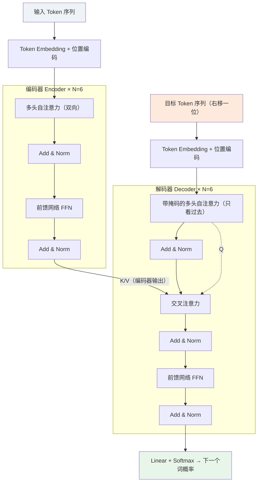

# Transformer 架构

Transformer 由 Vaswani 等 8 位 Google 研究者在 2017 年提出（论文 *Attention Is All You Need*）[\[1\]](#ref-1)，**完全基于注意力机制，彻底抛弃循环与卷积**。它同时拿下三个目标：翻译质量 SOTA（WMT'14 EN→DE 28.4 BLEU）、高度并行（训练远快于 RNN）、以及更低的训练成本——8 张 P100 训练 3.5 天。

---

## 一、整体结构：Encoder-Decoder

原版是机器翻译用的**编码器-解码器**结构，两侧各堆叠 $N=6$ 个相同层，全程维度固定为 $d_{model}=512$ [\[1\]](#ref-1)：

- **编码器层** = 2 个子层：多头自注意力 + 逐位置前馈网络。
- **解码器层** = 3 个子层：带因果掩码的自注意力 + **交叉注意力**（$Q$ 来自解码器，$K/V$ 来自编码器输出）+ 前馈网络。
- 每个子层都包残差连接和层归一化：$\text{LayerNorm}(x+\text{Sublayer}(x))$——即 **Post-LN** 排布 [\[1\]](#ref-1)。
- 因果掩码保证位置 $i$ 的预测只依赖 $<i$ 的已知输出，这是自回归生成的合法性来源（详见 [KV Cache.md](KV%20Cache.md) 第一节）。

---

## 二、核心组件拆解

### 1. 位置编码（Positional Encoding）

注意力本身是置换等变的，不含顺序信息，因此必须注入位置。原版用不同频率的正弦/余弦函数（无需学习参数）[\[1\]](#ref-1)：

$$PE_{(pos,2i)}=\sin(pos/10000^{2i/d_{model}}), \quad PE_{(pos,2i+1)}=\cos(pos/10000^{2i/d_{model}})$$

波长从 $2\pi$ 到 $10000\cdot2\pi$ 构成几何级数；任意固定偏移 $k$，$PE_{pos+k}$ 都是 $PE_{pos}$ 的线性函数——作者假设这让模型容易学「相对位置」注意力。实验显示换成可学习位置嵌入结果几乎相同（Table 3 row E）[\[1\]](#ref-1)。

### 2. 缩放点积注意力与多头注意力

单头注意力的计算：

$$\text{Attention}(Q,K,V)=\text{softmax}\left(\frac{QK^T}{\sqrt{d_k}}\right)V$$

- 除以 $\sqrt{d_k}$：$d_k$ 过大时点积方差随之增大，把 softmax 推入梯度极小的饱和区，缩放可稳定梯度 [\[1\]](#ref-1)。
- **多头机制**：把 $d_{model}$ 切给 $h$ 个头分别做注意力再拼接投影，让各头在不同表示子空间、不同位置模式下学习。原版 $h=8$，每头 $d_k=d_v=d_{model}/h=64$，总算力与满维单头相当 [\[1\]](#ref-1)：

$$\text{MultiHead}(Q,K,V)=\text{Concat}(\text{head}_1,\cdots,\text{head}_h)W^O, \quad \text{head}_i=\text{Attention}(QW_i^Q,KW_i^K,VW_i^V)$$

### 3. 前馈网络（FFN）

逐位置的两层全连接（等价于两个 $1\times1$ 卷积），先升维再降维 [\[1\]](#ref-1)：

$$\text{FFN}(x)=\max(0,xW_1+b_1)W_2+b_2, \quad d_{model}=512 \to d_{ff}=2048$$

中间层通常是 $d_{model}$ 的 4 倍。参数量上 FFN 占大头（现代模型约 60%+），它承担「存储知识」的角色。

### 4. 自注意力 vs RNN / CNN

原论文第 4 节的三方对比 [\[1\]](#ref-1)，解释了为什么注意力赢了：

| 层类型 | 每层计算量 | 顺序操作（并行度瓶颈） | 最长依赖路径 |
| --- | --- | --- | --- |
| 自注意力 | $O(n^2 \cdot d)$ | $O(1)$ | $O(1)$ |
| 循环 RNN | $O(n \cdot d^2)$ | $O(n)$ | $O(n)$ |
| 卷积 CNN | $O(k \cdot n \cdot d^2)$ | $O(1)$ | $O(\log_k n)$ |

RNN 无法并行是硬伤；CNN 需要堆 $\log_k n$ 层才能连接两端 token；自注意力一层内任意两位置直接相连，且完全并行。

---

## 三、原论文超参数速查表

| 配置 | $N$ | $d_{model}$ | $d_{ff}$ | $h$ | 参数量 | Dropout | 训练步数 | EN-DE BLEU |
| --- | --- | --- | --- | --- | --- | --- | --- | --- |
| Base | 6 | 512 | 2048 | 8 | 65M | 0.1 | 100K | 27.3 |
| Big | 6 | 1024 | 4096 | 16 | 213M | 0.3 | 300K | **28.4** |

其他关键设置 [\[1\]](#ref-1)：

- **优化器**：Adam（$\beta_1=0.9$，$\beta_2=0.98$，$\epsilon=10^{-9}$），学习率随 warmup 先升后降：
$$lr=d_{model}^{-0.5}\cdot\min(step^{-0.5}, step\cdot warmup^{-1.5}), \quad warmup=4000$$
- **正则**：残差与 dropout（$P_{drop}=0.1$）、标签平滑 $\epsilon_{ls}=0.1$（损 BLEU 但涨准确率）。
- **推理**：beam size = 4，长度惩罚 $\alpha=0.6$，最大输出长度 = 输入长度 + 50。
- **硬件**：8×P100，Base 约 12 小时，Big 约 3.5 天。

---

## 四、从 2017 到今天：现代 LLM 的架构演进

GPT-1 把结构改为 **decoder-only**，GPT-2 引入 **pre-norm**；LLaMA（2023）把当时的最佳组件固化成事实标准配方 [\[7\]](#ref-7)。对 53 个模型的统计显示：77% 用 RMSNorm、70% 用 RoPE、72% 用 SwiGLU 系激活、43% 用 GQA [\[7\]](#ref-7)。

| 组件 | 2017 原版 | 现代主流 | 改动动机 |
| --- | --- | --- | --- |
| 归一化位置 | Post-LN | **Pre-Norm** | 残差通路无阻塞，深层网络训练更稳 [\[6\]](#ref-6) |
| 归一化类型 | LayerNorm | **RMSNorm** | 去掉均值中心化与偏置，约快 10–15%，效果持平 [\[2\]](#ref-2) |
| 位置编码 | 正弦函数 | **RoPE**（旋转位置编码） | 通过旋转 Q/K 让相对位置自然出现在注意力打分里，利于长度外推 [\[3\]](#ref-3) |
| 注意力头 | MHA | **GQA / MQA**（前沿还有 MLA） | KV Cache 按 $n_h/n_{kv}$ 倍缩减，长上下文推理可行 [\[5\]](#ref-5) |
| FFN 激活 | ReLU | **SwiGLU**（门控） | 门控换宽度：表达力增益大于容量损失，一致优于 ReLU/GELU [\[4\]](#ref-4) |
| 偏置项 | 全部保留 | 通常全部去掉 | 略减参数、简化实现，无可测质量损失 [\[7\]](#ref-7) |
| Dropout | 0.1–0.3 | 预训练常不用 | 万亿级 token 数据下过拟合风险低 [\[7\]](#ref-7) |

现代 decoder block 的数据流（对照第一节的 Post-LN 图）：

$$x_{out}=x+\text{Attn}_{GQA+RoPE}(\text{RMSNorm}(x)), \qquad x=x+\text{SwiGLU}(\text{RMSNorm}(x))$$

> **实例（LLaMA 3）**[\[8\]](#ref-8)：标准 dense Transformer + GQA（8 个 KV 头）+ SwiGLU + RoPE（基频 $\theta=500000$ 以支持 32K 上下文）。三个尺寸的关键配置：

| LLaMA 3 | 8B | 70B | 405B |
| --- | --- | --- | --- |
| Layers | 32 | 80 | 126 |
| $d_{model}$ | 4096 | 8192 | 16384 |
| FFN 维度 | 14336 | 28672 | 53248 |
| Q 头 / KV 头 | 32 / 8 | 64 / 8 | 128 / 8 |

注意两点：① FFN 维度 ≈ $\frac{8}{3}d_{model}$ 而非 $4d$——这是 SwiGLU 引入门控多出的一个矩阵后，为保持总参数量所做的补偿 [\[4\]](#ref-4)；② KV 头恒为 8——正是 [KV Cache.md](KV%20Cache.md) 里 GQA 省显存的那一招。

---

## 参考文献

[1] A. Vaswani et al. ["Attention Is All You Need."](https://arxiv.org/abs/1706.03762) *NeurIPS*, 2017.

[2] B. Zhang, R. Sennrich. ["Root Mean Square Layer Normalization."](https://arxiv.org/abs/1910.07467) *NeurIPS*, 2019.

[3] J. Su et al. ["RoFormer: Enhanced Transformer with Rotary Position Embedding."](https://arxiv.org/abs/2104.09864) *Neurocomputing*, 2024.

[4] N. Shazeer. ["GLU Variants Improve Transformer."](https://arxiv.org/abs/2002.05202) *arXiv:2002.05202*, 2020.

[5] J. Ainslie et al. ["GQA: Training Generalized Multi-Query Transformer Models from Multi-Head Checkpoint."](https://arxiv.org/abs/2305.13245) *EMNLP*, 2023.

[6] R. Xiong et al. ["On Layer Normalization in the Transformer Architecture."](https://arxiv.org/abs/2002.04745) *ICML*, 2020.

[7] J. Y. Tan. ["The Crystallization of Transformer Architectures (2017-2025)."](https://jytan.io/blog/transformer-architectures/) 2025.

[8] A. Grattafiori et al. ["The Llama 3 Herd of Models."](https://arxiv.org/abs/2407.21783) *arXiv:2407.21783*, 2024.
