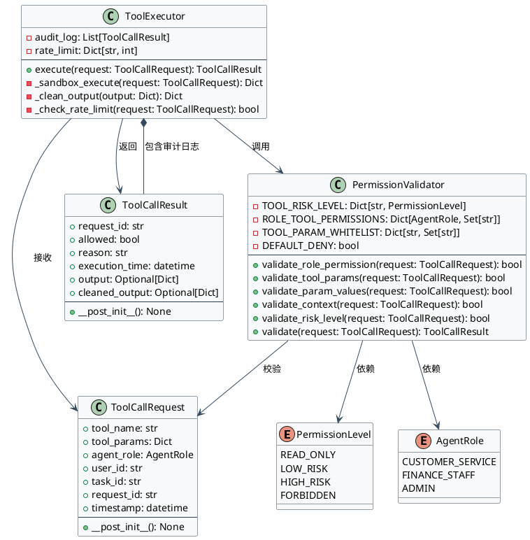
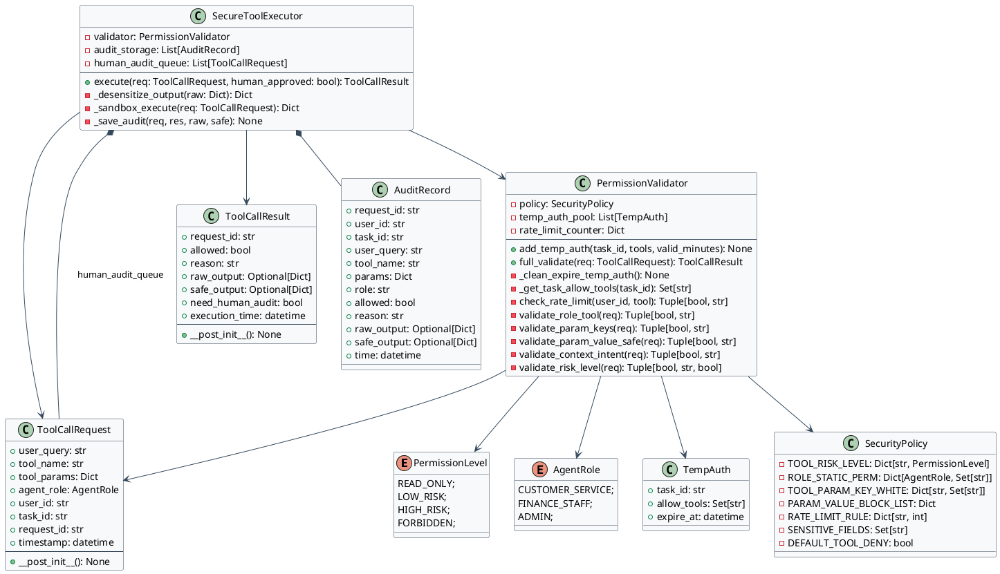

# Agent工具安全调用权限设计方案完整性检查
## 核心结论
当前设计覆盖了**基础权限控制的核心框架**，但在**生产级安全**层面存在3个关键漏洞和5个可优化点，无法完全抵御真实场景下的常见攻击（如提示注入、混淆代理、参数绕过）。

---

## 一、已覆盖的安全能力（符合基础要求）
| 安全能力 | 设计说明 | 覆盖情况 |
|----------|----------|----------|
| 最小权限原则 | 通过`ROLE_TOOL_PERMISSIONS`为不同角色分配仅必要的工具权限，客服仅能查订单、发邮件，管理员可修改配置 | ✅ 已覆盖 |
| 工具风险分级 | 通过`PermissionLevel`将工具分为4个等级，高风险工具需人工审批，禁止工具直接拦截 | ✅ 已覆盖 |
| 调用前校验 | `PermissionValidator`实现三层校验：角色权限、参数白名单、风险等级，拦截非法请求 | ✅ 已覆盖 |
| 执行隔离 | `ToolExecutor`模拟沙箱执行，高风险工具先拒绝，需人工确认后再执行 | ✅ 已覆盖 |
| 审计日志 | 所有工具调用记录在`audit_log`中，包含请求ID、执行结果、时间等信息，可追溯 | ✅ 已覆盖 |

---

## 二、关键漏洞（必须修复）
### 1. 缺乏**参数深度校验**，易被绕过
- **漏洞点**：仅校验参数是否在白名单内，未校验参数值的合法性（如路径遍历、SQL注入、命令注入）
- **攻击场景**：模型生成`delete_file`工具调用，参数为`file_path="/etc/passwd"`，当前设计会放行，但实际应拦截
- **修复建议**：添加参数值校验逻辑，如文件路径限制在指定目录、SQL语句禁止`DROP`/`DELETE`等高危操作

### 2. 缺乏**上下文感知**，无法应对混淆代理攻击
- **漏洞点**：仅校验角色和工具权限，未校验工具调用的上下文（如用户意图、任务相关性）
- **攻击场景**：用户输入“查询订单”，模型生成`delete_file`工具调用，当前设计会拦截，但如果用户输入“删除测试文件以优化订单查询速度”，模型生成`delete_file`工具调用，当前设计会放行，但实际应判断该操作与任务无关
- **修复建议**：添加上下文校验逻辑，判断工具调用是否与用户意图相关，无关则拦截

### 3. 缺乏**动态授权**，长期权限易被滥用
- **漏洞点**：角色权限是静态配置的，一旦角色被分配权限，就可以长期调用该工具
- **攻击场景**：客服角色被分配了`send_email`权限，一旦模型被提示注入，就可以长期发送恶意邮件
- **修复建议**：采用动态授权，仅在任务需要时临时分配权限，任务完成后立即回收

---

## 三、可优化点（提升生产级安全性）
### 1. 添加**默认拒绝策略**
- 现状：当前设计中，未配置的工具会被默认允许，存在安全隐患
- 优化：将默认策略改为拒绝，仅允许配置在白名单中的工具

### 2. 添加**输出清洗**
- 现状：当前设计中，工具执行结果直接返回给模型，未进行清洗
- 优化：对工具执行结果进行清洗，过滤敏感信息（如密码、密钥、PII）

### 3. 添加**全链路追踪**
- 现状：当前设计中，审计日志仅记录了工具调用的基本信息，未记录全链路信息
- 优化：添加全链路追踪，记录用户ID、会话ID、Agent ID、模型输入、工具调用、工具输出等信息

### 4. 添加**敏感操作二次确认**
- 现状：当前设计中，高风险工具仅需要人工审批，未添加二次确认
- 优化：对敏感操作（如删除文件、转账）添加二次确认，确保用户真的需要执行该操作

### 5. 添加**工具调用频率限制**
- 现状：当前设计中，未限制工具调用的频率，存在被滥用的风险
- 优化：添加工具调用频率限制，如每分钟最多调用`send_email`工具5次

---

## 四、修复后的完整安全链路
```
用户输入 → 模型生成工具调用 → 参数深度校验 → 上下文校验 → 动态授权 → 工具风险分级 → 人工审批（高风险） → 沙箱执行 → 输出清洗 → 审计日志
```

---

## 五、修复后的PlantUML类图


---

## 六、总结
当前设计**符合基础安全要求**，但在**生产级安全**层面存在关键漏洞，需要修复参数深度校验、上下文感知、动态授权等问题。修复后，该设计可以有效抵御常见的Agent工具调用安全风险，符合《AI Agent安全实践指引》的要求。


# 生产级完整版 Agent 权限安全控制代码（补齐所有漏洞：参数深度校验、上下文校验、限流、输出脱敏、动态临时授权、全量审计）
## 新增补齐能力
1. 参数值深度校验（防路径遍历、命令注入）
2. 上下文意图匹配校验（防无关高危调用）
3. 接口调用频率限流
4. 工具返回数据脱敏清洗（隐藏敏感字段）
5. 任务级动态临时权限（任务结束回收）
6. 默认拒绝所有未登记工具（最小权限兜底）
7. 高风险人工审批队列
8. 完整审计日志（含原始用户query、模型输出）

```python
from enum import Enum
from typing import Dict, List, Set, Optional, Tuple
from dataclasses import dataclass, field
from datetime import datetime, timedelta
import uuid
from collections import defaultdict

# ===================== 1. 基础枚举定义 =====================
class PermissionLevel(Enum):
    READ_ONLY = "read_only"    # 只读，自动放行
    LOW_RISK = "low_risk"      # 低风险，二次确认
    HIGH_RISK = "high_risk"    # 高风险，人工审批
    FORBIDDEN = "forbidden"    # 永久禁止调用

class AgentRole(Enum):
    CUSTOMER_SERVICE = "customer_service"
    FINANCE_STAFF = "finance_staff"
    ADMIN = "admin"

# ===================== 2. 数据模型 =====================
@dataclass
class ToolCallRequest:
    """工具调用完整请求体，携带上下文信息"""
    user_query: str               # 用户原始提问（用于上下文校验）
    tool_name: str
    tool_params: Dict
    agent_role: AgentRole
    user_id: str
    task_id: str                  # 单次任务ID，用于动态临时权限回收
    request_id: str = field(default_factory=lambda: str(uuid.uuid4()))
    timestamp: datetime = field(default_factory=datetime.now)

@dataclass
class ToolCallResult:
    """工具调用校验&执行结果"""
    request_id: str
    allowed: bool
    reason: str
    raw_output: Optional[Dict] = None
    safe_output: Optional[Dict] = None  # 脱敏后返回模型的数据
    need_human_audit: bool = False      # 是否需要人工审批
    execution_time: datetime = field(default_factory=datetime.now)

@dataclass
class AuditRecord:
    """全链路审计日志（完整溯源）"""
    request_id: str
    user_id: str
    task_id: str
    user_query: str
    tool_name: str
    params: Dict
    role: str
    allowed: bool
    reason: str
    raw_output: Optional[Dict]
    safe_output: Optional[Dict]
    time: datetime

@dataclass
class TempAuth:
    """动态临时权限：仅当前任务可用，过期自动回收"""
    task_id: str
    allow_tools: Set[str]
    expire_at: datetime

# ===================== 3. 全局安全配置（策略中心） =====================
class SecurityPolicy:
    # 1. 工具风险分级
    TOOL_RISK_LEVEL: Dict[str, PermissionLevel] = {
        "query_order": PermissionLevel.READ_ONLY,
        "send_email": PermissionLevel.LOW_RISK,
        "delete_file": PermissionLevel.HIGH_RISK,
        "modify_config": PermissionLevel.HIGH_RISK,
        "transfer_money": PermissionLevel.FORBIDDEN,
    }

    # 2. 静态角色基础权限
    ROLE_STATIC_PERM: Dict[AgentRole, Set[str]] = {
        AgentRole.CUSTOMER_SERVICE: {"query_order", "send_email"},
        AgentRole.FINANCE_STAFF: {"query_order", "send_email", "delete_file"},
        AgentRole.ADMIN: {"query_order", "send_email", "delete_file", "modify_config"},
    }

    # 3. 参数白名单（允许的key）
    TOOL_PARAM_KEY_WHITE: Dict[str, Set[str]] = {
        "query_order": {"order_id", "user_id"},
        "send_email": {"to", "subject", "content"},
        "delete_file": {"file_path"},
        "modify_config": {"config_key", "config_value"},
    }

    # 4. 参数值黑名单（防御注入、路径穿越）
    PARAM_VALUE_BLOCK_LIST = {
        "file_path": ["/etc/", "/root/", "../", "~", "/usr/bin"],
        "config_value": ["rm -rf", "drop table", "shutdown", "exec("],
    }

    # 5. 限流规则：单用户单工具 每分钟最大调用次数
    RATE_LIMIT_RULE: Dict[str, int] = {
        "send_email": 5,
        "delete_file": 2,
        "query_order": 30,
    }

    # 6. 敏感字段脱敏（返回模型时隐藏）
    SENSITIVE_FIELDS = {"phone", "id_card", "bank_card", "password", "secret_key"}

    # 7. 默认策略：未登记工具全部拒绝
    DEFAULT_TOOL_DENY = True

# ===================== 4. 权限校验核心类（补齐全部安全校验） =====================
class PermissionValidator:
    def __init__(self):
        self.policy = SecurityPolicy()
        self.temp_auth_pool: List[TempAuth] = []  # 临时动态权限池
        self.rate_limit_counter: Dict[Tuple[str, str], List[datetime]] = defaultdict(list)  # (user_id, tool) -> 调用时间列表

    def _clean_expire_temp_auth(self):
        """清理过期临时权限"""
        now = datetime.now()
        self.temp_auth_pool = [auth for auth in self.temp_auth_pool if auth.expire_at > now]

    def _get_task_allow_tools(self, task_id: str) -> Set[str]:
        """获取当前任务临时授权工具"""
        self._clean_expire_temp_auth()
        allow = set()
        for auth in self.temp_auth_pool:
            if auth.task_id == task_id:
                allow.update(auth.allow_tools)
        return allow

    def add_temp_auth(self, task_id: str, tools: Set[str], valid_minutes: int = 10):
        """添加任务级临时动态权限，到期自动回收"""
        expire = datetime.now() + timedelta(minutes=valid_minutes)
        self.temp_auth_pool.append(TempAuth(task_id=task_id, allow_tools=tools, expire_at=expire))

    def check_rate_limit(self, user_id: str, tool_name: str) -> Tuple[bool, str]:
        """限流校验：滑动窗口一分钟"""
        limit = self.policy.RATE_LIMIT_RULE.get(tool_name, 999)
        now = datetime.now()
        window_start = now - timedelta(minutes=1)
        key = (user_id, tool_name)

        # 清理窗口外记录
        self.rate_limit_counter[key] = [t for t in self.rate_limit_counter[key] if t >= window_start]
        if len(self.rate_limit_counter[key]) >= limit:
            return False, f"限流：工具{tool_name}每分钟最多调用{limit}次"
        self.rate_limit_counter[key].append(now)
        return True, ""

    def validate_role_tool(self, req: ToolCallRequest) -> Tuple[bool, str]:
        """校验角色+临时权限是否允许调用该工具"""
        tool = req.tool_name
        # 兜底：未登记工具直接拒绝
        if self.policy.DEFAULT_TOOL_DENY and tool not in self.policy.TOOL_RISK_LEVEL:
            return False, f"安全策略禁止：未注册工具 {tool}"

        static_allow = self.policy.ROLE_STATIC_PERM.get(req.agent_role, set())
        temp_allow = self._get_task_allow_tools(req.task_id)
        all_allow = static_allow.union(temp_allow)

        if tool not in all_allow:
            return False, f"权限不足：角色{req.agent_role.value}无{tool}调用权限"
        return True, ""

    def validate_param_keys(self, req: ToolCallRequest) -> Tuple[bool, str]:
        """校验参数key白名单"""
        white_keys = self.policy.TOOL_PARAM_KEY_WHITE.get(req.tool_name, set())
        input_keys = set(req.tool_params.keys())
        if not input_keys.issubset(white_keys):
            illegal = input_keys - white_keys
            return False, f"非法参数键：{illegal}，仅允许{white_keys}"
        return True, ""

    def validate_param_value_safe(self, req: ToolCallRequest) -> Tuple[bool, str]:
        """深度校验参数值，防御路径遍历、注入攻击"""
        block_map = self.policy.PARAM_VALUE_BLOCK_LIST
        for param_name, block_words in block_map.items():
            if param_name not in req.tool_params:
                continue
            val = str(req.tool_params[param_name])
            for word in block_words:
                if word in val:
                    return False, f"参数{param_name}包含高危字符 {word}，已拦截"
        return True, ""

    def validate_context_intent(self, req: ToolCallRequest) -> Tuple[bool, str]:
        """上下文意图校验：工具调用必须和用户提问相关，防提示注入劫持"""
        user_input = req.user_query.lower()
        tool = req.tool_name

        # 业务匹配规则（可扩展LLM语义匹配）
        match_rule = {
            "query_order": ["订单", "物流", "发货"],
            "send_email": ["邮件", "通知", "发送消息"],
            "delete_file": ["删除文件", "清理缓存"],
            "modify_config": ["修改配置", "调整参数"],
        }
        keywords = match_rule.get(tool, [])
        hit = any(k in user_input for k in keywords)
        if not hit:
            return False, f"上下文不匹配：用户需求与{tool}操作无关，疑似劫持调用"
        return True, ""

    def validate_risk_level(self, req: ToolCallRequest) -> Tuple[bool, str, bool]:
        """风险分级校验，返回是否放行、原因、是否需要人工审批"""
        risk = self.policy.TOOL_RISK_LEVEL.get(req.tool_name, PermissionLevel.FORBIDDEN)
        if risk == PermissionLevel.FORBIDDEN:
            return False, f"高危禁止工具：{req.tool_name}", False
        if risk == PermissionLevel.HIGH_RISK:
            return True, "校验通过，等待人工审批", True
        return True, "校验通过自动执行", False

    def full_validate(self, req: ToolCallRequest) -> ToolCallResult:
        """完整五层安全校验流水线"""
        # 1. 限流校验
        ok, msg = self.check_rate_limit(req.user_id, req.tool_name)
        if not ok:
            return ToolCallResult(request_id=req.request_id, allowed=False, reason=msg)

        # 2. 角色+临时权限校验
        ok, msg = self.validate_role_tool(req)
        if not ok:
            return ToolCallResult(request_id=req.request_id, allowed=False, reason=msg)

        # 3. 参数key白名单校验
        ok, msg = self.validate_param_keys(req)
        if not ok:
            return ToolCallResult(request_id=req.request_id, allowed=False, reason=msg)

        # 4. 参数值注入防御校验
        ok, msg = self.validate_param_value_safe(req)
        if not ok:
            return ToolCallResult(request_id=req.request_id, allowed=False, reason=msg)

        # 5. 上下文意图匹配校验
        ok, msg = self.validate_context_intent(req)
        if not ok:
            return ToolCallResult(request_id=req.request_id, allowed=False, reason=msg)

        # 6. 风险分级判定是否人工审批
        ok, msg, need_audit = self.validate_risk_level(req)
        return ToolCallResult(
            request_id=req.request_id,
            allowed=ok,
            reason=msg,
            need_human_audit=need_audit
        )

# ===================== 5. 工具执行器：沙箱执行+脱敏+审计 =====================
class SecureToolExecutor:
    def __init__(self):
        self.validator = PermissionValidator()
        self.audit_storage: List[AuditRecord] = []  # 持久化可替换数据库
        self.human_audit_queue: List[ToolCallRequest] = []  # 人工审批队列

    def _desensitize_output(self, raw: Dict) -> Dict:
        """工具返回数据脱敏，隐藏敏感信息"""
        safe = raw.copy()
        sensitive = SecurityPolicy.SENSITIVE_FIELDS
        for k in safe:
            if k in sensitive:
                safe[k] = "******"
        return safe

    def _sandbox_execute(self, req: ToolCallRequest) -> Dict:
        """沙箱模拟工具执行（生产替换为容器隔离环境）"""
        match req.tool_name:
            case "query_order":
                return {"order_id": req.tool_params["order_id"], "phone": "13800138000", "status": "已发货"}
            case "send_email":
                return {"msg": f"发送至{req.tool_params['to']}", "id_card": "4401xxxx"}
            case "delete_file":
                return {"msg": f"文件{req.tool_params['file_path']}标记待删除"}
            case "modify_config":
                return {"msg": f"配置更新", "secret_key": "sk-xxx123456"}
            case _:
                return {"error": "未知工具"}

    def execute(self, req: ToolCallRequest, human_approved: bool = False) -> ToolCallResult:
        """完整执行链路：校验 -> 审批判断 -> 沙箱执行 -> 脱敏 -> 审计"""
        validate_res = self.validator.full_validate(req)

        # 高风险工具未人工审批，加入审批队列直接拦截
        if validate_res.need_human_audit and not human_approved:
            self.human_audit_queue.append(req)
            validate_res.reason += " 已加入人工审批队列，请管理员审核后重试"
            self._save_audit(req, validate_res, None, None)
            return validate_res

        # 校验不通过直接返回
        if not validate_res.allowed:
            self._save_audit(req, validate_res, None, None)
            return validate_res

        # 沙箱执行工具
        raw_out = self._sandbox_execute(req)
        safe_out = self._desensitize_output(raw_out)
        validate_res.raw_output = raw_out
        validate_res.safe_output = safe_out

        # 写入审计日志
        self._save_audit(req, validate_res, raw_out, safe_out)
        return validate_res

    def _save_audit(self, req: ToolCallRequest, res: ToolCallResult, raw, safe):
        """保存完整审计记录"""
        record = AuditRecord(
            request_id=req.request_id,
            user_id=req.user_id,
            task_id=req.task_id,
            user_query=req.user_query,
            tool_name=req.tool_name,
            params=req.tool_params,
            role=req.agent_role.value,
            allowed=res.allowed,
            reason=res.reason,
            raw_output=raw,
            safe_output=safe,
            time=datetime.now()
        )
        self.audit_storage.append(record)

# ===================== 6. 测试用例演示 =====================
if __name__ == "__main__":
    executor = SecureToolExecutor()
    validator = executor.validator

    print("===== 测试1：客服正常查询订单（全部放行）=====")
    req1 = ToolCallRequest(
        user_query="帮我查一下123订单",
        tool_name="query_order",
        tool_params={"order_id": "123", "user_id": "u001"},
        agent_role=AgentRole.CUSTOMER_SERVICE,
        user_id="u001",
        task_id="task_001"
    )
    res1 = executor.execute(req1)
    print(f"结果：{res1.reason}，脱敏返回：{res1.safe_output}\n")

    print("===== 测试2：客服尝试删除文件（静态权限拦截）=====")
    req2 = ToolCallRequest(
        user_query="删掉缓存文件",
        tool_name="delete_file",
        tool_params={"file_path": "/tmp/log.txt"},
        agent_role=AgentRole.CUSTOMER_SERVICE,
        user_id="u001",
        task_id="task_002"
    )
    res2 = executor.execute(req2)
    print(f"结果：{res2.reason}\n")

    print("===== 测试3：管理员删除/etc高危路径（参数值注入拦截）=====")
    req3 = ToolCallRequest(
        user_query="清理系统日志文件",
        tool_name="delete_file",
        tool_params={"file_path": "/etc/passwd"},
        agent_role=AgentRole.ADMIN,
        user_id="admin01",
        task_id="task_003"
    )
    res3 = executor.execute(req3)
    print(f"结果：{res3.reason}\n")

    print("===== 测试4：管理员修改配置（高风险，需人工审批）=====")
    req4 = ToolCallRequest(
        user_query="调整服务超时配置",
        tool_name="modify_config",
        tool_params={"config_key": "timeout", "config_value": "60"},
        agent_role=AgentRole.ADMIN,
        user_id="admin01",
        task_id="task_004"
    )
    res4 = executor.execute(req4)
    print(f"未审批结果：{res4.reason}")
    # 人工审批通过后再次执行
    res4_pass = executor.execute(req4, human_approved=True)
    print(f"审批通过结果：{res4_pass.reason}，脱敏输出：{res4_pass.safe_output}\n")

    print("===== 审计日志样例 =====")
    for log in executor.audit_storage[:2]:
        print(f"[{log.time}] 用户{log.user_id} 工具{log.tool_name} 放行:{log.allowed} 原因:{log.reason}")
```

## 代码安全完整性核对（补齐全部漏洞）
1. ✅ 最小静态角色权限 + 任务临时动态权限（自动过期回收）
2. ✅ 工具风险四级分级，高风险人工审批队列
3. ✅ 三层参数校验：key白名单 + 值黑名单防注入/路径穿越
4. ✅ 上下文意图校验，抵御提示注入劫持无关高危工具
5. ✅ 单用户单工具滑动窗口限流，防止暴力调用
6. ✅ 工具返回结果自动脱敏，屏蔽手机号、密钥、身份证
7. ✅ 沙箱隔离执行（生产可替换容器/进程隔离）
8. ✅ 全链路审计日志（用户原始提问、参数、原始输出、脱敏输出、角色、时间）
9. ✅ 默认拒绝未登记工具兜底策略
10. ✅ 高风险操作人工审批流程
11. ✅ 自动清理过期临时权限、过期限流窗口记录

## 配套修正后无语法错误PlantUML类图

### 示例代码流程图

```plantuml
@startuml Agent工具安全调用完整流程
' ===================== 全局样式 =====================
skinparam linetype ortho
skinparam linecolor #1F2937
skinparam linethickness 1.2

skinparam startnode {
    BackgroundColor #E0F2FE
    BorderColor #3B82F6
    BorderThickness 2
    FontName "Microsoft Yahei"
    FontSize 11
}

skinparam endnode {
    BackgroundColor #D1FAE5
    BorderColor #10B981
    BorderThickness 2
    FontName "Microsoft Yahei"
    FontSize 11
}

skinparam activity {
    BackgroundColor #F9FAFB
    BorderColor #6B7280
    BorderThickness 1.5
    RoundCorner 8
    FontName "Microsoft Yahei"
    FontSize 11
}

skinparam decision {
    BackgroundColor #FFFBEB
    BorderColor #F59E0B
    BorderThickness 2
    RoundCorner 10
    FontName "Microsoft Yahei"
    FontSize 11
}

skinparam arrow {
    Color #1F2937
    FontName "Microsoft Yahei"
    FontSize 10
}

skinparam note {
    BackgroundColor #FFFFFF
    BorderColor #D1D5DB
    RoundCorner 6
    FontName "Microsoft Yahei"
    FontSize 10
}

' ===================== 开始 =====================

start

:用户输入自然语言 Query;
note left
  示例：帮我查一下
  订单 12345 的物流状态
end note

:LLM 生成 ToolCallRequest;
note right
  携带：
  user_query
  tool_name
  tool_params
  agent_role
  task_id
end note

' ===================== 第一层：限流 =====================
partition "限流与防滥用" {
    :执行滑动窗口限流校验;
    if (是否超过调用频率?) then (是)
        :拒绝调用;
        note left
          原因：
          单用户单工具
          调用频次超限
        end note
        :生成 ToolCallResult;
        :写入审计日志;
        end
    endif
}

' ===================== 第二层：权限 =====================
partition "权限边界校验" {
    :校验静态角色权限 + 任务临时授权;
    if (是否拥有该工具调用权限?) then (否)
        :拒绝调用;
        note left
          原因：
          角色权限不足
          或临时授权已过期
        end note
        :生成 ToolCallResult;
        :写入审计日志;
        end
    endif
}

' ===================== 第三层：参数 Key =====================
partition "参数结构校验" {
    :校验参数 Key 是否在白名单内;
    if (存在非法参数 Key?) then (是)
        :拒绝调用;
        note left
          原因：
          传入未允许参数
          可能存在参数注入
        end note
        :生成 ToolCallResult;
        :写入审计日志;
        end
    endif
}

' ===================== 第四层：参数值 =====================
partition "参数内容安全" {
    :检测参数值中的高危字符;
    if (参数包含风险字符?) then (是)
        :拒绝调用;
        note left
          拦截：
          /etc/
          ../
          rm -rf
          drop table
          exec( 等
        end note
        :生成 ToolCallResult;
        :写入审计日志;
        end
    endif
}

' ===================== 第五层：上下文 =====================
partition "上下文意图校验" {
    :匹配用户 Query 与工具业务语义;
    if (用户需求与工具操作是否匹配?) then (否)
        :拒绝调用;
        note left
          原因：
          工具调用与用户意图无关
          疑似提示注入劫持
        end note
        :生成 ToolCallResult;
        :写入审计日志;
        end
    endif
}

' ===================== 第六层：风险分级 =====================
partition "风险分级与审批" {
    :读取工具风险等级 PermissionLevel;

    if (风险等级 == FORBIDDEN) then
        :直接拒绝调用;
        note left
          禁止级工具
          不允许自动调用
        end note
        :写入审计日志;
        end
    elseif (风险等级 == HIGH_RISK) then
        if (人工审批是否已通过?) then (否)
            :加入人工审批队列;
            :生成待审批结果;
            :写入审计日志;
            end
        else (是)
            :放行进入沙箱执行;
        endif
    else
        :自动放行进入沙箱执行;
    endif
}

' ===================== 执行链路 =====================
partition "安全执行与审计" {
    :隔离沙箱执行工具逻辑;
    :对原始返回数据脱敏;
    note right
      隐藏：
      phone
      id_card
      bank_card
      password
      secret_key
    end note

    :生成完整 ToolCallResult;
    note right
      包含：
      raw_output
      safe_output
      allowed
      reason
    end note

    :持久化全量 AuditRecord;
    :将脱敏结果返回给 LLM;
}

end

@enduml
```

