# Memory System — Agent 记忆模块

模块化 Agent 记忆系统：**三层记忆 + 四大存储引擎 + 记忆治理体系**，支持多用户隔离、冲突检测、版本回滚与过期清理。基于 `uv` 管理，SQLite 本地可运行。

## 特性

- **三层记忆架构**：工作记忆（短期）→ 会话记忆（中间层）→ 长期记忆（跨会话持久化）
- **四大存储引擎**：VectorStore（SQLite 语义检索 + 画像 + 版本日志）、GraphStore（知识图谱）、KeyValueStore（配置/临时变量 + TTL）、EventStreamStore（审计事件流）
- **记忆治理**：过滤器（黑名单/长度/类型）→ 评分器（重要性/稳定性/复用性/时效性 四维加权）→ 清理器（过期/去重/低分/容量）→ 版本控制器（快照/回滚/差异）
- **冲突检测**：互斥规则自动识别画像矛盾（如"爱吃辣" vs "忌辣"），冲突内容拒绝入库
- **多租户隔离**：每个用户独立记忆空间，跨用户数据不泄露
- **用户画像**：基础信息 + 动态偏好 + 分场景画像 + 锁定字段（AI 无权自动修改）

## 架构

```
┌─────────────────────────────────────────────────┐
│ MemorySystem          系统入口，多用户（租户）隔离  │
│   └── UserMemory ×N   单用户完整记忆空间            │
├─────────┬───────────┬───────────┬───────────────┤
│ Working │ Session   │ LongTerm  │ MemoryGovernance│
│ Memory  │ Memory    │ Memory    │                │
│ 短期裁剪 │ 会话沉淀   │ 跨会话持久  │ 过滤/评分/清理/ │
│         │           │           │ 版本/冲突检测    │
├─────────┴───────────┴───────────┴───────────────┤
│ VectorStore │ GraphStore │ KeyValueStore │ EventStore │
└─────────────────────────────────────────────────┘
```

## 类图

> 基于 `src/` 实际代码生成，反映当前真实实现（47/47 测试通过）。

```mermaid
classDiagram
    direction TB

    %% ==================== 系统层 ====================
    class MemorySystem {
        +str system_id
        +VectorStore vector_store
        +MemoryGovernance governance
        +Dict[str, UserMemory] user_memories
        +get_user_memory(user_id) UserMemory
        +add_user_memory(user_id, memory)
        +remove_user_memory(user_id)
    }

    class UserMemory {
        +str user_id
        +VectorStore vector_store
        +MemoryGovernance governance
        +WorkingMemory working_memory
        +SessionMemory session_memory
        +LongTermMemory long_term_memory
        +UserProfile profile
        +_load_profile()
        +_make_memory(content, memory_type, metadata, session_id) MemoryItem
        +add_working_memory(content, metadata) MemoryItem
        +start_session(session_id)
        +add_session_memory(content, metadata) MemoryItem
        +end_session() List[MemoryItem]
        +add_long_term_memory(content, metadata) MemoryItem
        +retrieve_relevant_memories(query, top_k) List[MemoryItem]
        +flush_working_memory()
        +update_profile(profile_data)
    }

    %% ==================== 三层记忆 ====================
    class WorkingMemory {
        +int max_tokens
        -List[MemoryItem] _items
        +add_item(item)
        +get_items() List[MemoryItem]
        +trim_to_max_tokens()
        +clear()
        +current_tokens() int
        +size() int
    }

    class SessionMemory {
        +str session_id
        -List[MemoryItem] _items
        +Dict[str, Any] session_context
        +add_item(item)
        +get_items() List[MemoryItem]
        +get_session_context() Dict
        +update_context(key, value)
        +end_session() List[MemoryItem]
        +size() int
    }

    class LongTermMemory {
        +VectorStore vector_store
        +GraphStore graph_store
        +KeyValueStore kv_store
        +EventStreamStore event_store
        +add_memory(item) str
        +retrieve_memories(query, top_k, filters) List[MemoryItem]
        +retrieve_by_user(user_id, query, top_k) List[MemoryItem]
        +update_memory(memory_id, new_content, metadata)
        +delete_memory(memory_id)
        +add_graph_node(node)
        +add_graph_edge(edge)
        +store_value(key, value, ttl)
        +get_value(key) Any
    }

    %% ==================== 记忆治理 ====================
    class MemoryGovernance {
        +VectorStore vector_store
        +MemoryFilter filter
        +MemoryScorer scorer
        +MemoryCleaner cleaner
        +MemoryVersioner versioner
        +float long_term_threshold
        +should_enter_long_term(item) bool
        +score_memory(item) float
        +clean_expired_memories(items, user_id) List[MemoryItem]
        +version_memory(item) str
        +detect_conflicts(items) List[Dict]
        +adjudicate_entry(item, existing) bool
        +perform_maintenance(items) List[MemoryItem]
    }

    class MemoryFilter {
        +List[MemoryType] allowed_types
        +List[str] blocked_keywords
        +int max_content_length
        +int min_content_length
        +filter_item(item) bool
    }

    class MemoryScorer {
        +float importance_weight
        +float stability_weight
        +float reuse_weight
        +float recency_weight
        +score(item) float
    }

    class MemoryCleaner {
        +Dict[str, int] ttl_config
        +clean_expired(items) List[MemoryItem]
        +clean_duplicates(items) List[MemoryItem]
        +clean_low_score(items, threshold) List[MemoryItem]
        +enforce_capacity(items, max_count) List[MemoryItem]
    }

    class MemoryVersioner {
        +Dict[str, List[MemoryVersion]] versions
        +create_version(memory) MemoryVersion
        +get_versions(memory_id) List[MemoryVersion]
        +rollback(memory, version_id) MemoryItem
        +diff(memory_id, version_a, version_b) Dict
    }

    %% ==================== 存储引擎 ====================
    class VectorStore {
        +str store_id
        +str db_path
        +List[str] indices
        +_init_db()
        +insert_memory(memory)
        +get_memory(memory_id) MemoryItem
        +delete_memory(memory_id)
        +update_memory(memory_id, new_content, metadata)
        +search_memories(user_id, query_vector, top_k, filters) List[MemoryItem]
        +query_by_time_range(user_id, start, end) List[MemoryItem]
        +count_by_user(user_id) int
        +insert_user_profile(profile)
        +get_user_profile(user_id) UserProfile
        +insert_version(version)
        +get_versions(memory_id) List[MemoryVersion]
        +close()
    }

    class VectorIndex {
        +str name
        +List[str] columns
    }

    class GraphStore {
        +str store_id
        +Dict[str, GraphNode] nodes
        +List[GraphEdge] edges
        +add_node(node)
        +get_node(node_id) GraphNode
        +delete_node(node_id)
        +add_edge(edge)
        +get_edges(node_id) List[GraphEdge]
        +delete_edge(edge_id)
        +query_nodes(label, kwargs) List[GraphNode]
        +find_path(from_node_id, to_node_id, max_depth) List[List[str]]
        +clear()
    }

    class KeyValueStore {
        +str store_id
        -Dict[str, Any] _data
        -Dict[str, float] _ttl
        +put(key, value, ttl)
        +get(key) Any
        +delete(key)
        +exists(key) bool
        +keys(pattern) List[str]
        +get_all() Dict
        +clear()
        +size() int
        -_evict_expired()
    }

    class EventStreamStore {
        +str store_id
        -List[Event] _events
        +add_event(event)
        +get_all_events() List[Event]
        +query_events(time_range, event_type, limit) List[Event]
        +count_by_type(event_type) int
        +clear()
    }

    %% ==================== 数据模型 ====================
    class MemoryItem {
        +str memory_id
        +str content
        +Dict[str, Any] metadata
        +datetime created_at
        +datetime updated_at
        +MemoryType memory_type
        +float score
        +int version
        +str user_id
        +str session_id
        +__post_init__()
    }

    class MemoryType {
        <<enumeration>>
        WORKING = "working"
        SESSION = "session"
        LONG_TERM = "long_term"
    }

    class UserProfile {
        +str user_id
        +Dict[str, Any] base_info
        +Dict[str, Any] preferences
        +Dict[str, Dict] scene_profiles
        +Dict[str, Any] config
        +List[str] lock_keys
        +int current_version
        +float last_updated
        +List[float] embedding
    }

    class GraphNode {
        +str node_id
        +str label
        +Dict[str, Any] properties
    }

    class GraphEdge {
        +str edge_id
        +str from_node_id
        +str to_node_id
        +str relationship
        +Dict[str, Any] properties
    }

    class Event {
        +str event_id
        +str event_type
        +Dict[str, Any] payload
        +datetime timestamp
        +__post_init__()
    }

    class MemoryVersion {
        +str version_id
        +str memory_id
        +str content
        +datetime created_at
        +__post_init__()
    }

    %% ==================== 关联关系 ====================

    %% 系统 → 用户
    MemorySystem "1" --> "*" UserMemory : 管理
    MemorySystem "1" --> "1" VectorStore : 持有
    MemorySystem "1" --> "1" MemoryGovernance : 持有

    %% 用户 → 三层记忆
    UserMemory "1" --> "1" WorkingMemory : 包含
    UserMemory "1" --> "0..1" SessionMemory : 包含(会话进行中)
    UserMemory "1" --> "1" LongTermMemory : 包含
    UserMemory "1" --> "1" MemoryGovernance : 引用
    UserMemory "1" --> "1" VectorStore : 引用
    UserMemory "1" --> "1" UserProfile : 画像

    %% 长期记忆 → 四大存储
    LongTermMemory "1" --> "1" VectorStore : 依赖
    LongTermMemory "1" --> "1" GraphStore : 依赖
    LongTermMemory "1" --> "1" KeyValueStore : 依赖
    LongTermMemory "1" --> "1" EventStreamStore : 依赖

    %% 治理 → 四子模块
    MemoryGovernance "1" --> "1" MemoryFilter : 包含
    MemoryGovernance "1" --> "1" MemoryScorer : 包含
    MemoryGovernance "1" --> "1" MemoryCleaner : 包含
    MemoryGovernance "1" --> "1" MemoryVersioner : 包含
    MemoryGovernance "1" --> "0..1" VectorStore : 引用

    %% 记忆容器 → MemoryItem
    WorkingMemory "*" --> "*" MemoryItem : 存储
    SessionMemory "*" --> "*" MemoryItem : 存储
    MemoryItem "1" --> "1" MemoryType : 枚举

    %% 存储引擎 → 数据模型
    VectorStore "*" --> "*" MemoryItem : 持久化
    VectorStore "1" --> "1" UserProfile : 持久化
    VectorStore "1" --> "*" VectorIndex : 索引
    VectorStore "*" --> "*" MemoryVersion : 版本日志
    GraphStore "*" --> "*" GraphNode : 存储
    GraphStore "*" --> "*" GraphEdge : 存储
    EventStreamStore "*" --> "*" Event : 存储
    MemoryVersioner "*" --> "*" MemoryVersion : 维护

    %% ==================== 工具函数 ====================
    class Embeddings {
        <<module utils.embeddings>>
        +cosine_similarity(vec_a, vec_b) float
        +generate_embedding(text, dimensions) List[float]
    }

    class IdGenerator {
        <<module utils.id_generator>>
        +generate_id() str
    }

    VectorStore ..> Embeddings : 使用
    LongTermMemory ..> Embeddings : 使用
    UserMemory ..> Embeddings : 使用
    UserMemory ..> IdGenerator : 使用
    MemoryVersioner ..> IdGenerator : 使用
    LongTermMemory ..> IdGenerator : 使用
```



## 模块职责速览

| 层级 | 包 | 职责 |
|------|----|------|
| 系统层 | `core.memory_system` | 全局入口，多用户（租户）隔离 |
| 用户层 | `core.user_memory` | 单用户记忆整合，画像加载/更新 |
| 记忆层 | `core.working_memory` | 短期记忆，内存级，超容量自动裁剪（FIFO） |
| | `core.session_memory` | 会话记忆，`end_session()` 沉淀重要内容到长期记忆 |
| | `core.long_term_memory` | 长期记忆，聚合四大存储引擎 |
| 治理层 | `core.memory_governance` | 入库裁决（过滤→评分→冲突检测），周期性维护 |
| | `core.memory_filter` | 类型白名单 / 黑名单关键词 / 内容长度过滤 |
| | `core.memory_scorer` | 重要性/稳定性/复用性/时效性 四维加权评分 |
| | `core.memory_cleaner` | TTL过期清理 / 去重 / 低分删除 / 容量控制 |
| | `core.memory_versioner` | 版本快照 / 回滚 / 差异对比 |
| 存储层 | `stores.vector_store` | SQLite 持久化：记忆项 + 用户画像 + 版本日志，余弦相似度检索 |
| | `stores.graph_store` | 内存图：节点/边/路径查询 |
| | `stores.kv_store` | 内存 KV：TTL 过期 |
| | `stores.event_store` | 内存事件流：时间范围/类型查询 |
| 模型层 | `models.*` | 纯数据类（dataclass），无业务逻辑 |

## 目录结构

```
memory/
├── main.py                      # 演示示例
├── pyproject.toml               # uv 项目配置
├── src/
│   ├── core/                    # 核心逻辑
│   │   ├── memory_system.py     # 系统入口，管理所有用户
│   │   ├── user_memory.py       # 单用户记忆整合
│   │   ├── working_memory.py    # 工作记忆（短期）
│   │   ├── session_memory.py    # 会话记忆（中间层）
│   │   ├── long_term_memory.py  # 长期记忆（持久化）
│   │   ├── memory_governance.py # 治理总控（裁决 + 维护）
│   │   ├── memory_filter.py     # 过滤器
│   │   ├── memory_scorer.py     # 评分器
│   │   ├── memory_cleaner.py    # 清理器
│   │   └── memory_versioner.py  # 版本控制器
│   ├── models/                  # 数据模型（dataclass）
│   │   ├── memory_item.py       # MemoryItem + MemoryType 枚举
│   │   ├── user_profile.py      # 用户画像
│   │   ├── graph.py             # 图谱节点/边
│   │   ├── event.py             # 事件
│   │   └── version.py           # 版本快照
│   ├── stores/                  # 存储引擎
│   │   ├── vector_store.py      # SQLite 向量存储
│   │   ├── graph_store.py       # 图谱存储
│   │   ├── kv_store.py          # 键值存储
│   │   └── event_store.py       # 事件流存储
│   └── utils/
│       ├── embeddings.py        # 余弦相似度 + embedding
│       └── id_generator.py      # UUID 生成
└── tests/
    └── test_memory.py           # 47 个测试用例
```

## 快速开始

```bash
# 安装依赖（创建 .venv）
uv sync

# 运行演示
uv run python main.py

# 运行测试
uv run pytest tests/ -v
```

## 使用示例

```python
from src.core.memory_system import MemorySystem

memory_system = MemorySystem(db_path="memory_system.db")

# 获取（或创建）用户记忆空间
user = memory_system.get_user_memory("user_123")

# 1. 工作记忆 —— 短期，超容量自动裁剪
user.add_working_memory("用户说他喜欢吃川菜")

# 2. 会话记忆 —— 结束后重要内容自动沉淀到长期记忆
user.start_session("session_456")
user.add_session_memory("用户询问了关于 Python 的问题")
user.end_session()   # 评分达标的项自动进入长期记忆

# 3. 长期记忆 —— 经治理裁决（过滤→评分→冲突检测）后入库
user.add_long_term_memory(
    "用户是一名后端开发工程师", {"importance": 0.8}
)

# 4. 检索 —— 跨三层记忆 Top-K 召回
memories = user.retrieve_relevant_memories("用户的职业是什么？", top_k=5)

# 5. 更新用户画像（锁定字段 AI 无权修改）
user.update_profile({
    "base_info": {"name": "张三", "occupation": "后端开发工程师"},
    "preferences": {"food": "川菜"},
})

# 6. 清空工作记忆
user.flush_working_memory()
```

## 记忆治理流程

一条长期记忆入库前需依次通过：

1. **MemoryFilter** — 类型白名单、黑名单关键词、内容长度校验
2. **MemoryScorer** — `importance × 0.4 + stability × 0.2 + reuse × 0.2 + recency × 0.2`
3. **阈值裁决** — 得分 ≥ `long_term_threshold`（默认 0.5）
4. **冲突检测** — 与已有长期记忆比对互斥规则，冲突则拒绝

## 生产环境升级路径

当前为 **SQLite 本地可运行版**，生产环境可平滑替换：

| 层 | 现状 | 生产方案 |
|----|------|----------|
| 向量存储 | SQLite + Python 余弦相似度 | PostgreSQL + pgvector |
| Embedding | 本地确定性哈希 | OpenAI / BGE / M3E |
| 缓存 | 无 | Redis 热点缓存 |
| 异步 | 同步 | asyncio |
