### Agent记忆模块类图（可直接落地实现版）

```mermaid
classDiagram
    %% 核心抽象层
    class MemorySystem {
        +String system_id
        +Map<String, UserMemory> user_memories
        +add_user_memory(user_id: String, memory: UserMemory)
        +get_user_memory(user_id: String) UserMemory
        +remove_user_memory(user_id: String)
    }

    class UserMemory {
        +String user_id
        +WorkingMemory working_memory
        +LongTermMemory long_term_memory
        +SessionMemory session_memory
        +MemoryGovernance governance
        +add_working_memory(content: String, metadata: Map)
        +retrieve_relevant_memories(query: String, top_k: int) List<MemoryItem>
        +flush_working_memory()
    }

    %% 短期记忆体系
    class WorkingMemory {
        +List<MemoryItem> items
        +int max_tokens
        +int current_tokens
        +add_item(item: MemoryItem)
        +trim_to_max_tokens()
        +clear()
    }

    class SessionMemory {
        +String session_id
        +List<MemoryItem> session_items
        +Map<String, Object> session_context
        +add_session_item(item: MemoryItem)
        +get_session_history() List<MemoryItem>
        +end_session()
    }

    %% 长期记忆体系
    class LongTermMemory {
        +VectorStore vector_store
        +GraphStore graph_store
        +KeyValueStore kv_store
        +EventStreamStore event_stream_store
        +add_memory(item: MemoryItem, memory_type: String)
        +retrieve_memories(query: String, filters: Map, top_k: int) List<MemoryItem>
        +update_memory(memory_id: String, new_content: String)
        +delete_memory(memory_id: String)
    }

    %% 记忆存储引擎
    class VectorStore {
        +String store_id
        +List<VectorIndex> indices
        +insert_vector(memory_id: String, vector: List<Float>, metadata: Map)
        +search_similar_vectors(query_vector: List<Float>, top_k: int, filters: Map) List<Map>
        +delete_vector(memory_id: String)
    }

    class GraphStore {
        +String store_id
        +Graph graph
        +add_node(node: GraphNode)
        +add_edge(edge: GraphEdge)
        +query_graph(query: String) List<GraphNode>
    }

    class KeyValueStore {
        +String store_id
        +Map<String, Object> kv_map
        +put(key: String, value: Object)
        +get(key: String) Object
        +delete(key: String)
    }

    class EventStreamStore {
        +String store_id
        +List<Event> events
        +add_event(event: Event)
        +query_events(time_range: Tuple<Long, Long>) List<Event>
    }

    %% 记忆治理模块
    class MemoryGovernance {
        +MemoryFilter filter
        +MemoryScorer scorer
        +MemoryCleaner cleaner
        +MemoryVersioner versioner
        +should_enter_long_term(item: MemoryItem) Boolean
        +score_memory(item: MemoryItem) Float
        +clean_expired_memories()
        +version_memory(memory_id: String) String
    }

    class MemoryFilter {
        +List<String> allowed_types
        +List<String> blocked_keywords
        +filter_item(item: MemoryItem) Boolean
    }

    class MemoryScorer {
        +Float reuse_weight
        +Float stability_weight
        +Float importance_weight
        +score(item: MemoryItem) Float
    }

    class MemoryCleaner {
        +Map<String, Long> ttl_config
        +clean_duplicates()
        +clean_expired()
    }

    class MemoryVersioner {
        +Map<String, List<MemoryVersion>> versions
        +create_version(memory_id: String) String
        +rollback_version(memory_id: String, version_id: String)
    }

    %% 基础数据结构
    class MemoryItem {
        +String memory_id
        +String content
        +Map<String, Object> metadata
        +Long created_at
        +Long updated_at
        +String memory_type
        +Float score
        +String version
    }

    class GraphNode {
        +String node_id
        +String label
        +Map<String, Object> properties
    }

    class GraphEdge {
        +String edge_id
        +String from_node_id
        +String to_node_id
        +String relationship
        +Map<String, Object> properties
    }

    class Event {
        +String event_id
        +String event_type
        +Map<String, Object> payload
        +Long timestamp
    }

    class MemoryVersion {
        +String version_id
        +String memory_id
        +String content
        +Long created_at
    }

    %% 关联关系
    MemorySystem "1" --> "*" UserMemory : 管理
    UserMemory "1" --> "1" WorkingMemory : 包含
    UserMemory "1" --> "1" SessionMemory : 包含
    UserMemory "1" --> "1" LongTermMemory : 包含
    UserMemory "1" --> "1" MemoryGovernance : 包含

    LongTermMemory "1" --> "1" VectorStore : 依赖
    LongTermMemory "1" --> "1" GraphStore : 依赖
    LongTermMemory "1" --> "1" KeyValueStore : 依赖
    LongTermMemory "1" --> "1" EventStreamStore : 依赖

    MemoryGovernance "1" --> "1" MemoryFilter : 包含
    MemoryGovernance "1" --> "1" MemoryScorer : 包含
    MemoryGovernance "1" --> "1" MemoryCleaner : 包含
    MemoryGovernance "1" --> "1" MemoryVersioner : 包含

    WorkingMemory "*" --> "*" MemoryItem : 包含
    SessionMemory "*" --> "*" MemoryItem : 包含
    VectorStore "*" --> "*" MemoryItem : 存储
    GraphStore "*" --> "*" GraphNode : 存储
    GraphStore "*" --> "*" GraphEdge : 存储
    KeyValueStore "*" --> "*" MemoryItem : 存储
    EventStreamStore "*" --> "*" Event : 存储
    MemoryVersioner "*" --> "*" MemoryVersion : 存储
```


### 漏洞修复与增强点
1. **补充三层记忆架构**：新增`SessionMemory`作为短期与长期记忆的中间层，存储会话级结构化摘要，解决原始方案中短期记忆直接溢出到长期记忆的问题。
2. **完善记忆治理体系**：新增`MemoryGovernance`模块，包含过滤、评分、清理、版本控制四个子模块，解决原始方案中记忆写入无审核、过期无清理、错误无回滚的问题。
3. **多租户隔离强化**：`MemorySystem`通过`user_memories` Map实现用户级隔离，每个用户拥有独立的记忆空间，避免跨用户记忆泄露。
4. **存储引擎扩展**：补充`GraphStore`、`KeyValueStore`、`EventStreamStore`三种长期记忆存储类型，覆盖不同场景的记忆存储需求。
5. **版本控制机制**：新增`MemoryVersioner`模块，支持记忆版本管理与回滚，解决记忆错误无法恢复的问题。
6. **记忆评分体系**：新增`MemoryScorer`模块，从复用性、稳定性、重要性三个维度对记忆进行评分，只有超过阈值的记忆才能进入长期存储。
7. **过期清理机制**：新增`MemoryCleaner`模块，支持按TTL配置清理过期记忆，解决长期记忆无限膨胀的问题。

### 实现步骤
1. 实现基础数据结构：`MemoryItem`、`GraphNode`、`GraphEdge`、`Event`、`MemoryVersion`。
2. 实现存储引擎：`VectorStore`、`GraphStore`、`KeyValueStore`、`EventStreamStore`。
3. 实现记忆治理模块：`MemoryFilter`、`MemoryScorer`、`MemoryCleaner`、`MemoryVersioner`。
4. 实现记忆体系：`WorkingMemory`、`SessionMemory`、`LongTermMemory`。
5. 实现用户记忆管理：`UserMemory`。
6. 实现系统级管理：`MemorySystem`。

### 关键方法说明
- `UserMemory.retrieve_relevant_memories()`：根据用户查询，从短期、会话、长期记忆中检索相关记忆，返回Top-K结果。
- `MemoryGovernance.should_enter_long_term()`：判断一条记忆是否应该进入长期存储，通过过滤和评分实现。
- `MemoryCleaner.clean_expired_memories()`：清理所有过期记忆，释放存储空间。
- `MemoryVersioner.rollback_version()`：回滚到指定版本的记忆，解决记忆错误问题。

该类图覆盖了记忆系统的核心功能，同时补充了工程实现中必须的治理和隔离机制，确保系统的稳定性、安全性和可维护性。


根据上述内容，把具体代码实现到D:\project\ai_agent\memory，使用uv管理项目。

### 一、项目初始化与目录结构
#### 1. 初始化项目
```bash
# 创建项目目录
mkdir -p D:\project\ai_agent\memorySystem
cd D:\project\ai_agent\memorySystem

# 使用uv初始化项目
uv init --app .
```

#### 2. 目录结构（采用src布局）
```
memorySystem/
├── .venv/                  # uv自动创建的虚拟环境
├── src/
│   └── memory_system/      # 核心代码目录
│       ├── __init__.py
│       ├── core/           # 核心逻辑
│       │   ├── __init__.py
│       │   ├── memory.py   # 记忆系统核心类
│       │   ├── storage.py  # 存储引擎
│       │   └── governance.py # 记忆治理
│       ├── models/         # 数据模型
│       │   ├── __init__.py
│       │   ├── memory_item.py # 记忆项模型
│       │   └── user_profile.py # 用户画像模型
│       └── utils/          # 工具函数
│           ├── __init__.py
│           └── embeddings.py # 向量生成工具
├── tests/                  # 测试目录
│   ├── __init__.py
│   ├── test_memory.py
│   └── test_storage.py
├── pyproject.toml          # uv项目配置
├── uv.lock                 # uv依赖锁定文件
└── README.md               # 项目说明
```

### 二、核心代码实现
#### 1. 数据模型（src/memory_system/models/）
##### memory_item.py
```python
from dataclasses import dataclass
from datetime import datetime
from typing import Any, Dict, Optional

@dataclass
class MemoryItem:
    """记忆项数据模型"""
    memory_id: str
    content: str
    metadata: Dict[str, Any]
    created_at: datetime
    updated_at: datetime
    memory_type: str  # "working", "session", "long_term"
    score: float = 0.0
    version: int = 1
    user_id: str = ""
    session_id: Optional[str] = None
```

##### user_profile.py
```python
from dataclasses import dataclass, field
from typing import Any, Dict, List, Optional

@dataclass
class UserProfile:
    """用户画像数据模型"""
    user_id: str
    base_info: Dict[str, Any] = field(default_factory=dict)
    preferences: Dict[str, Any] = field(default_factory=dict)
    scene_profiles: Dict[str, Dict[str, Any]] = field(default_factory=dict)
    config: Dict[str, Any] = field(default_factory=dict)
    lock_keys: List[str] = field(default_factory=list)
    current_version: int = 1
    last_updated: Optional[float] = None
    embedding: Optional[List[float]] = None
```

#### 2. 存储引擎（src/memory_system/core/storage.py）
```python
import json
import sqlite3
from datetime import datetime
from pathlib import Path
from typing import Any, Dict, List, Optional, Tuple

from ..models.memory_item import MemoryItem
from ..models.user_profile import UserProfile

class VectorStore:
    """向量存储引擎（基于SQLite实现）"""
    
    def __init__(self, db_path: str = "memory_system.db"):
        self.db_path = db_path
        self._init_db()
    
    def _init_db(self):
        """初始化数据库表"""
        conn = sqlite3.connect(self.db_path)
        cursor = conn.cursor()
        
        # 记忆项表
        cursor.execute("""
            CREATE TABLE IF NOT EXISTS memory_items (
                memory_id TEXT PRIMARY KEY,
                content TEXT NOT NULL,
                metadata TEXT NOT NULL,
                created_at TEXT NOT NULL,
                updated_at TEXT NOT NULL,
                memory_type TEXT NOT NULL,
                score REAL NOT NULL DEFAULT 0.0,
                version INTEGER NOT NULL DEFAULT 1,
                user_id TEXT NOT NULL,
                session_id TEXT,
                embedding TEXT
            )
        """)
        
        # 用户画像表
        cursor.execute("""
            CREATE TABLE IF NOT EXISTS user_profiles (
                user_id TEXT PRIMARY KEY,
                base_info TEXT NOT NULL,
                preferences TEXT NOT NULL,
                scene_profiles TEXT NOT NULL,
                config TEXT NOT NULL,
                lock_keys TEXT NOT NULL,
                current_version INTEGER NOT NULL DEFAULT 1,
                last_updated REAL,
                embedding TEXT
            )
        """)
        
        # 记忆版本表
        cursor.execute("""
            CREATE TABLE IF NOT EXISTS memory_versions (
                id INTEGER PRIMARY KEY AUTOINCREMENT,
                memory_id TEXT NOT NULL,
                version INTEGER NOT NULL,
                content TEXT NOT NULL,
                created_at TEXT NOT NULL,
                FOREIGN KEY (memory_id) REFERENCES memory_items(memory_id)
            )
        """)
        
        conn.commit()
        conn.close()
    
    def insert_memory(self, memory: MemoryItem):
        """插入记忆项"""
        conn = sqlite3.connect(self.db_path)
        cursor = conn.cursor()
        
        # 转换datetime为字符串
        created_at = memory.created_at.isoformat()
        updated_at = memory.updated_at.isoformat()
        
        # 转换embedding为JSON字符串
        embedding_str = json.dumps(memory.metadata.get("embedding", []))
        
        cursor.execute("""
            INSERT OR REPLACE INTO memory_items 
            (memory_id, content, metadata, created_at, updated_at, memory_type, score, version, user_id, session_id, embedding)
            VALUES (?, ?, ?, ?, ?, ?, ?, ?, ?, ?, ?)
        """, (
            memory.memory_id,
            memory.content,
            json.dumps(memory.metadata),
            created_at,
            updated_at,
            memory.memory_type,
            memory.score,
            memory.version,
            memory.user_id,
            memory.session_id,
            embedding_str
        ))
        
        conn.commit()
        conn.close()
    
    def get_memory(self, memory_id: str) -> Optional[MemoryItem]:
        """获取记忆项"""
        conn = sqlite3.connect(self.db_path)
        cursor = conn.cursor()
        
        cursor.execute("""
            SELECT * FROM memory_items WHERE memory_id = ?
        """, (memory_id,))
        
        row = cursor.fetchone()
        conn.close()
        
        if row:
            return self._row_to_memory_item(row)
        return None
    
    def search_memories(self, user_id: str, query_vector: List[float], top_k: int = 5) -> List[MemoryItem]:
        """搜索相似记忆项"""
        conn = sqlite3.connect(self.db_path)
        cursor = conn.cursor()
        
        # 简单的余弦相似度计算（实际项目中建议使用pgvector或ChromaDB）
        query_str = json.dumps(query_vector)
        cursor.execute("""
            SELECT *, 
                   (embedding <-> ?) AS distance
            FROM memory_items 
            WHERE user_id = ?
            ORDER BY distance ASC
            LIMIT ?
        """, (query_str, user_id, top_k))
        
        rows = cursor.fetchall()
        conn.close()
        
        return [self._row_to_memory_item(row) for row in rows]
    
    def _row_to_memory_item(self, row: Tuple) -> MemoryItem:
        """将数据库行转换为MemoryItem对象"""
        return MemoryItem(
            memory_id=row[0],
            content=row[1],
            metadata=json.loads(row[2]),
            created_at=datetime.fromisoformat(row[3]),
            updated_at=datetime.fromisoformat(row[4]),
            memory_type=row[5],
            score=row[6],
            version=row[7],
            user_id=row[8],
            session_id=row[9]
        )
    
    def insert_user_profile(self, profile: UserProfile):
        """插入用户画像"""
        conn = sqlite3.connect(self.db_path)
        cursor = conn.cursor()
        
        # 转换embedding为JSON字符串
        embedding_str = json.dumps(profile.embedding or [])
        
        cursor.execute("""
            INSERT OR REPLACE INTO user_profiles 
            (user_id, base_info, preferences, scene_profiles, config, lock_keys, current_version, last_updated, embedding)
            VALUES (?, ?, ?, ?, ?, ?, ?, ?, ?)
        """, (
            profile.user_id,
            json.dumps(profile.base_info),
            json.dumps(profile.preferences),
            json.dumps(profile.scene_profiles),
            json.dumps(profile.config),
            json.dumps(profile.lock_keys),
            profile.current_version,
            profile.last_updated,
            embedding_str
        ))
        
        conn.commit()
        conn.close()
    
    def get_user_profile(self, user_id: str) -> Optional[UserProfile]:
        """获取用户画像"""
        conn = sqlite3.connect(self.db_path)
        cursor = conn.cursor()
        
        cursor.execute("""
            SELECT * FROM user_profiles WHERE user_id = ?
        """, (user_id,))
        
        row = cursor.fetchone()
        conn.close()
        
        if row:
            return UserProfile(
                user_id=row[0],
                base_info=json.loads(row[1]),
                preferences=json.loads(row[2]),
                scene_profiles=json.loads(row[3]),
                config=json.loads(row[4]),
                lock_keys=json.loads(row[5]),
                current_version=row[6],
                last_updated=row[7],
                embedding=json.loads(row[8]) if row[8] else None
            )
        return None

class MemoryGovernance:
    """记忆治理类"""
    
    def __init__(self, vector_store: VectorStore):
        self.vector_store = vector_store
    
    def should_enter_long_term(self, memory: MemoryItem) -> bool:
        """判断记忆是否应该进入长期存储"""
        # 简单规则：得分大于0.5的记忆进入长期存储
        return memory.score > 0.5
    
    def clean_expired_memories(self, user_id: str, days: int = 30):
        """清理过期记忆"""
        conn = sqlite3.connect(self.vector_store.db_path)
        cursor = conn.cursor()
        
        # 删除超过指定天数的记忆
        cursor.execute("""
            DELETE FROM memory_items 
            WHERE user_id = ? 
              AND updated_at < datetime('now', '-' || ? || ' days')
        """, (user_id, days))
        
        conn.commit()
        conn.close()
```

#### 3. 核心记忆系统（src/memory_system/core/memory.py）
```python
import uuid
from datetime import datetime
from typing import Any, Dict, List, Optional

from ..models.memory_item import MemoryItem
from ..models.user_profile import UserProfile
from .storage import VectorStore, MemoryGovernance

class MemorySystem:
    """记忆系统核心类"""
    
    def __init__(self, db_path: str = "memory_system.db"):
        self.vector_store = VectorStore(db_path)
        self.governance = MemoryGovernance(self.vector_store)
        self.user_memories: Dict[str, "UserMemory"] = {}
    
    def get_user_memory(self, user_id: str) -> "UserMemory":
        """获取用户记忆实例"""
        if user_id not in self.user_memories:
            self.user_memories[user_id] = UserMemory(user_id, self.vector_store, self.governance)
        return self.user_memories[user_id]

class UserMemory:
    """用户记忆实例"""
    
    def __init__(self, user_id: str, vector_store: VectorStore, governance: MemoryGovernance):
        self.user_id = user_id
        self.vector_store = vector_store
        self.governance = governance
        self.working_memory: List[MemoryItem] = []
        self.session_memory: List[MemoryItem] = []
        self.long_term_memory: List[MemoryItem] = []
        self.profile: Optional[UserProfile] = None
        
        # 加载用户画像
        self._load_profile()
    
    def _load_profile(self):
        """加载用户画像"""
        self.profile = self.vector_store.get_user_profile(self.user_id)
        if not self.profile:
            # 创建默认用户画像
            self.profile = UserProfile(user_id=self.user_id)
            self.vector_store.insert_user_profile(self.profile)
    
    def add_working_memory(self, content: str, metadata: Dict[str, Any] = None) -> MemoryItem:
        """添加工作记忆"""
        memory = MemoryItem(
            memory_id=str(uuid.uuid4()),
            content=content,
            metadata=metadata or {},
            created_at=datetime.now(),
            updated_at=datetime.now(),
            memory_type="working",
            user_id=self.user_id
        )
        self.working_memory.append(memory)
        return memory
    
    def add_session_memory(self, content: str, metadata: Dict[str, Any] = None) -> MemoryItem:
        """添加会话记忆"""
        memory = MemoryItem(
            memory_id=str(uuid.uuid4()),
            content=content,
            metadata=metadata or {},
            created_at=datetime.now(),
            updated_at=datetime.now(),
            memory_type="session",
            user_id=self.user_id,
            session_id=metadata.get("session_id")
        )
        self.session_memory.append(memory)
        return memory
    
    def add_long_term_memory(self, content: str, metadata: Dict[str, Any] = None) -> MemoryItem:
        """添加长期记忆"""
        memory = MemoryItem(
            memory_id=str(uuid.uuid4()),
            content=content,
            metadata=metadata or {},
            created_at=datetime.now(),
            updated_at=datetime.now(),
            memory_type="long_term",
            user_id=self.user_id
        )
        
        # 判断是否应该进入长期存储
        if self.governance.should_enter_long_term(memory):
            self.vector_store.insert_memory(memory)
            self.long_term_memory.append(memory)
        
        return memory
    
    def retrieve_relevant_memories(self, query: str, top_k: int = 5) -> List[MemoryItem]:
        """检索相关记忆"""
        # 简单实现：返回所有记忆的前top_k条
        # 实际项目中应该使用向量搜索
        all_memories = self.working_memory + self.session_memory + self.long_term_memory
        return all_memories[:top_k]
    
    def flush_working_memory(self):
        """清空工作记忆"""
        self.working_memory.clear()
    
    def update_profile(self, profile_data: Dict[str, Any]):
        """更新用户画像"""
        if not self.profile:
            self._load_profile()
        
        # 更新画像数据
        for key, value in profile_data.items():
            if key in self.profile.__dict__:
                setattr(self.profile, key, value)
        
        self.profile.last_updated = datetime.now().timestamp()
        self.profile.current_version += 1
        
        # 保存到数据库
        self.vector_store.insert_user_profile(self.profile)
```

#### 4. 工具函数（src/memory_system/utils/embeddings.py）
```python
from typing import List

def generate_embedding(text: str) -> List[float]:
    """生成文本向量（简单实现，实际项目中应使用OpenAI或其他Embedding模型）"""
    # 这里返回一个固定长度的随机向量作为示例
    import random
    return [random.random() for _ in range(1536)]
```

### 三、依赖配置（pyproject.toml）
```toml
[project]
name = "memory-system"
version = "0.1.0"
description = "Agent memory system implementation"
readme = "README.md"
requires-python = ">=3.11"
dependencies = [
    "sqlite3",  # Python内置
    "python-dotenv>=1.0.0",
]

[build-system]
requires = ["hatchling"]
build-backend = "hatchling.build"

[tool.hatch.build.targets.wheel]
packages = ["src/memory_system"]
```

### 四、使用示例（main.py）
```python
from src.memory_system.core.memory import MemorySystem

def main():
    # 初始化记忆系统
    memory_system = MemorySystem()
    
    # 获取用户记忆
    user_memory = memory_system.get_user_memory("user_123")
    
    # 添加工作记忆
    user_memory.add_working_memory("用户说他喜欢吃川菜")
    
    # 添加会话记忆
    user_memory.add_session_memory("用户询问了关于Python的问题", {"session_id": "session_456"})
    
    # 添加长期记忆
    user_memory.add_long_term_memory("用户是一名后端开发工程师", {"importance": 0.8})
    
    # 检索相关记忆
    memories = user_memory.retrieve_relevant_memories("用户的职业是什么？")
    print("相关记忆：")
    for memory in memories:
        print(f"- {memory.content}")
    
    # 更新用户画像
    user_memory.update_profile({
        "base_info": {
            "name": "张三",
            "age": 25,
            "occupation": "后端开发工程师"
        },
        "preferences": {
            "food": "川菜",
            "hobby": "编程"
        }
    })
    
    # 清理过期记忆
    user_memory.governance.clean_expired_memories("user_123", days=7)

if __name__ == "__main__":
    main()
```

### 五、运行项目
```bash
# 安装依赖
uv sync

# 运行示例
uv run main.py
```

### 六、扩展与优化
1. **向量存储优化**：替换SQLite为ChromaDB或pgvector，提升向量搜索性能
2. **记忆治理增强**：添加更复杂的记忆评分、过滤和清理规则
3. **用户画像增强**：添加更多画像维度和自动更新机制
4. **异步支持**：使用asyncio实现异步记忆操作
5. **多租户支持**：添加租户隔离机制，支持多个租户使用同一个记忆系统
6. **监控与日志**：添加监控指标和日志记录，便于排查问题

这个实现已经包含了记忆系统的核心功能，你可以根据实际需求进行扩展和优化。

# Agent记忆系统已完整实现并验证通过 ✅

## 项目概览

已在当前目录完成整套 **Agent记忆系统** 的代码实现，基于 `uv` 管理项目，**20个测试用例全部通过**。

## 完整架构（对照类图1:1实现）

```
三级记忆体系
├── 工作记忆 WorkingMemory     → 短期上下文，内存级，自动裁剪
├── 会话记忆 SessionMemory     → 会话级持久化，结束后沉淀重要内容
└── 长期记忆 LongTermMemory    → 跨会话持久化，向量检索召回

四大存储引擎
├── VectorStore  向量存储      → 语义相似度检索 + 用户画像 + 版本日志
├── GraphStore   图谱存储      → 实体节点 + 关系边 + 路径查询
├── KeyValueStore 键值存储     → 配置/临时变量 + TTL过期
└── EventStore   事件流存储    → 审计日志 + 时序事件

记忆治理体系
├── MemoryFilter   过滤器      → 黑名单/长度/类型过滤，无效内容不入库
├── MemoryScorer   评分器      → 重要性/稳定性/复用性/时效性四维加权评分
├── MemoryCleaner  清理器      → 过期清理 + 去重 + 低价值删除 + 容量控制
├── MemoryVersioner 版本控制器 → 版本快照 + 回滚 + 差异对比
└── MemoryGovernance 治理总控  → 冲突检测 + 入库裁决 + 周期性维护

用户画像系统
├── 基础信息 base_info         → 高权重，可锁定
├── 动态偏好 preference        → 低权重，易变更
├── 分场景画像 scene_profiles  → 工作/闲聊/学习场景隔离，解决场景冲突
├── 版本日志 profile_log       → 变更账本，一键回滚任意历史版本
└── 锁定字段 lock_keys         → 核心信息AI不可自动修改
```

## 核心文件清单

| 层级 | 文件 | 说明 |
|------|------|------|
| **入口** | `main.py` | 完整演示示例，可直接运行 |
| **核心** | `core/memory_system.py` | 系统总入口，管理所有用户记忆 |
| | `core/user_memory.py` | 单用户完整记忆体系整合 |
| | `core/working_memory.py` | 工作记忆（短期） |
| | `core/session_memory.py` | 会话记忆（中间层） |
| | `core/long_term_memory.py` | 长期记忆（持久化） |
| **治理** | `core/memory_governance.py` | 记忆治理总控 |
| | `core/memory_filter.py` | 记忆过滤器 |
| | `core/memory_scorer.py` | 记忆评分器 |
| | `core/memory_cleaner.py` | 记忆清理器 |
| | `core/memory_versioner.py` | 记忆版本控制器 |
| **模型** | `models/memory_item.py` | 记忆项模型 + 类型枚举 |
| | `models/user_profile.py` | 用户画像模型 + 场景合并 |
| | `models/graph.py` | 图谱节点/边模型 |
| | `models/event.py` | 事件模型 |
| | `models/version.py` | 版本快照模型 |
| **存储** | `stores/vector_store.py` | 向量存储 + 画像 + 版本日志 |
| | `stores/graph_store.py` | 知识图谱存储 |
| | `stores/kv_store.py` | 键值存储 |
| | `stores/event_store.py` | 事件流存储 |
| **工具** | `utils/embeddings.py` | 余弦相似度 + 本地embedding |
| | `utils/id_generator.py` | ID生成工具 |
| **测试** | `tests/test_memory.py` | 20个测试用例全覆盖 |

## 快速验证

```bash
# 运行完整演示
uv run python main.py

# 运行测试
uv run pytest tests/ -v
```

## 补充的方案漏洞修复（对比原始类图新增）

1. **会话记忆中间层**：补齐短期→长期的过渡层，重要内容才沉淀，避免短期记忆直接污染长期库
2. **记忆评分体系**：多维度加权评分，只有超过阈值的记忆才入库，解决记忆库膨胀问题
3. **冲突检测引擎**：互斥标签规则 + 语义对立检测，自动识别画像矛盾
4. **分场景画像隔离**：工作/闲聊/学习各一套偏好，解决场景冲突（同一用户不同场景诉求相反）
5. **锁定字段机制**：用户核心信息AI无权自动修改，必须用户确认
6. **版本回滚全链路**：记忆 + 画像都支持版本快照和回滚，可追溯、可恢复
7. **周期性维护机制**：过期清理、去重、低价值删除、容量控制，自动运维

## 生产环境升级路径

当前为 **SQLite本地可运行版**，生产环境可平滑升级：
- 存储层：SQLite → **PostgreSQL + pgvector**（你之前指定的方案）
- Embedding：本地哈希 → OpenAI/BGE/M3E 真实语义向量
- 缓存层：增加Redis热点缓存
- 异步化：改造为async/await架构